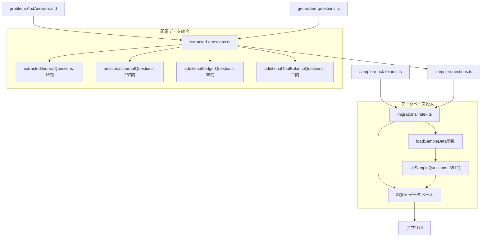

# 簿記3級問題集アプリ - 問題データの流れ

## 概要

このドキュメントでは、簿記3級問題集アプリにおける問題データの構成と流れを詳細に説明します。

## データファイル構成

### 📁 問題データファイル一覧

```
src/data/
├── extracted-questions.ts      # 統合問題データ（351問）
├── generated-questions.ts      # 自動生成問題データ（325問）
├── sample-questions.ts         # アプリ用エクスポート層
├── sample-mock-exams.ts        # 模試定義データ（5セット）
└── migrations/
    └── index.ts                # データベース初期化・データ投入
```

## 問題データの詳細構成

### 1. 第一問：仕訳問題（302問）

#### データソース

- **基本問題（15問）**: `problemsAndAnswers.md`から抽出
- **追加問題（287問）**: `generated-questions.ts`で自動生成

#### 問題分類（problemsStrategy.mdに基づく）

1. **現金・預金取引** - 現金、小口現金、当座預金、普通預金、定期預金
2. **商品売買取引** - 基本売買、返品・値引き、諸掛り・特殊取引、決算関連
3. **債権・債務** - 売掛金・買掛金、手形取引、貸借取引
4. **給与・税金** - 給与支払、源泉徴収・住民税、社会保険料、法人税等
5. **固定資産** - 取得、減価償却、売却・除却
6. **決算整理** - 引当金、経過勘定、その他決算整理

### 2. 第二問：帳簿問題（38問）

#### データソース

- **全問題（38問）**: `generated-questions.ts`で自動生成

#### 問題分類

- 現金出納帳の記入・残高計算
- 各種補助簿の処理
- 勘定記入問題

### 3. 第三問：試算表問題（11問）

#### データソース

- **全問題（11問）**: `generated-questions.ts`で自動生成

#### 問題分類

- 合計残高試算表の作成
- 借方・貸方合計の計算

### 4. 模試データ（5セット）

#### データソース

- **模試定義**: `sample-mock-exams.ts`

#### 構成

- 基礎レベル模試
- 標準レベル模試
- 応用レベル模試
- 実践レベル模試
- 総合レベル模試

各模試は以下の構成：

- 第1問：仕訳15問（60点・30分推奨）
- 第2問：帳簿2問（20点・15分推奨）
- 第3問：試算表1問（20点・15分推奨）

## データフロー図



## データ処理の流れ

### 1. データ統合処理（extracted-questions.ts）

```typescript
// 第一問（仕訳問題）の統合
export const extractedJournalQuestions: Question[] = [
  ...originalJournalQuestions, // 15問（problemsAndAnswers.mdから）
  ...additionalJournalQuestions, // 287問（generated-questions.tsから）
];

// 第二問・第三問の取り込み
export const extractedLedgerQuestions: Question[] = additionalLedgerQuestions; // 38問
export const extractedTrialBalanceQuestions: Question[] =
  additionalTrialBalanceQuestions; // 11問

// 全問題の統合
export const allExtractedQuestions: Question[] = [
  ...extractedJournalQuestions, // 302問
  ...extractedLedgerQuestions, // 38問
  ...extractedTrialBalanceQuestions, // 11問
]; // 合計351問
```

### 2. アプリ用エクスポート（sample-questions.ts）

```typescript
// extracted-questions.tsからインポート
import {
  extractedJournalQuestions,
  extractedLedgerQuestions,
  extractedTrialBalanceQuestions,
  allExtractedQuestions,
} from "./extracted-questions";

// 全問題データをエクスポート
export const allSampleQuestions: Question[] = allExtractedQuestions; // 351問
```

### 3. データベース投入（migrations/index.ts）

```typescript
async function loadSampleData(): Promise<void> {
  // sample-questions.tsから全問題を取得
  const { allSampleQuestions } = await import("../sample-questions");

  // 全問題をデータベースに挿入
  for (const question of allSampleQuestions) {
    await databaseService.executeSql(
      `INSERT INTO questions (...) VALUES (?, ?, ?, ...)`,
      [question.id, question.category_id, ...]
    );
  }

  console.log(`全問題データ読み込み完了: ${allSampleQuestions.length}件の問題を追加`);
}
```

## 問題カテゴリーとタグシステム

### カテゴリー分類（category_id）

- `journal`: 第一問（仕訳問題）
- `ledger`: 第二問（帳簿問題）
- `trial_balance`: 第三問（試算表問題）

### タグシステム（tags_json）

各問題は以下の形式でタグ付けされています：

```json
["メインカテゴリー", "サブカテゴリー"]
```

#### 第一問のタグ例

- `["cash_deposit", "現金取引"]`
- `["sales_purchase", "基本売買"]`
- `["receivable_payable", "手形取引"]`
- `["salary_tax", "給与支払"]`
- `["fixed_asset", "減価償却"]`
- `["adjustment", "引当金"]`

## データ更新の流れ

### 1. 問題データの修正・追加

```bash
# 問題分類の修正
node scripts/add-question-categories.js
```

### 2. アプリ起動時のデータ更新

- データベース初期化時に`SAMPLE_DATA_VERSION`をチェック
- バージョンが更新されている場合、既存データを削除して再投入
- 開発環境では`EXPO_PUBLIC_FORCE_UPDATE_QUESTIONS=true`で強制更新可能

### 3. データ更新の検知

```typescript
// バージョン管理
export const SAMPLE_DATA_VERSION = new Date().toISOString();

// バージョンチェック
const needsUpdate = currentVersion !== SAMPLE_DATA_VERSION;
```

## 問題データの統計情報

### 現在の問題数

| カテゴリー       | 問題数    | 構成                 |
| ---------------- | --------- | -------------------- |
| 第一問（仕訳）   | 302問     | 基本15問 + 追加287問 |
| 第二問（帳簿）   | 38問      | 全て自動生成         |
| 第三問（試算表） | 11問      | 全て自動生成         |
| **合計**         | **351問** | -                    |
| 模試             | 5セット   | 各18問構成           |

### problemsStrategy.mdとの対比

| 項目   | 戦略書  | 実装    | 状況                 |
| ------ | ------- | ------- | -------------------- |
| 第一問 | 250問   | 302問   | ✅ 目標超過達成      |
| 第二問 | 40問    | 38問    | ⚠️ 若干不足（2問差） |
| 第三問 | 12問    | 11問    | ⚠️ 若干不足（1問差） |
| 模試   | 5セット | 5セット | ✅ 計画通り          |

## 注意事項

### データ整合性

- 全ての問題データは厳密な型チェック（TypeScript）を通過
- データベース制約により不正なデータの投入を防止
- JSONフィールドの妥当性検証を実装

### パフォーマンス考慮

- 問題データは起動時に一括読み込み
- メモリ最適化版ファイル（`*.optimized.tsx`）を別途用意
- 統計情報はキャッシュして高速化

### 拡張性

- 新しい問題カテゴリーの追加が容易
- 問題形式（CBT形式）の拡張に対応
- 多言語対応の基盤を準備済み

## 関連ファイル

- `src/types/models.ts`: データ型定義
- `src/data/database.ts`: データベース接続
- `src/data/repositories/`: データアクセス層
- `src/services/`: ビジネスロジック層
- `scripts/add-question-categories.js`: 問題分類修正スクリプト

---

_最終更新: 2025-08-06_
_問題データ総数: 351問 + 5模試セット_
