# ユーザーフロー設計

## 1. メインフロー概要

### 1.1 学習フロー（通常学習）
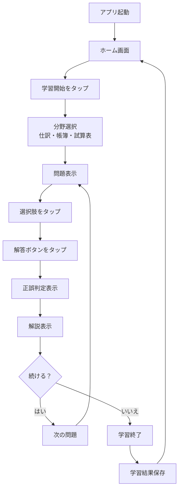

### 1.2 復習フロー（弱点克服）
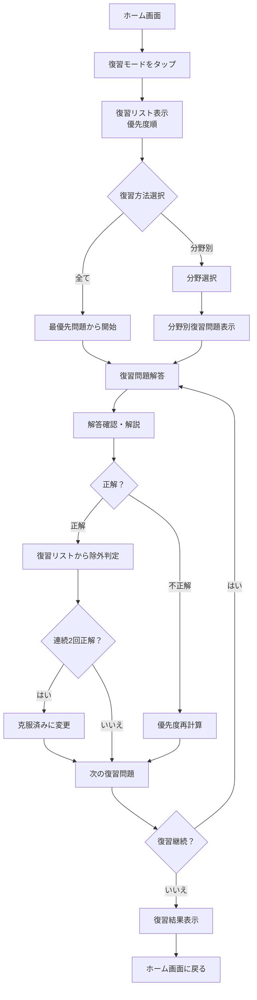

### 1.3 模試フロー（実力測定・新コンテンツ構成対応）
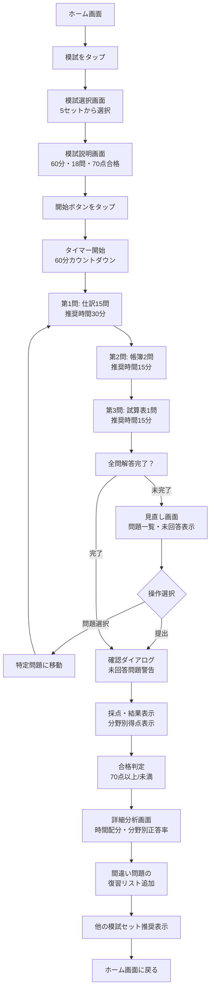

## 2. 詳細フロー設計

### 2.1 アプリ起動・初期化フロー
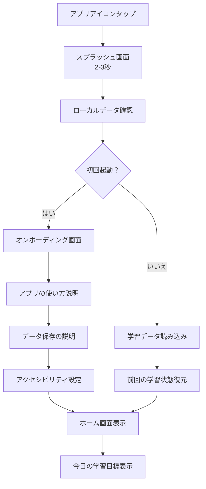

### 2.2 問題解答詳細フロー
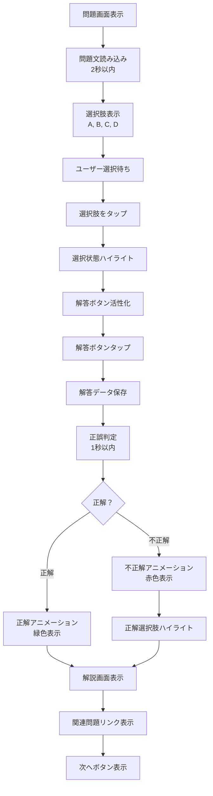

### 2.3 復習優先度計算フロー
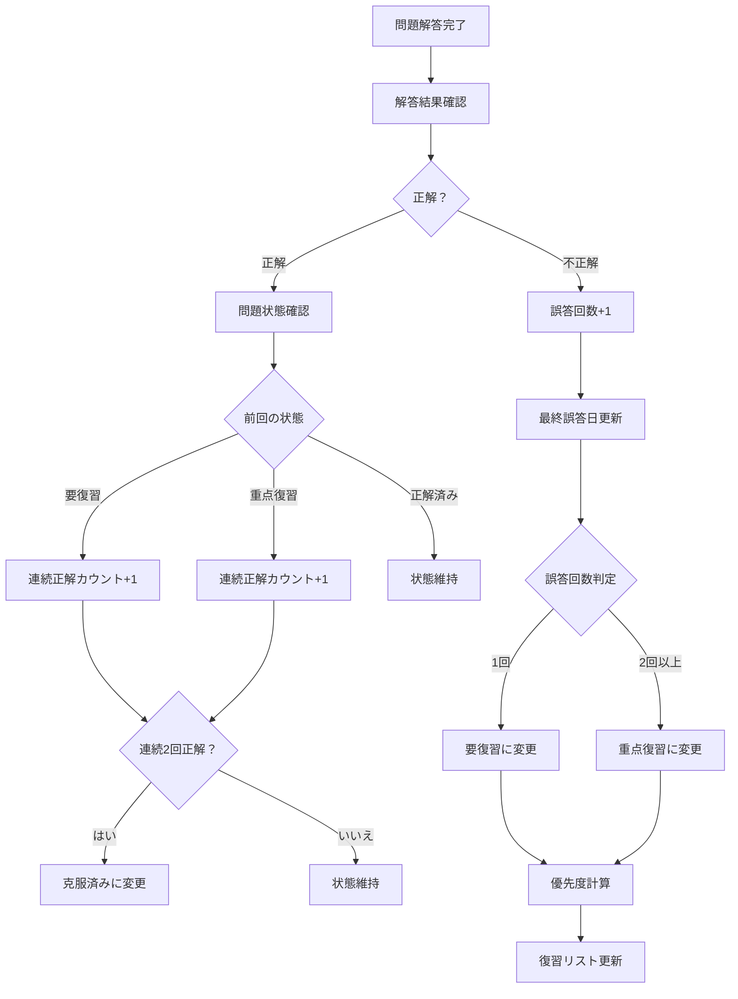

### 2.4 データ同期・保存フロー
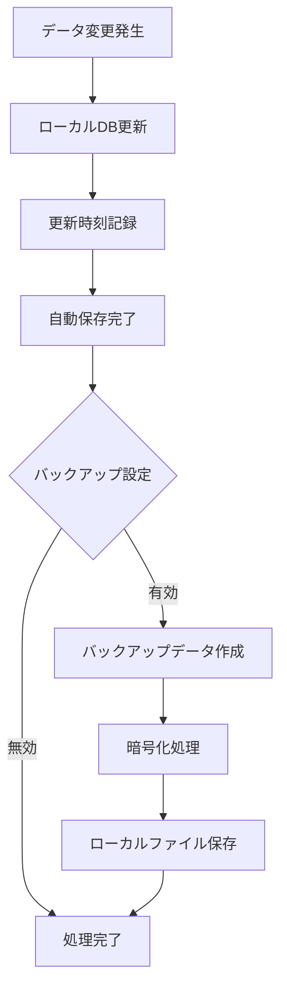

## 3. エラーハンドリングフロー

### 3.1 アプリクラッシュ・復旧フロー
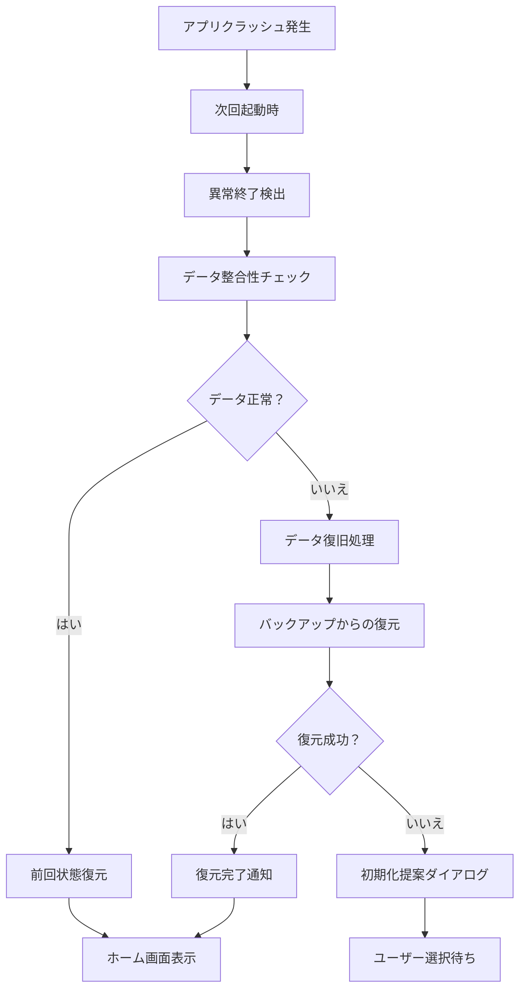

### 3.2 データ不整合エラーフロー
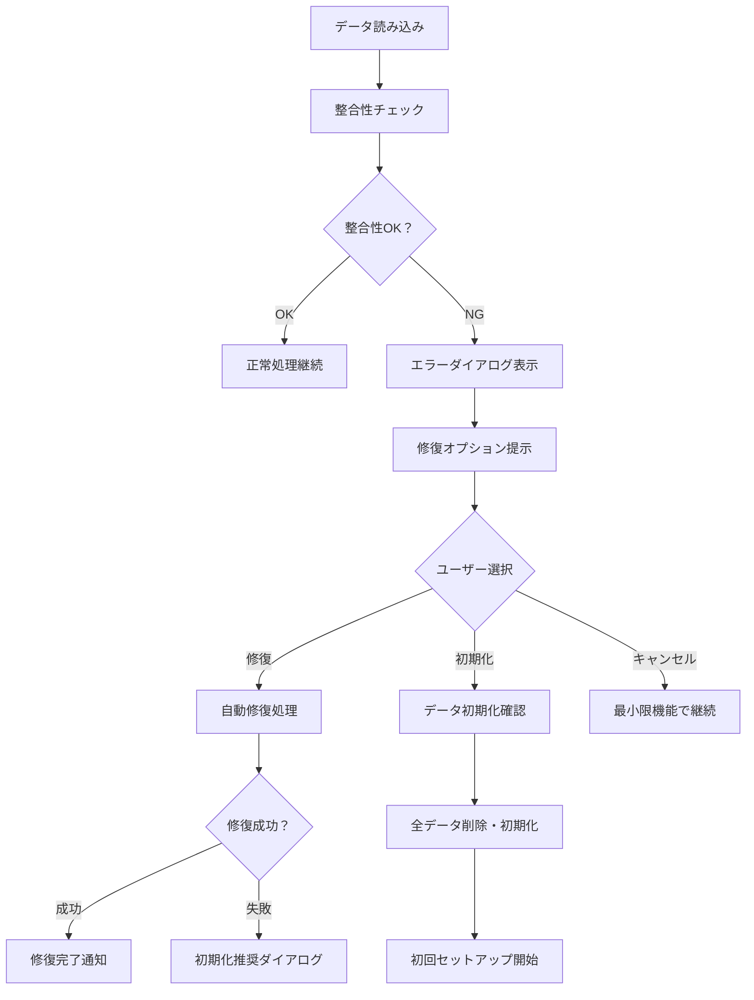

## 4. 特殊条件下のフロー

### 4.1 オフライン利用フロー
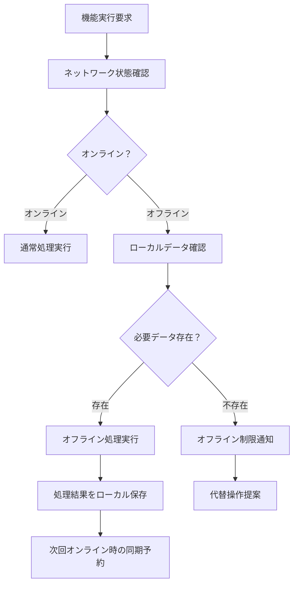

### 4.2 アクセシビリティ対応フロー
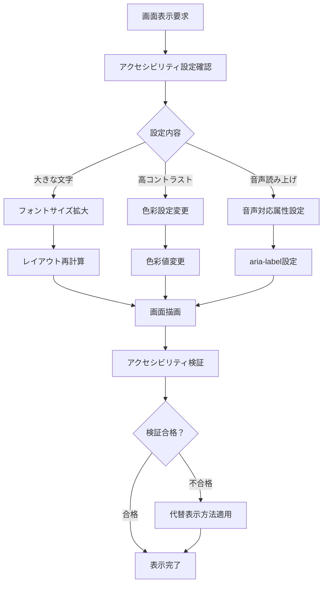

## 5. パフォーマンス最適化フロー

### 5.1 問題読み込み最適化フロー
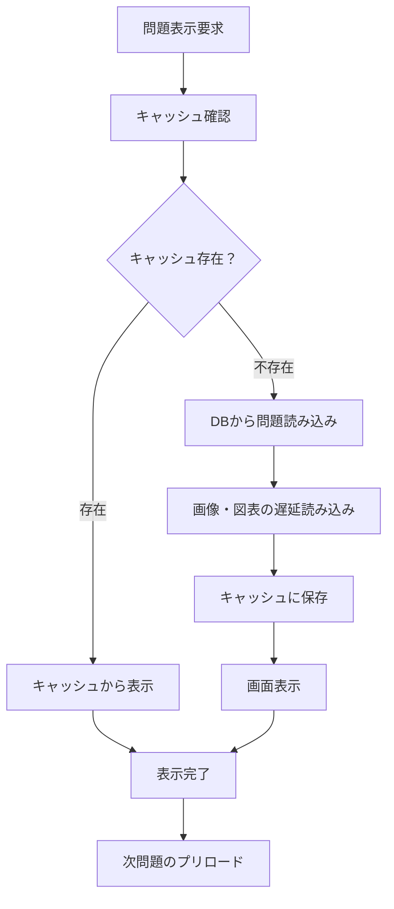

### 5.2 大量データ処理フロー
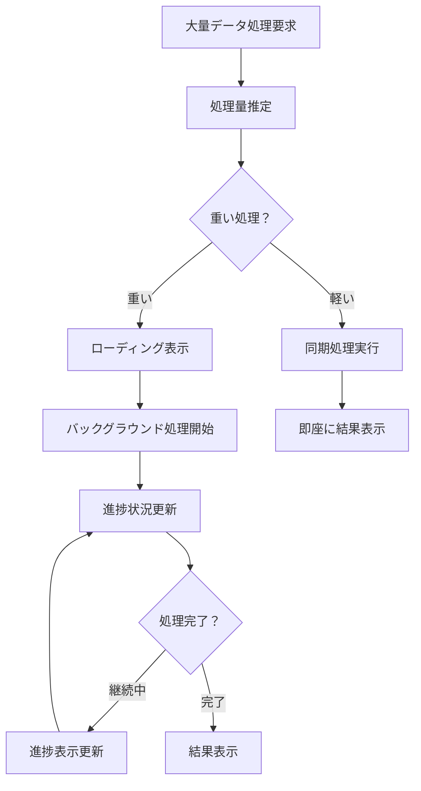

## 6. ユーザビリティ考慮点

### 6.1 操作フィードバック設計
- **タップ反応**: 100ms以内の視覚フィードバック
- **処理中表示**: 1秒を超える処理にはローディング表示
- **完了通知**: 重要な操作完了時はトーストやアニメーション
- **エラー通知**: 分かりやすいエラーメッセージと回復手段提示

### 6.2 ナビゲーション設計
- **パンくずリスト**: 深い階層では現在位置を明示
- **戻る機能**: ハードウェア戻るボタンの適切なハンドリング
- **ショートカット**: 頻繁な操作へのクイックアクセス
- **一貫性**: 同様の操作は同じフローで実行

### 6.3 学習継続サポート
- **中断・再開**: いつでも学習を中断・再開可能
- **進捗保存**: 学習途中での強制終了にも対応
- **モチベーション**: 学習継続を促す適切なフィードバック
- **習慣化**: 定期的な学習を促すリマインダー機能

## 7. フロー検証・テスト観点

### 7.1 ユーザビリティテスト項目
- **タスク完了率**: 主要フローを90%以上のユーザーが完了可能
- **エラー回復**: エラー発生後の回復手順の理解度
- **学習効果**: フローが学習効果を阻害していないか
- **操作時間**: 各操作の所要時間が許容範囲内か

### 7.2 パフォーマンステスト項目
- **応答時間**: 各画面遷移が2秒以内
- **メモリ使用量**: 長時間利用時のメモリリーク検証
- **電池消費**: 学習セッション中の適切な消費量
- **データ使用量**: オフライン前提のため最小限

---

## 更新履歴

| 日付 | バージョン | 変更内容 | 更新者 |
|---|---|---|---|
| 2025-01-27 | 1.0 | 初版作成 | - |

---

**このユーザーフローは、実際のユーザーテストの結果に基づいて継続的に改善していきます。特に学習効果とユーザビリティのバランスを重視します。**