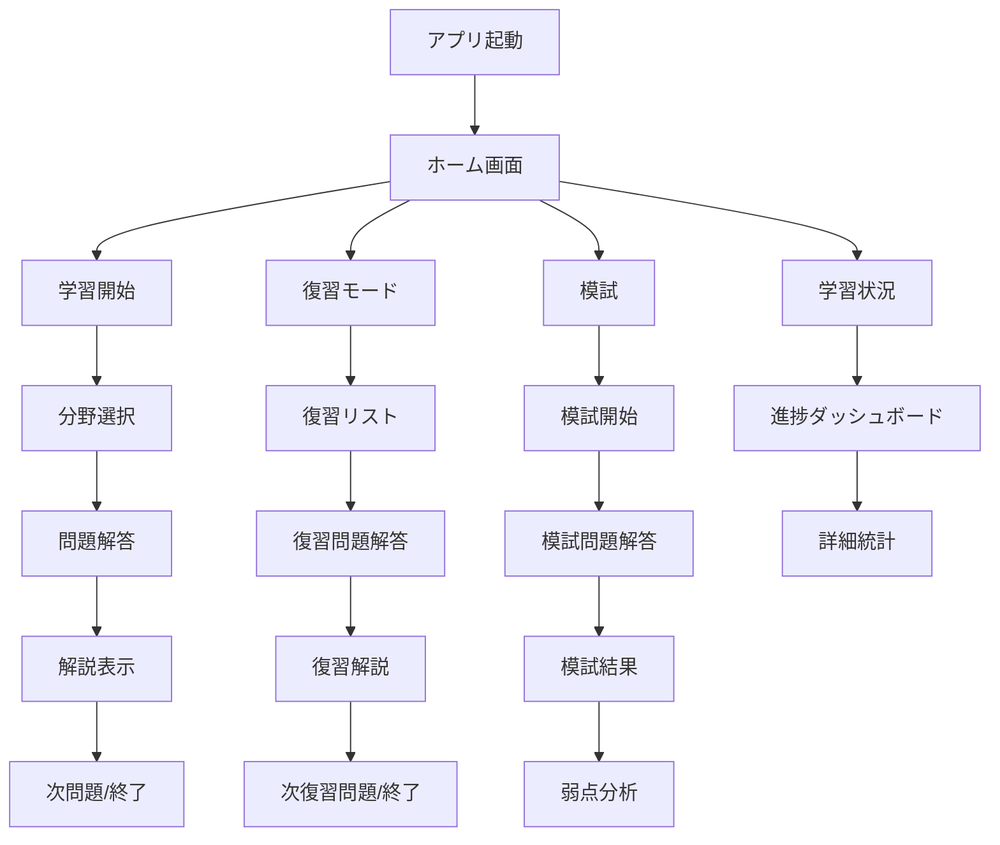
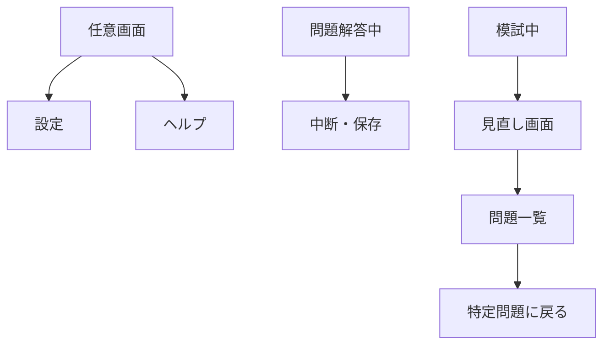

# 情報アーキテクチャ（IA）

## 1. アプリ構造概要

### 1.1 アプリ階層構造
```
簿記3級 確実復習アプリ
├── ホーム画面
│   ├── 学習開始
│   ├── 復習モード
│   ├── 模試
│   └── 学習状況
├── 学習機能
│   ├── 分野選択（仕訳・帳簿/補助簿・試算表/精算表）
│   ├── 問題解答
│   ├── 解説表示
│   └── 次問題/終了
├── 復習機能
│   ├── 復習リスト（優先度順）
│   ├── 弱点分野選択
│   ├── 復習問題解答
│   └── 克服状況確認
├── 模試機能
│   ├── 模試開始（60分制限）
│   ├── 問題解答（第1-3問）
│   ├── 見直し・提出
│   └── 結果・分析表示
├── 学習状況画面
│   ├── 全体進捗
│   ├── 分野別状況
│   ├── 弱点一覧
│   └── 学習統計
└── 設定・その他
    ├── アクセシビリティ設定
    ├── データ管理
    ├── ヘルプ・サポート
    └── アプリ情報
```

## 2. 画面遷移構造

### 2.1 メイン導線


### 2.2 サブ導線


## 3. 情報グルーピング

### 3.1 学習関連情報
**グループ名**: 学習コンテンツ
**含まれる情報**:
- 問題文・選択肢
- 解説・図解
- 関連問題リンク
- 学習履歴

**表示優先度**: 高
**アクセス頻度**: 毎日

### 3.2 進捗管理情報
**グループ名**: 学習進捗
**含まれる情報**:
- 全体進捗（307問中の完了数）
- 分野別進捗（仕訳・帳簿/補助簿・試算表/精算表）
- 正答率推移
- 学習日数・連続学習

**表示優先度**: 高
**アクセス頻度**: 週数回

### 3.3 復習管理情報
**グループ名**: 弱点管理
**含まれる情報**:
- 誤答問題リスト
- 復習優先度
- 克服状況
- 復習計画

**表示優先度**: 最高
**アクセス頻度**: 毎日

### 3.4 模試・評価情報
**グループ名**: 実力測定
**含まれる情報**:
- 模試結果・得点
- 分野別分析
- 時間配分分析
- 合格判定

**表示優先度**: 中
**アクセス頻度**: 週1回

### 3.5 設定・システム情報
**グループ名**: アプリ設定
**含まれる情報**:
- アクセシビリティ設定
- データバックアップ・復元
- ヘルプ・FAQ
- バージョン情報

**表示優先度**: 低
**アクセス頻度**: 初回・必要時のみ

## 4. ナビゲーション設計

### 4.1 プライマリナビゲーション
**タブバー形式（4タブ）**:
1. **ホーム** 🏠
   - 学習開始・復習モード・模試へのクイックアクセス
   - 今日の学習目標・進捗サマリー

2. **学習** 📚
   - 分野別学習
   - 学習履歴
   - 継続中の学習セッション

3. **復習** 🔄
   - 復習リスト（優先度順）
   - 弱点分野別復習
   - 復習進捗

4. **統計** 📊
   - 学習ダッシュボード
   - 詳細分析
   - 模試履歴

### 4.2 セカンダリナビゲーション
**各画面内のサブメニュー**:
- 分野別フィルタ
- ソート・表示オプション
- 詳細設定へのリンク

### 4.3 ユーティリティナビゲーション
**全画面共通要素**:
- 設定アイコン（右上）
- ヘルプアイコン（必要時）
- 戻るボタン（左上）

## 5. コンテンツ戦略

### 5.1 コンテンツ階層
```
レベル1: 重要度最高（常時表示）
├── 現在の復習対象問題数
├── 今日の学習進捗
└── 直近の学習結果

レベル2: 重要度高（メイン画面）
├── 分野別進捗
├── 正答率推移
└── 模試結果

レベル3: 重要度中（詳細画面）
├── 詳細統計
├── 学習履歴
└── 設定オプション

レベル4: 重要度低（必要時のみ）
├── ヘルプ・FAQ
├── アプリ情報  
└── データ管理
```

### 5.2 情報提示の原則

#### 5.2.1 即座性
- **問題解答後**: 1秒以内に正誤判定表示
- **学習開始時**: 前回の続きから即座に開始可能
- **復習開始時**: 最優先問題を即座に表示

#### 5.2.2 明瞭性
- **状態表示**: 色分け + テキストの併用
- **数値表示**: 「XX問中XX問完了」形式で統一
- **進捗表示**: プログレスバー + パーセンテージ

#### 5.2.3 一貫性
- **用語統一**: グロッサリーに基づく表記
- **レイアウト**: 同じ情報は同じ位置に配置
- **操作**: 同じアクションは同じ手順で実行

## 6. 画面別情報設計

### 6.1 ホーム画面
**主要情報（一目で分かる）**:
- 復習待ち問題数（赤いバッジ）
- 今日の学習状況（問題数・時間）
- 全体進捗（307問中の完了数）

**アクション要素**:
- [学習開始] ボタン（最も目立つ配置）
- [復習開始] ボタン（復習待ちがある場合のみ表示）
- [模試開始] ボタン
- [学習状況を見る] リンク

### 6.2 学習画面
**必須表示情報**:
- 現在の問題番号・分野
- 問題文・選択肢
- 解答ボタン・スキップボタン

**補助情報**:
- 分野別進捗インジケーター
- 前回の解答結果（再学習時のみ）

### 6.3 復習リスト画面
**リスト表示情報**:
- 問題番号・分野・優先度
- 誤答回数・最終誤答日
- 推奨復習順序（1位、2位...）

**フィルタ・ソート**:
- 分野別フィルタ（仕訳・帳簿/補助簿・試算表/精算表）
- 優先度順・誤答回数順・日付順

### 6.4 模試画面
**固定表示要素**:
- 残り時間（カウントダウン）
- 問題進捗（15問中5問目等）
- 見直しマーク機能

**問題一覧（見直し時）**:
- 全問題の解答状況（未回答・回答済み・マーク付き）
- ワンタップで特定問題に移動

### 6.5 統計画面
**ダッシュボード形式**:
- 重要指標を上部に配置（正答率・復習待ち数）
- グラフ・チャートを中心に配置
- 詳細リンクを下部に配置

## 7. アクセシビリティ考慮

### 7.1 情報構造のアクセシビリティ
- **見出し階層**: h1 > h2 > h3 の論理的な構造
- **ランドマーク**: メイン・ナビゲーション・補完エリアの明確な区分
- **フォーカス順序**: 論理的な順序でキーボード操作可能

### 7.2 情報提示のアクセシビリティ
- **色依存の回避**: 色のみでなく形状・テキストでも情報伝達
- **コントラスト**: WCAG 2.1 AA基準（4.5:1）以上
- **テキスト拡大**: 200%拡大時も情報が欠損しない

## 8. レスポンシブ対応

### 8.1 画面サイズ別優先度
**スマートフォン（縦）**: 最優先
- 必須情報のみ表示
- 大きなタッチターゲット
- スクロール最小化

**スマートフォン（横）**: 対応
- 2カラムレイアウト可能な場合のみ活用
- 基本は縦向きと同じ情報密度

**タブレット**: 補完的対応
- より多くの情報を同時表示
- サイドバーナビゲーション検討

## 9. 情報アーキテクチャの検証

### 9.1 カードソーティング結果（想定）
**グループ化傾向**:
- 学習機能（問題・解説・履歴）
- 復習機能（弱点・優先度・計画）
- 評価機能（模試・統計・分析）
- 管理機能（設定・ヘルプ・データ）

### 9.2 ユーザビリティテスト観点
- **情報発見性**: 目的の情報を3タップ以内で発見可能
- **情報理解性**: 専門用語の説明・文脈の提供
- **情報操作性**: 情報の絞り込み・ソート・詳細確認

---

## 更新履歴

| 日付 | バージョン | 変更内容 | 更新者 |
|---|---|---|---|
| 2025-01-27 | 1.0 | 初版作成 | - |

---

**この情報アーキテクチャは、ユーザビリティテストの結果に基づいて継続的に改善していきます。**