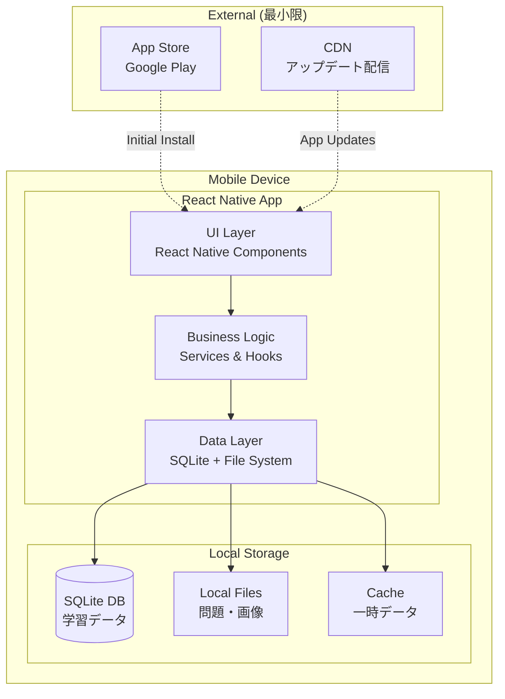
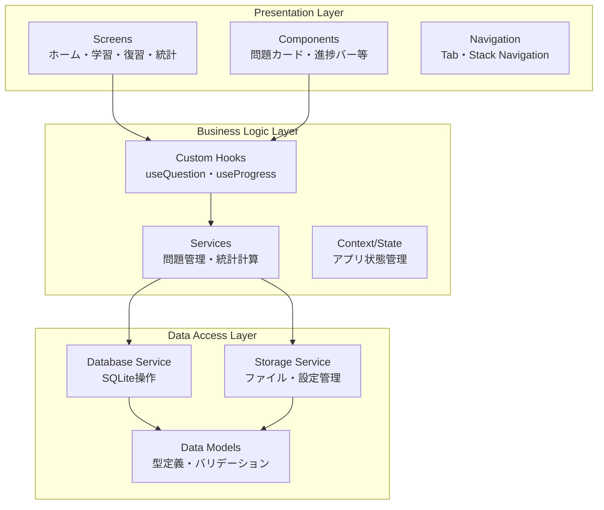
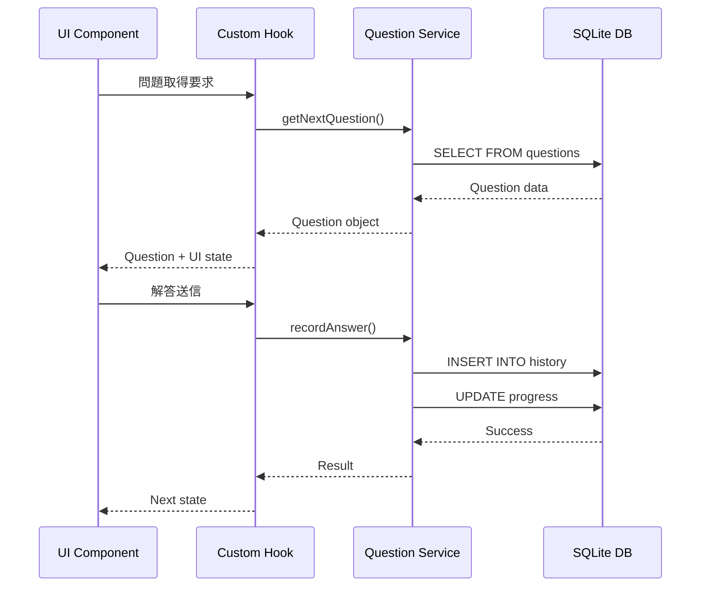
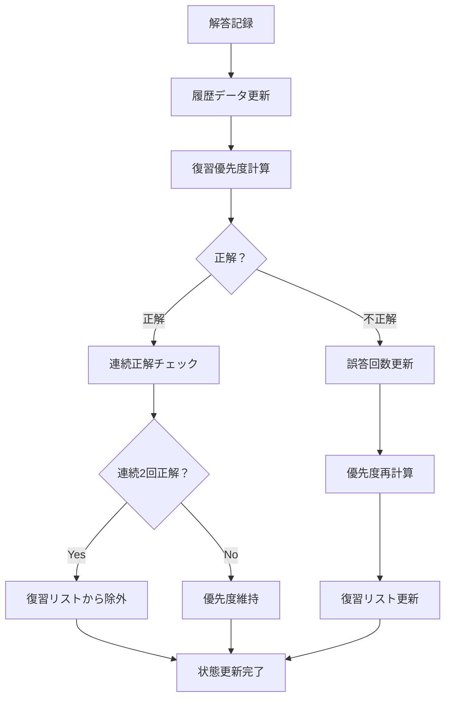

# システムアーキテクチャ

## 1. アーキテクチャ概要

### 1.1 設計方針
- **ローカルファースト**: サーバー通信を最小化し、端末内で完結する設計
- **シンプル第一**: 複雑性を排除し、保守性・信頼性を重視
- **オフライン完全対応**: ネットワーク接続なしで全機能が利用可能
- **クロスプラットフォーム**: iOS・Android 両対応

### 1.2 技術スタック選定理由
- **React Native + Expo**: 開発効率・保守性・拡張性のバランス
- **SQLite**: 軽量・高速・オフライン対応のローカルDB
- **TypeScript**: 型安全性による品質向上・開発効率化

## 2. システム構成図

### 2.1 全体アーキテクチャ


### 2.2 アプリ内アーキテクチャ


## 3. 主要コンポーネント設計

### 3.1 問題管理システム
```typescript
// CBT形式対応の問題管理
interface QuestionService {
  // 問題取得
  getQuestionsByCategory(category: Category): Promise<Question[]>
  
  // CBT形式解答記録（プルダウン選択＋数値入力）
  recordAnswer(questionId: string, answer: CBTAnswer): Promise<void>
  
  // 勘定科目マスタ取得
  getAccountItems(questionType: QuestionType): Promise<AccountItem[]>
  
  // 解答検証（同一仕訳内重複チェック等）
  validateAnswer(answer: CBTAnswer): ValidationResult
  
  // 復習リスト生成
  generateReviewList(): Promise<ReviewItem[]>
  
  // 優先度計算
  calculatePriority(questionHistory: QuestionHistory): number
}

// CBT解答データ構造
interface CBTAnswer {
  questionId: string
  questionType: 'journal' | 'ledger' | 'trial_balance'
  
  // 仕訳問題の場合
  journalEntry?: {
    debit: { account: string; amount: number }
    credit: { account: string; amount: number }
  }
  
  // 帳簿問題の場合
  ledgerEntry?: {
    entries: Array<{
      account?: string
      description?: string
      amount?: number
    }>
  }
  
  // 試算表問題の場合
  trialBalance?: {
    balances: Record<string, number>
  }
}

// 状態管理
interface QuestionState {
  currentQuestion: Question | null
  availableAccounts: AccountItem[]
  currentAnswer: CBTAnswer | null
  reviewList: ReviewItem[]
  progress: Progress
  isLoading: boolean
  validationErrors: string[]
}
```

### 3.2 データ永続化層
```typescript
// SQLite データベース設計
interface DatabaseService {
  // 問題データ
  questions: QuestionRepository
  
  // 学習履歴
  learningHistory: HistoryRepository
  
  // 進捗統計
  progress: ProgressRepository
  
  // 設定データ
  settings: SettingsRepository
}

// ファイルシステム管理
interface StorageService {
  // 問題画像・図表
  getQuestionAssets(questionId: string): Promise<Asset[]>
  
  // バックアップ・復元
  exportUserData(): Promise<BackupData>
  importUserData(backup: BackupData): Promise<void>
  
  // キャッシュ管理
  clearCache(): Promise<void>
}
```

### 3.3 UI状態管理
```typescript
// Context API による状態管理
interface AppContext {
  // 現在の学習状態
  learningState: LearningState
  
  // 復習管理
  reviewManager: ReviewManager
  
  // 統計・進捗
  progressTracker: ProgressTracker
  
  // 設定・環境
  appSettings: AppSettings
}

// CBT対応カスタムフック例
function useQuestionFlow() {
  // CBT形式問題の状態管理
  const [currentQuestion, setCurrentQuestion] = useState<Question>()
  const [userAnswer, setUserAnswer] = useState<CBTAnswer>()
  const [availableAccounts, setAvailableAccounts] = useState<AccountItem[]>([])
  const [showExplanation, setShowExplanation] = useState(false)
  const [validationErrors, setValidationErrors] = useState<string[]>([])
  
  // CBT形式解答の検証
  const validateCBTAnswer = useCallback((answer: CBTAnswer) => {
    const result = questionService.validateAnswer(answer)
    setValidationErrors(result.errors)
    return result.isValid
  }, [])
  
  // 自動カンマ挿入処理
  const formatCurrency = useCallback((value: number) => {
    return new Intl.NumberFormat('ja-JP').format(value)
  }, [])
  
  // ビジネスロジックの抽象化
  const nextQuestion = useCallback(() => {
    // 次問題取得・勘定科目マスタ更新・状態更新
  }, [])
  
  return { 
    currentQuestion, 
    userAnswer, 
    availableAccounts,
    showExplanation, 
    validationErrors,
    validateCBTAnswer,
    formatCurrency,
    nextQuestion 
  }
}
```

## 4. データフロー設計

### 4.1 学習フロー


### 4.2 復習優先度計算フロー


## 5. パフォーマンス設計

### 5.1 データ最適化
```typescript
// 遅延読み込み戦略
class QuestionLoader {
  // 現在問題の即座表示
  loadCurrentQuestion(id: string): Promise<Question>
  
  // 次問題のプリロード
  preloadNextQuestions(currentId: string, count: number): Promise<void>
  
  // 画像の段階的読み込み
  loadQuestionImages(questionId: string): Promise<ImageAsset[]>
}

// メモリ管理
class CacheManager {
  // LRU キャッシュで問題データ管理
  private questionCache = new LRUCache<string, Question>(100)
  
  // 使用頻度の低いデータのパージ
  performCleanup(): void
}
```

### 5.2 レンダリング最適化
```typescript
// React.memo での再描画抑制
const QuestionCard = React.memo(({ question, onAnswer }: Props) => {
  // 問題表示コンポーネント
}, (prevProps, nextProps) => {
  return prevProps.question.id === nextProps.question.id
})

// useMemo での計算結果キャッシュ
function useProgressCalculation(history: LearningHistory[]) {
  return useMemo(() => {
    return calculateProgress(history)
  }, [history])
}
```

## 6. セキュリティ設計

### 6.1 データ保護
```typescript
// 学習データの暗号化
class SecureStorage {
  // AES-256 暗号化
  async encryptUserData(data: UserData): Promise<string>
  async decryptUserData(encryptedData: string): Promise<UserData>
  
  // キー管理
  private generateEncryptionKey(): string
  private storeKeySecurely(key: string): void
}

// 個人情報の非収集
interface UserDataModel {
  // 許可されるデータ（匿名化済み）
  learningProgress: Progress
  questionHistory: History[]
  appSettings: Settings
  
  // 禁止データ（コンパイルエラーで防止）
  // personalInfo: never
  // deviceIdentifier: never
}
```

### 6.2 コードセキュリティ
```typescript
// 入力値検証
class InputValidator {
  validateQuestionId(id: string): boolean {
    return /^Q\d{3}$/.test(id)
  }
  
  validateCBTAnswer(answer: CBTAnswer): ValidationResult {
    const errors: string[] = []
    
    if (answer.questionType === 'journal' && answer.journalEntry) {
      // 同一仕訳内勘定科目重複チェック
      if (answer.journalEntry.debit.account === answer.journalEntry.credit.account) {
        errors.push('同一仕訳内で同じ勘定科目は使用できません')
      }
      
      // 金額の妥当性チェック
      if (answer.journalEntry.debit.amount !== answer.journalEntry.credit.amount) {
        errors.push('借方金額と貸方金額が一致していません')
      }
    }
    
    return { isValid: errors.length === 0, errors }
  }
}

// SQLインジェクション対策
class SafeDatabase {
  async executeQuery(query: string, params: unknown[]): Promise<Result> {
    // プリペアドステートメント必須
    return this.db.executeSql(query, params)
  }
}
```

## 7. 可観測性・監視

### 7.1 ログ設計
```typescript
// 構造化ログ
interface LogEvent {
  timestamp: string
  level: 'INFO' | 'WARN' | 'ERROR'
  event: string
  context: Record<string, unknown>
}

// 学習行動ログ（個人情報除外）
class LearningLogger {
  logQuestionAnswered(questionId: string, correct: boolean, timeSpent: number) {
    this.log({
      event: 'question_answered',
      context: { questionId, correct, timeSpent }
    })
  }
  
  logStudySessionCompleted(questionsCount: number, duration: number) {
    this.log({
      event: 'study_session_completed', 
      context: { questionsCount, duration }
    })
  }
}
```

### 7.2 エラー監視
```typescript
// エラー境界での例外処理
class ErrorBoundary extends React.Component {
  componentDidCatch(error: Error, errorInfo: ErrorInfo) {
    // エラーログ記録（個人情報除外）
    ErrorLogger.capture(error, {
      component: errorInfo.componentStack,
      timestamp: new Date().toISOString()
    })
  }
}

// 非同期エラーのキャッチ
function useAsyncErrorHandler() {
  return useCallback((error: Error) => {
    ErrorLogger.capture(error, { context: 'async_operation' })
    // ユーザーフレンドリーなエラー表示
  }, [])
}
```

## 8. CBT特有の技術要件

### 8.1 CBT解答検証システム
```typescript
// リアルタイム解答検証
interface CBTValidator {
  // 同一仕訳内勘定科目重複チェック
  validateJournalEntry(entry: JournalEntry): ValidationResult
  
  // 金額の妥当性チェック
  validateAmount(amount: number): ValidationResult
  
  // 必須項目チェック
  validateRequiredFields(answer: CBTAnswer): ValidationResult
  
  // 数値フォーマット自動補正
  formatCurrency(input: string): number
}

// 検証結果の型定義
interface ValidationResult {
  isValid: boolean
  errors: ValidationError[]
  warnings: ValidationWarning[]
}

interface ValidationError {
  field: string
  code: string
  message: string
}
```

### 8.2 プルダウンデータ管理
```typescript
// 勘定科目動的取得システム
interface AccountItemService {
  // 問題タイプ別勘定科目取得
  getAccountsByQuestionType(type: QuestionType): Promise<AccountItem[]>
  
  // 使用済み勘定科目フィルタ（重複防止）
  filterUsedAccounts(
    availableAccounts: AccountItem[], 
    usedAccounts: string[]
  ): AccountItem[]
  
  // 勘定科目の検索・フィルタ
  searchAccounts(query: string, category?: AccountCategory): AccountItem[]
}

// プルダウンUI状態管理
interface DropdownState {
  isOpen: boolean
  searchTerm: string
  selectedValue: string | null
  filteredOptions: DropdownOption[]
  disabledOptions: string[]  // 重複防止で無効化
}
```

### 8.3 数値入力・フォーマット処理
```typescript
// 数値入力コンポーネント
interface CurrencyInput {
  // 自動カンマ挿入
  formatInput(value: string): string
  
  // 不正文字除去
  sanitizeInput(value: string): string
  
  // 数値変換
  parseToNumber(formatted: string): number
  
  // 入力検証
  validateRange(value: number, min?: number, max?: number): boolean
}

// 実装例
const formatCurrency = (input: string): string => {
  const number = parseInt(input.replace(/[^\d]/g, ''))
  return isNaN(number) ? '' : number.toLocaleString('ja-JP')
}
```

### 8.4 セッション管理・進捗保存
```typescript
// CBT学習セッション管理
interface CBTSession {
  sessionId: string
  questionType: QuestionType
  startedAt: Date
  currentQuestionIndex: number
  answers: Map<string, CBTAnswer>
  validationHistory: ValidationResult[]
  
  // 中断・再開機能
  pause(): void
  resume(): void
  
  // プログレス保存
  saveProgress(): Promise<void>
  
  // セッション復元
  restoreFromSaved(): Promise<void>
}
```

## 9. 拡張性・保守性設計

### 9.1 モジュール設計
```
src/
├── components/           # 再利用可能UIコンポーネント
│   ├── common/          # 汎用コンポーネント
│   └── domain/          # ドメイン固有コンポーネント
├── screens/             # 画面コンポーネント
├── services/            # ビジネスロジック
├── data/               # データアクセス層
│   ├── repositories/   # データ操作
│   ├── models/         # データ型定義
│   └── migrations/     # DB マイグレーション
├── utils/              # 共通ユーティリティ
├── constants/          # 定数定義
└── types/              # TypeScript 型定義
```

### 9.2 設定・環境管理
```typescript
// 環境別設定
interface AppConfig {
  database: {
    name: string
    version: number
  }
  logging: {
    level: 'DEBUG' | 'INFO' | 'WARN' | 'ERROR'
    enableFileLogging: boolean
  }
  features: {
    enableAnalytics: boolean
    enableCrashReporting: boolean
  }
}

// 機能フラグ
class FeatureFlags {
  static isEnabled(feature: string): boolean {
    return this.flags[feature] ?? false
  }
  
  private static flags: Record<string, boolean> = {
    'new-ui-design': false,
    'advanced-analytics': false
  }
}
```

## 10. テスト戦略

### 10.1 テストピラミッド
```
E2E Tests (5%)
├── 主要ユーザーフロー
└── クリティカルパス

Integration Tests (25%)
├── コンポーネント結合
├── データフロー
└── API統合

Unit Tests (70%)
├── ビジネスロジック
├── ユーティリティ関数
└── データ変換
```

### 10.2 テスト対象優先度
```typescript
// 高優先度: ビジネス重要機能
describe('QuestionService', () => {
  test('正解記録時の復習リスト更新', () => {
    // 学習効果に直結する機能
  })
  
  test('優先度計算の正確性', () => {
    // アプリの核心機能
  })
})

// 中優先度: UI・UX
describe('QuestionScreen', () => {
  test('問題表示の2秒以内レンダリング', () => {
    // パフォーマンス要件
  })
})

// 低優先度: エッジケース
describe('ErrorHandling', () => {
  test('ネットワークエラー時の適切な表示', () => {
    // 例外的な状況での動作
  })
})
```

## 10. 制約・トレードオフ

### 10.1 技術的制約
- **React Native制約**: ネイティブ機能の制限・パフォーマンス上での制約
- **SQLite制約**: 同時接続数・複雑クエリでの性能制限
- **ローカルストレージ**: 端末容量・バックアップの困難性

### 10.2 設計判断・トレードオフ
| 選択肢 | 採用案 | 理由 | トレードオフ |
|---|---|---|---|
| データ保存 | SQLite (ローカル) | オフライン・プライバシー重視 | データ同期・分析の困難性 |
| 状態管理 | Context + hooks | シンプル・学習コスト低 | 大規模時の性能問題 |
| 画像管理 | ローカルファイル | 高速・オフライン対応 | アプリサイズ増大 |
| テスト戦略 | Unit中心 | 開発速度・保守性 | E2E不足のリスク |

---

## 更新履歴

| 日付 | バージョン | 変更内容 | 更新者 |
|---|---|---|---|
| 2025-01-27 | 1.0 | 初版作成 | - |

---

**このアーキテクチャは、要件変更・技術進歩に応じて継続的に進化させていきます。変更時は影響範囲を慎重に評価し、適切な移行計画を立てて実施します。**