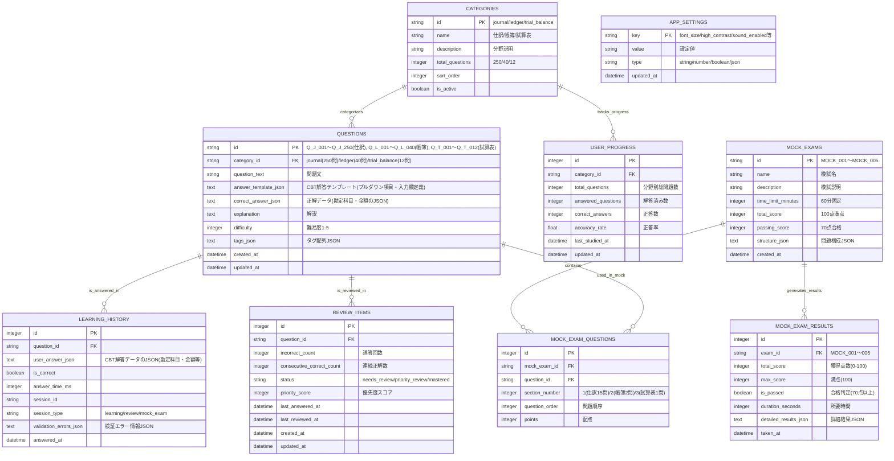

# データモデル設計

## 1. データベース概要

### 1.1 設計方針
- **シンプル第一**: 必要最小限のテーブル・カラムで構成
- **正規化**: 第3正規形まで正規化し、データ重複を排除
- **パフォーマンス**: 頻繁なクエリに対するインデックス最適化
- **整合性**: 外部キー制約による参照整合性の確保

### 1.2 技術スタック
- **データベース**: SQLite 3.x
- **ORM**: なし（生SQLで直接操作）
- **マイグレーション**: カスタムマイグレーション機能
- **バックアップ**: JSON形式での全データエクスポート

## 2. 論理データモデル

### 2.1 ER図（学習コンテンツ構成対応）


## 3. 物理データモデル

### 3.1 テーブル定義

#### 3.1.1 questions（問題テーブル）
```sql
-- CBT形式対応の問題テーブル
CREATE TABLE questions (
    id TEXT PRIMARY KEY,                    -- 問題ID（Q001形式）
    category_id TEXT NOT NULL,              -- 分野ID
    question_text TEXT NOT NULL,            -- 問題文
    answer_template_json TEXT NOT NULL,     -- CBT解答テンプレート（プルダウン項目・入力欄定義）
    correct_answer_json TEXT NOT NULL,      -- 正解データ（勘定科目・金額のJSON）
    explanation TEXT NOT NULL,              -- 解説
    difficulty INTEGER NOT NULL DEFAULT 1,  -- 難易度（1-5）
    created_at DATETIME DEFAULT CURRENT_TIMESTAMP,
    updated_at DATETIME DEFAULT CURRENT_TIMESTAMP,
    
    FOREIGN KEY (category_id) REFERENCES categories (id),
    CHECK (difficulty BETWEEN 1 AND 5),
    CHECK (json_valid(answer_template_json)),
    CHECK (json_valid(correct_answer_json))
);

-- インデックス
CREATE INDEX idx_questions_category ON questions (category_id);
CREATE INDEX idx_questions_difficulty ON questions (difficulty);
```

#### 3.1.2 categories（分野テーブル）
```sql
CREATE TABLE categories (
    id TEXT PRIMARY KEY,                    -- 分野ID（journal, ledger, trial_balance）
    name TEXT NOT NULL,                     -- 分野名
    description TEXT,                       -- 分野説明
    total_questions INTEGER NOT NULL DEFAULT 0, -- 分野別総問題数
    sort_order INTEGER NOT NULL DEFAULT 0, -- 表示順序
    is_active BOOLEAN NOT NULL DEFAULT 1   -- 有効フラグ
);

-- 初期データ（新学習コンテンツ構成）
INSERT INTO categories (id, name, description, sort_order, total_questions) VALUES
('journal', '仕訳', '基本的な仕訳問題（25パターン×10問）', 1, 250),
('ledger', '帳簿', '元帳・補助簿に関する問題（4種類×10問）', 2, 40),
('trial_balance', '試算表', '試算表作成・修正に関する問題（3パターン×4問）', 3, 12);
```

#### 3.1.3 learning_history（学習履歴テーブル）
```sql
-- CBT形式対応の学習履歴テーブル
CREATE TABLE learning_history (
    id INTEGER PRIMARY KEY AUTOINCREMENT,
    question_id TEXT NOT NULL,              -- 問題ID
    user_answer_json TEXT NOT NULL,         -- CBT解答データのJSON（勘定科目・金額等）
    is_correct BOOLEAN NOT NULL,            -- 正誤
    answer_time_ms INTEGER NOT NULL,        -- 解答時間（ミリ秒）
    session_id TEXT,                        -- セッションID
    session_type TEXT DEFAULT 'learning',   -- 'learning'/'review'/'mock_exam'
    validation_errors_json TEXT,            -- 検証エラー情報JSON
    answered_at DATETIME DEFAULT CURRENT_TIMESTAMP,
    
    FOREIGN KEY (question_id) REFERENCES questions (id),
    CHECK (json_valid(user_answer_json)),
    CHECK (validation_errors_json IS NULL OR json_valid(validation_errors_json)),
    CHECK (session_type IN ('learning', 'review', 'mock_exam')),
    CHECK (answer_time_ms > 0)
);

-- インデックス
CREATE INDEX idx_history_question ON learning_history (question_id);
CREATE INDEX idx_history_date ON learning_history (answered_at);
CREATE INDEX idx_history_session ON learning_history (session_id);
```

#### 3.1.4 account_items（勘定科目マスタテーブル）
```sql
-- CBT形式で使用する勘定科目マスタ
CREATE TABLE account_items (
    id INTEGER PRIMARY KEY AUTOINCREMENT,
    code TEXT NOT NULL UNIQUE,              -- 勘定科目コード
    name TEXT NOT NULL,                     -- 勘定科目名
    category TEXT NOT NULL,                 -- 分類（asset/liability/equity/revenue/expense）
    question_types_json TEXT NOT NULL,      -- 使用可能な問題タイプ（["journal","ledger"]等）
    sort_order INTEGER NOT NULL DEFAULT 0,  -- 表示順序
    is_active BOOLEAN NOT NULL DEFAULT 1,   -- 有効フラグ
    created_at DATETIME DEFAULT CURRENT_TIMESTAMP,
    
    CHECK (category IN ('asset', 'liability', 'equity', 'revenue', 'expense')),
    CHECK (json_valid(question_types_json))
);

-- インデックス
CREATE INDEX idx_accounts_category ON account_items (category);
CREATE INDEX idx_accounts_sort ON account_items (sort_order);
```

#### 3.1.5 review_items（復習アイテムテーブル）
```sql
CREATE TABLE review_items (
    id INTEGER PRIMARY KEY AUTOINCREMENT,
    question_id TEXT NOT NULL UNIQUE,       -- 問題ID（一意制約）
    incorrect_count INTEGER NOT NULL DEFAULT 0,     -- 誤答回数
    consecutive_correct_count INTEGER NOT NULL DEFAULT 0, -- 連続正解回数
    status TEXT NOT NULL DEFAULT 'needs_review',    -- 状態
    priority_score INTEGER NOT NULL DEFAULT 0,      -- 優先度スコア
    last_answered_at DATETIME,              -- 最終解答日時
    last_reviewed_at DATETIME,              -- 最終復習日時
    created_at DATETIME DEFAULT CURRENT_TIMESTAMP,
    updated_at DATETIME DEFAULT CURRENT_TIMESTAMP,
    
    FOREIGN KEY (question_id) REFERENCES questions (id),
    CHECK (status IN ('needs_review', 'priority_review', 'mastered')),
    CHECK (incorrect_count >= 0),
    CHECK (consecutive_correct_count >= 0),
    CHECK (priority_score >= 0)
);

-- インデックス
CREATE INDEX idx_review_status ON review_items (status);
CREATE INDEX idx_review_priority ON review_items (priority_score DESC);
CREATE INDEX idx_review_last_answered ON review_items (last_answered_at);
```

#### 3.1.5 user_progress（学習進捗テーブル）
```sql
CREATE TABLE user_progress (
    id INTEGER PRIMARY KEY AUTOINCREMENT,
    category_id TEXT NOT NULL UNIQUE,       -- 分野ID
    total_questions INTEGER NOT NULL DEFAULT 0,     -- 総問題数
    answered_questions INTEGER NOT NULL DEFAULT 0,  -- 解答済み問題数
    correct_answers INTEGER NOT NULL DEFAULT 0,     -- 正答数
    accuracy_rate REAL NOT NULL DEFAULT 0.0,        -- 正答率
    last_studied_at DATETIME,               -- 最終学習日時
    updated_at DATETIME DEFAULT CURRENT_TIMESTAMP,
    
    FOREIGN KEY (category_id) REFERENCES categories (id),
    CHECK (answered_questions <= total_questions),
    CHECK (correct_answers <= answered_questions),
    CHECK (accuracy_rate BETWEEN 0.0 AND 1.0)
);

-- インデックス
CREATE INDEX idx_progress_category ON user_progress (category_id);
```

#### 3.1.6 app_settings（アプリ設定テーブル）
```sql
CREATE TABLE app_settings (
    key TEXT PRIMARY KEY,                   -- 設定キー
    value TEXT NOT NULL,                    -- 設定値
    type TEXT NOT NULL DEFAULT 'string',   -- データ型
    updated_at DATETIME DEFAULT CURRENT_TIMESTAMP,
    
    CHECK (type IN ('string', 'number', 'boolean', 'json'))
);

-- 初期設定データ
INSERT INTO app_settings (key, value, type) VALUES
('font_size', '16', 'number'),
('high_contrast', 'false', 'boolean'),
('sound_enabled', 'true', 'boolean'),
('daily_goal', '20', 'number'),
('reminder_enabled', 'true', 'boolean');
```

#### 3.1.7 mock_exam_results（模試結果テーブル）
```sql
CREATE TABLE mock_exam_results (
    id INTEGER PRIMARY KEY AUTOINCREMENT,
    exam_id TEXT NOT NULL,                  -- 模試ID
    total_score INTEGER NOT NULL,           -- 総得点
    max_score INTEGER NOT NULL DEFAULT 100, -- 満点
    is_passed BOOLEAN NOT NULL,             -- 合格判定
    duration_seconds INTEGER NOT NULL,      -- 所要時間（秒）
    detailed_results_json TEXT NOT NULL,    -- 詳細結果（JSON）
    taken_at DATETIME DEFAULT CURRENT_TIMESTAMP,
    
    CHECK (total_score >= 0),
    CHECK (total_score <= max_score),
    CHECK (duration_seconds > 0)
);

-- インデックス
CREATE INDEX idx_exam_results_date ON mock_exam_results (taken_at);
CREATE INDEX idx_exam_results_score ON mock_exam_results (total_score);
```

#### 3.1.8 mock_exams（模試定義テーブル）
```sql
CREATE TABLE mock_exams (
    id TEXT PRIMARY KEY,                    -- 模試ID（MOCK_001〜005）
    name TEXT NOT NULL,                     -- 模試名
    description TEXT,                       -- 模試説明
    time_limit_minutes INTEGER NOT NULL DEFAULT 60, -- 制限時間
    total_score INTEGER NOT NULL DEFAULT 100,       -- 満点
    passing_score INTEGER NOT NULL DEFAULT 70,      -- 合格点
    structure_json TEXT NOT NULL,           -- 問題構成（JSON）
    is_active BOOLEAN NOT NULL DEFAULT 1,   -- 有効フラグ
    created_at DATETIME DEFAULT CURRENT_TIMESTAMP,
    
    CHECK (time_limit_minutes > 0),
    CHECK (total_score > 0),
    CHECK (passing_score > 0 AND passing_score <= total_score)
);

-- 初期データ（5セットの模試）
INSERT INTO mock_exams (id, name, description, structure_json) VALUES
('MOCK_001', '基礎レベル模試', '基本的な問題中心の模試', '{"section1":{"count":15,"points":60},"section2":{"count":2,"points":20},"section3":{"count":1,"points":20}}'),
('MOCK_002', '標準レベル模試', '標準的な難易度の模試', '{"section1":{"count":15,"points":60},"section2":{"count":2,"points":20},"section3":{"count":1,"points":20}}'),
('MOCK_003', '応用レベル模試', '応用問題を含む模試', '{"section1":{"count":15,"points":60},"section2":{"count":2,"points":20},"section3":{"count":1,"points":20}}'),
('MOCK_004', '実践レベル模試', '実践的な問題構成の模試', '{"section1":{"count":15,"points":60},"section2":{"count":2,"points":20},"section3":{"count":1,"points":20}}'),
('MOCK_005', '総合レベル模試', '総合的な実力測定模試', '{"section1":{"count":15,"points":60},"section2":{"count":2,"points":20},"section3":{"count":1,"points":20}}');
```

#### 3.1.9 mock_exam_questions（模試問題関連テーブル）
```sql
CREATE TABLE mock_exam_questions (
    id INTEGER PRIMARY KEY AUTOINCREMENT,
    mock_exam_id TEXT NOT NULL,             -- 模試ID
    question_id TEXT NOT NULL,              -- 問題ID
    section_number INTEGER NOT NULL,        -- セクション番号（1:仕訳, 2:帳簿, 3:試算表）
    question_order INTEGER NOT NULL,        -- 問題順序
    points INTEGER NOT NULL DEFAULT 1,      -- 配点
    
    FOREIGN KEY (mock_exam_id) REFERENCES mock_exams (id),
    FOREIGN KEY (question_id) REFERENCES questions (id),
    CHECK (section_number BETWEEN 1 AND 3),
    CHECK (question_order > 0),
    CHECK (points > 0),
    
    UNIQUE(mock_exam_id, section_number, question_order)
);

-- インデックス
CREATE INDEX idx_mock_questions_exam ON mock_exam_questions (mock_exam_id);
CREATE INDEX idx_mock_questions_section ON mock_exam_questions (mock_exam_id, section_number);
```

## 4. データ操作パターン

### 4.1 問題取得パターン

#### 4.1.1 学習用問題取得
```sql
-- 未学習問題を優先的に取得
SELECT q.*
FROM questions q
LEFT JOIN learning_history lh ON q.id = lh.question_id
WHERE q.category_id = ? 
  AND lh.question_id IS NULL
ORDER BY q.difficulty ASC, RANDOM()
LIMIT 1;
```

#### 4.1.2 復習用問題取得
```sql
-- 優先度順で復習問題取得
SELECT q.*, ri.priority_score, ri.incorrect_count
FROM questions q
INNER JOIN review_items ri ON q.id = ri.question_id
WHERE ri.status IN ('needs_review', 'priority_review')
ORDER BY ri.priority_score DESC, ri.last_answered_at ASC
LIMIT ?;
```

### 4.2 解答記録パターン

#### 4.2.1 解答履歴記録
```sql
-- 解答履歴の記録
INSERT INTO learning_history (
    question_id, user_answer, is_correct, answer_time_ms, session_id
) VALUES (?, ?, ?, ?, ?);
```

#### 4.2.2 復習アイテム更新
```sql
-- 正解時の復習アイテム更新
UPDATE review_items 
SET consecutive_correct_count = consecutive_correct_count + 1,
    status = CASE 
        WHEN consecutive_correct_count + 1 >= 2 THEN 'mastered'
        ELSE status 
    END,
    last_answered_at = CURRENT_TIMESTAMP,
    updated_at = CURRENT_TIMESTAMP
WHERE question_id = ?;

-- 不正解時の復習アイテム更新/挿入
INSERT OR REPLACE INTO review_items (
    question_id, incorrect_count, consecutive_correct_count, 
    status, priority_score, last_answered_at
) VALUES (
    ?, 
    COALESCE((SELECT incorrect_count FROM review_items WHERE question_id = ?), 0) + 1,
    0,
    CASE WHEN COALESCE((SELECT incorrect_count FROM review_items WHERE question_id = ?), 0) + 1 >= 2 
         THEN 'priority_review' 
         ELSE 'needs_review' END,
    ?, -- 計算された優先度スコア
    CURRENT_TIMESTAMP
);
```

### 4.3 統計情報取得パターン

#### 4.3.1 分野別進捗取得
```sql
-- 分野別学習進捗の計算
SELECT 
    c.id,
    c.name,
    COUNT(DISTINCT q.id) as total_questions,
    COUNT(DISTINCT lh.question_id) as answered_questions,
    COUNT(DISTINCT CASE WHEN lh.is_correct = 1 THEN lh.question_id END) as correct_answers,
    CASE 
        WHEN COUNT(DISTINCT lh.question_id) > 0 
        THEN CAST(COUNT(DISTINCT CASE WHEN lh.is_correct = 1 THEN lh.question_id END) AS REAL) / COUNT(DISTINCT lh.question_id)
        ELSE 0.0 
    END as accuracy_rate
FROM categories c
LEFT JOIN questions q ON c.id = q.category_id
LEFT JOIN learning_history lh ON q.id = lh.question_id
GROUP BY c.id, c.name;
```

#### 4.3.2 学習履歴統計
```sql
-- 日別学習統計
SELECT 
    DATE(answered_at) as study_date,
    COUNT(*) as questions_answered,
    AVG(CASE WHEN is_correct = 1 THEN 1.0 ELSE 0.0 END) as accuracy_rate,
    AVG(answer_time_ms / 1000.0) as avg_time_seconds
FROM learning_history
WHERE answered_at >= DATE('now', '-30 days')
GROUP BY DATE(answered_at)
ORDER BY study_date;
```

## 5. データ整合性・制約

### 5.1 参照整合性制約
```sql
-- 外部キー制約の有効化
PRAGMA foreign_keys = ON;

-- 削除時の連鎖制約
-- 問題削除時は関連する履歴・復習アイテムも削除
ALTER TABLE learning_history 
ADD CONSTRAINT fk_history_question 
FOREIGN KEY (question_id) REFERENCES questions (id) 
ON DELETE CASCADE;

ALTER TABLE review_items 
ADD CONSTRAINT fk_review_question 
FOREIGN KEY (question_id) REFERENCES questions (id) 
ON DELETE CASCADE;
```

### 5.2 データ検証制約
```sql
-- 選択肢のJSON形式検証（トリガーを使用）
CREATE TRIGGER validate_choices_json
BEFORE INSERT ON questions
FOR EACH ROW
BEGIN
    SELECT CASE
        WHEN json_valid(NEW.choices_json) = 0 THEN
            RAISE(ABORT, 'Invalid JSON format in choices_json')
    END;
END;
```

### 5.3 データ一貫性トリガー
```sql
-- 学習履歴追加時の進捗自動更新
CREATE TRIGGER update_progress_on_answer
AFTER INSERT ON learning_history
FOR EACH ROW
BEGIN
    INSERT OR REPLACE INTO user_progress (
        category_id, total_questions, answered_questions, 
        correct_answers, accuracy_rate, last_studied_at, updated_at
    )
    SELECT 
        q.category_id,
        (SELECT COUNT(*) FROM questions WHERE category_id = q.category_id),
        COUNT(DISTINCT lh.question_id),
        COUNT(DISTINCT CASE WHEN lh.is_correct = 1 THEN lh.question_id END),
        CASE 
            WHEN COUNT(DISTINCT lh.question_id) > 0 
            THEN CAST(COUNT(DISTINCT CASE WHEN lh.is_correct = 1 THEN lh.question_id END) AS REAL) / COUNT(DISTINCT lh.question_id)
            ELSE 0.0 
        END,
        CURRENT_TIMESTAMP,
        CURRENT_TIMESTAMP
    FROM questions q
    JOIN learning_history lh ON q.id = lh.question_id
    WHERE q.category_id = (SELECT category_id FROM questions WHERE id = NEW.question_id)
    GROUP BY q.category_id;
END;
```

## 6. CBT形式データ構造サンプル

### 6.1 問題データのJSONサンプル

#### 6.1.1 仕訳問題のサンプル
```json
{
  "question_id": "Q_J_001",
  "question_text": "田中商店は商品100,000円を現金で仕入れた。この取引の仕訳を示しなさい。",
  "answer_template": {
    "type": "journal_entry",
    "fields": [
      {
        "label": "借方勘定科目",
        "type": "dropdown",
        "name": "debit_account",
        "required": true
      },
      {
        "label": "借方金額",
        "type": "number",
        "name": "debit_amount",
        "required": true,
        "format": "currency"
      },
      {
        "label": "貸方勘定科目", 
        "type": "dropdown",
        "name": "credit_account",
        "required": true
      },
      {
        "label": "貸方金額",
        "type": "number", 
        "name": "credit_amount",
        "required": true,
        "format": "currency"
      }
    ]
  },
  "correct_answer": {
    "debit_account": "仕入",
    "debit_amount": 100000,
    "credit_account": "現金",
    "credit_amount": 100000
  }
}
```

#### 6.1.2 帳簿問題のサンプル
```json
{
  "question_id": "Q_L_001", 
  "question_text": "下記取引を現金出納帳に記入しなさい。",
  "answer_template": {
    "type": "ledger_entry",
    "ledger_type": "cash_book",
    "fields": [
      {
        "row": 1,
        "fields": [
          {
            "label": "摘要",
            "type": "dropdown",
            "name": "description_1",
            "required": true
          },
          {
            "label": "入金",
            "type": "number",
            "name": "credit_1",
            "format": "currency"
          },
          {
            "label": "出金",
            "type": "number", 
            "name": "debit_1",
            "format": "currency"
          }
        ]
      }
    ]
  },
  "correct_answer": {
    "description_1": "商品売上",
    "credit_1": 50000,
    "debit_1": null
  }
}
```

#### 6.1.3 試算表問題のサンプル
```json
{
  "question_id": "Q_T_001",
  "question_text": "下記の合計残高試算表を完成させなさい。",
  "answer_template": {
    "type": "trial_balance",
    "accounts": [
      {"code": "111", "name": "現金", "field_name": "cash_balance"},
      {"code": "112", "name": "売掛金", "field_name": "accounts_receivable"},
      {"code": "511", "name": "仕入", "field_name": "purchases"},
      {"code": "411", "name": "売上", "field_name": "sales"},
      {"code": "311", "name": "資本金", "field_name": "capital"}
    ]
  },
  "correct_answer": {
    "cash_balance": 150000,
    "accounts_receivable": 80000,
    "purchases": 200000,
    "sales": 350000,
    "capital": 80000
  }
}
```

### 6.2 解答データのJSONサンプル

#### 6.2.1 仕訳解答データ
```json
{
  "question_id": "Q_J_001",
  "question_type": "journal",
  "user_answer": {
    "debit_account": "仕入",
    "debit_amount": 100000,
    "credit_account": "現金", 
    "credit_amount": 100000
  },
  "validation_result": {
    "is_valid": true,
    "errors": []
  },
  "answered_at": "2025-01-27T10:30:00Z"
}
```

#### 6.2.2 帳簿解答データ
```json
{
  "question_id": "Q_L_001",
  "question_type": "ledger",
  "user_answer": {
    "description_1": "商品売上",
    "credit_1": 50000,
    "debit_1": null
  },
  "validation_result": {
    "is_valid": true,
    "errors": []
  },
  "answered_at": "2025-01-27T10:35:00Z"
}
```

## 7. パフォーマンス最適化

### 6.1 インデックス戦略
```sql
-- 複合インデックス
CREATE INDEX idx_history_question_date ON learning_history (question_id, answered_at);
CREATE INDEX idx_review_status_priority ON review_items (status, priority_score DESC);

-- 部分インデックス（条件付きインデックス）
CREATE INDEX idx_active_review_items 
ON review_items (priority_score DESC, last_answered_at) 
WHERE status IN ('needs_review', 'priority_review');
```

### 6.2 クエリ最適化例
```sql
-- EXPLAIN QUERY PLAN で実行計画を確認
EXPLAIN QUERY PLAN
SELECT q.*, ri.priority_score
FROM questions q
INNER JOIN review_items ri ON q.id = ri.question_id
WHERE ri.status = 'needs_review'
ORDER BY ri.priority_score DESC
LIMIT 10;
```

## 8. データ移行・バックアップ

### 8.1 バックアップデータ形式
```typescript
interface BackupData {
  version: string
  timestamp: string
  data: {
    learning_history: LearningHistoryRow[]
    review_items: ReviewItemRow[]
    user_progress: UserProgressRow[]
    app_settings: AppSettingsRow[]
    mock_exam_results: MockExamResultRow[]
  }
}
```

### 8.2 データ移行スクリプト例
```sql
-- バージョン1.0から1.1への移行
ALTER TABLE review_items ADD COLUMN last_reviewed_at DATETIME;
UPDATE review_items SET last_reviewed_at = last_answered_at WHERE last_reviewed_at IS NULL;

-- データ整合性チェック
SELECT 'Inconsistent data found' as warning
WHERE EXISTS (
    SELECT 1 FROM review_items ri
    LEFT JOIN questions q ON ri.question_id = q.id
    WHERE q.id IS NULL
);
```

## 9. データ定義（JSONスキーマ）

### 9.1 問題データスキーマ
```typescript
interface Question {
  id: string                    // 問題ID（Q_J_001形式：Q_分野_番号）
  category_id: string           // 分野ID（journal/ledger/trial_balance）
  question_text: string         // 問題文
  choices: {                   // 選択肢
    A: string
    B: string  
    C: string
    D: string
  }
  correct_answer: "A" | "B" | "C" | "D"  // 正解
  explanation: string           // 解説
  difficulty: 1 | 2 | 3 | 4 | 5  // 難易度
  tags: string[]               // タグ（基本・応用・頻出等）
  created_at: string           // 作成日時
  updated_at: string           // 更新日時
}

// 学習コンテンツ構成に基づく問題分布
interface ContentDistribution {
  journal: {                   // 仕訳分野：250問
    basic_patterns: 150        // 基本パターン（15パターン×10問）
    advanced_patterns: 100     // 応用パターン（10パターン×10問）
    total: 250
  }
  ledger: {                    // 帳簿分野：40問  
    subsidiary_books: 20       // 補助簿問題（4種類×5問）
    general_ledger: 20         // 元帳問題（4種類×5問）
    total: 40
  }
  trial_balance: {             // 試算表分野：12問
    creation: 6                // 試算表作成（3パターン×2問）
    correction: 6              // 試算表修正（3パターン×2問）
    total: 12
  }
  total_questions: 302
}
```

### 9.2 模試データスキーマ
```typescript
interface MockExam {
  id: string                   // 模試ID（MOCK_001～MOCK_005）
  name: string                 // 模試名
  description: string          // 模試説明
  time_limit_minutes: 60       // 制限時間（分）
  total_score: 100            // 満点
  passing_score: 70           // 合格点
  questions: {
    section1: {               // 第1問（仕訳）
      question_ids: string[]  // 15問のID配列
      max_score: 60          // 配点
    }
    section2: {               // 第2問（帳簿）
      question_ids: string[]  // 2問のID配列
      max_score: 20          // 配点
    }
    section3: {               // 第3問（試算表）
      question_ids: string[]  // 1問のID配列
      max_score: 20          // 配点
    }
  }
  created_at: string
}

// 5セットの模試構成
interface MockExamSet {
  mock_001: MockExam           // 基礎レベル模試
  mock_002: MockExam           // 標準レベル模試
  mock_003: MockExam           // 応用レベル模試
  mock_004: MockExam           // 実践レベル模試
  mock_005: MockExam           // 総合レベル模試
}
```

### 9.3 学習履歴データスキーマ
```typescript
interface LearningSession {
  session_id: string           // セッションID
  started_at: string          // 開始時刻
  completed_at?: string       // 完了時刻
  session_type: "learning" | "review" | "mock_exam"
  category_filter?: string    // 分野フィルタ
  questions_answered: number  // 解答済み問題数
  correct_answers: number     // 正答数
  total_time_ms: number      // 総学習時間
}

interface DetailedAnswer {
  question_id: string
  user_answer: "A" | "B" | "C" | "D"
  is_correct: boolean
  answer_time_ms: number
  attempts: number            // 解答試行回数
  hint_used: boolean         // ヒント使用有無
  explanation_viewed: boolean // 解説閲覧有無
}
```

## 10. セキュリティ考慮事項

### 10.1 データ暗号化
```sql
-- 暗号化が必要な設定データの識別
SELECT key, 
       CASE WHEN key LIKE '%password%' OR key LIKE '%token%' 
            THEN '[ENCRYPTED]' 
            ELSE value 
       END as display_value
FROM app_settings;
```

### 10.2 SQLインジェクション対策
```typescript
// プリペアドステートメント必須
class DatabaseService {
  async getQuestionsByCategory(categoryId: string): Promise<Question[]> {
    // ❌ 危険: 文字列結合
    // const sql = `SELECT * FROM questions WHERE category_id = '${categoryId}'`
    
    // ✅ 安全: プリペアドステートメント
    const sql = 'SELECT * FROM questions WHERE category_id = ?'
    return this.db.executeSql(sql, [categoryId])
  }
}
```

## 11. 監視・メンテナンス

### 11.1 データベース健全性チェック
```sql
-- データベース整合性チェック
PRAGMA integrity_check;

-- 統計情報の更新
ANALYZE;

-- 未使用領域の回収
VACUUM;
```

### 11.2 データ品質監視
```sql
-- データ異常値の検出
SELECT 'Abnormal answer time' as issue, COUNT(*) as count
FROM learning_history 
WHERE answer_time_ms > 300000 -- 5分以上
   OR answer_time_ms < 1000;   -- 1秒未満

SELECT 'Missing review items' as issue, COUNT(*) as count
FROM learning_history lh
LEFT JOIN review_items ri ON lh.question_id = ri.question_id
WHERE lh.is_correct = 0 AND ri.question_id IS NULL;
```

---

## 更新履歴

| 日付 | バージョン | 変更内容 | 更新者 |
|---|---|---|---|
| 2025-01-27 | 1.0 | 初版作成 | - |

---

**このデータモデルは、アプリケーションの成長に合わせて段階的に拡張していきます。パフォーマンス問題や新機能要件に応じて、適切なリファクタリングを実施します。**