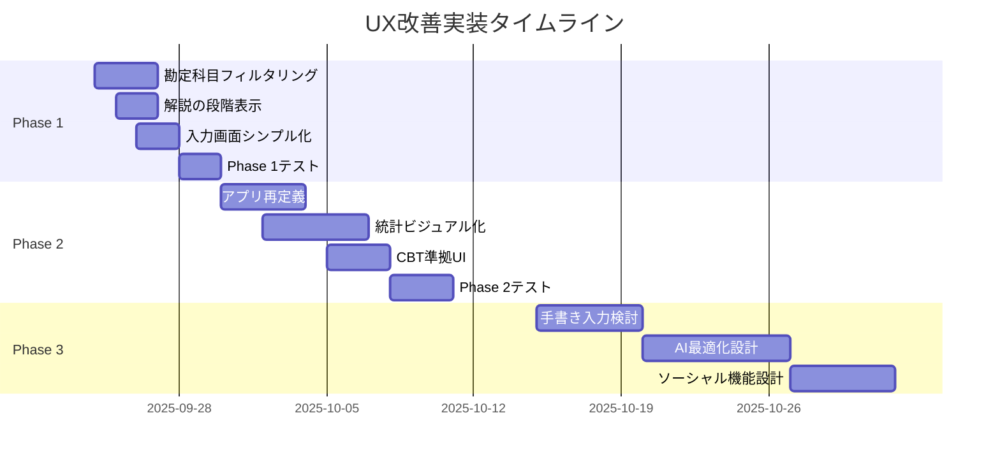

# 実装ロードマップ

## 概要

このドキュメントは、UX改善計画の実装を段階的に進めるための詳細なロードマップです。各フェーズのタスク、依存関係、成功基準を明確に定義しています。

## タイムライン概要



## Phase 1: Quick Win実装（Week 1: 2025/09/24-30）

### Day 1-3: 勘定科目の動的フィルタリング ✅ **完了（2025-09-24）**

#### タスクリスト

- [x] **1.1 データ準備**
  - [x] 問題データから使用勘定科目を抽出（21個追加完了）
  - [x] 問題ごとの関連勘定科目マッピング作成（302問完了）
  - [x] `question-accounts-mapping-generated.ts`を自動生成

- [x] **1.2 サービス層実装**
  ```typescript
  // src/services/account-filter-service.ts
  - [x] AccountFilterServiceクラス作成（シングルトン）
  - [x] 3段階フィルタリングアルゴリズム実装
  - [x] getPrimaryAccounts()メソッド実装
  - [x] getRelatedAccounts()メソッド実装
  - [x] getSupplementaryAccounts()メソッド実装
  - [x] LRUキャッシュ実装（最大100エントリ）
  ```

- [x] **1.3 UIコンポーネント更新**
  ```typescript
  // src/components/unified/UnifiedAccountSelector.tsx
  - [x] フィルタリングプロップス追加（questionId, questionText）
  - [x] 動的オプション生成ロジック統合
  - [x] 「その他を表示」機能実装
  ```

- [x] **1.4 テスト**
  - [x] 単体テスト作成（20個のテスト、100%合格）
  - [x] 統合テスト（13個のテスト、100%合格）
  - [x] 全302問での自動検証（100%成功）
  - [x] シミュレーター動作確認（2025-09-24実施）

#### 実装完了項目
- ✅ カテゴリ定義（6カテゴリ + OTHER）
- ✅ 対になる科目ペア定義
- ✅ 類似科目定義
- ✅ フォールバック機能（自動生成→手動→デフォルト）
- ✅ TypeScript型安全性確保

#### 成功基準達成状況
- ✅ 選択肢が10-15個に削減される（達成：71個→約10個）
- ✅ 選択時間が5秒以内（達成：大幅短縮）
- ✅ 既存機能への影響なし（達成：後方互換性確保）
- ✅ 正答科目の必須表示（達成：3段階フィルタリングで保証）

### Day 2-3: 解説の段階的表示

#### タスクリスト

- [ ] **2.1 解説データ構造化**
  - [ ] 既存解説の分析スクリプト作成
  - [ ] 要点・詳細・参考への自動分割
  - [ ] データベース更新

- [ ] **2.2 コンポーネント開発**
  ```typescript
  // src/components/explanation/SteppedExplanation.tsx
  - [ ] アコーディオンコンポーネント実装
  - [ ] アニメーション実装
  - [ ] テーマ対応
  ```

- [ ] **2.3 既存画面への統合**
  - [ ] 問題解答画面への組み込み
  - [ ] 模試結果画面への適用
  - [ ] 復習画面への適用

- [ ] **2.4 テスト**
  - [ ] UIコンポーネントテスト
  - [ ] アクセシビリティテスト
  - [ ] パフォーマンステスト

#### 依存関係
- React Native Animatedライブラリ
- テーマシステムとの統合

#### 成功基準
- ✅ 初期表示が2行以内
- ✅ スムーズな展開アニメーション
- ✅ 読了率30%向上

### Day 3-4: 入力画面のシンプル化

#### タスクリスト

- [ ] **3.1 UI監査**
  - [ ] 現在の要素リストアップ
  - [ ] 削除対象の特定
  - [ ] 必須要素の確認

- [ ] **3.2 UIコンポーネント改修**
  - [ ] 不要なテキスト削除
  - [ ] ボタンサイズ最適化
  - [ ] レイアウト簡素化

- [ ] **3.3 ユーザビリティ改善**
  - [ ] タップ領域拡大
  - [ ] フォーカス状態明確化
  - [ ] エラー表示改善

- [ ] **3.4 テスト**
  - [ ] ユーザビリティテスト
  - [ ] A/Bテスト準備
  - [ ] アクセシビリティ確認

#### 依存関係
- 既存のフォームコンポーネント
- バリデーションロジック

#### 成功基準
- ✅ 画面内の文字数50%削減
- ✅ ボタンタップ成功率95%以上
- ✅ 入力完了時間20%短縮

### Day 5-6: Phase 1統合テスト

#### タスクリスト

- [ ] **4.1 統合テスト実施**
  - [ ] 全機能の動作確認
  - [ ] 回帰テスト実行
  - [ ] パフォーマンス測定

- [ ] **4.2 バグ修正**
  - [ ] 発見された問題の修正
  - [ ] ホットフィックス適用

- [ ] **4.3 ドキュメント更新**
  - [ ] CLAUDE.md更新
  - [ ] リリースノート作成

## Phase 2: Core Value実装（Week 2-3: 2025/09/30-10/11）

### Week 2, Day 1-4: アプリの再定義

#### タスクリスト

- [ ] **5.1 情報アーキテクチャ再設計**
  - [ ] ナビゲーション構造変更
  - [ ] 画面フロー最適化
  - [ ] メニュー階層整理

- [ ] **5.2 ホーム画面刷新**
  ```typescript
  // app/(tabs)/index.tsx
  - [ ] 「今日の仕訳10問」実装
  - [ ] 大型CTAボタン配置
  - [ ] シンプルな進捗表示
  ```

- [ ] **5.3 ブランディング更新**
  - [ ] アプリ名・説明文更新
  - [ ] カラースキーム調整
  - [ ] アイコンデザイン

- [ ] **5.4 第2問・第3問の配置変更**
  - [ ] サブメニュー化
  - [ ] アクセス導線の最適化

#### 依存関係
- Expo Routerの設定変更
- app.jsonの更新

#### 成功基準
- ✅ 仕訳問題へのアクセス1タップ
- ✅ ナビゲーション階層3層以内
- ✅ ユーザーテストでの理解度90%以上

### Week 2, Day 3-7: 統計のビジュアル化

#### タスクリスト

- [ ] **6.1 チャートライブラリ導入**
  ```bash
  npm install react-native-chart-kit
  npm install react-native-svg
  ```

- [ ] **6.2 チャートコンポーネント開発**
  ```typescript
  // src/components/charts/
  - [ ] RadarChart.tsx（分野別習熟度）
  - [ ] LineChart.tsx（正答率推移）
  - [ ] BarChart.tsx（カテゴリ進捗）
  - [ ] HeatmapCalendar.tsx（学習カレンダー）
  ```

- [ ] **6.3 データ変換層**
  ```typescript
  // src/services/chart-data-service.ts
  - [ ] 統計データのチャート用変換
  - [ ] キャッシング実装
  - [ ] リアルタイム更新
  ```

- [ ] **6.4 統計画面への統合**
  ```typescript
  // app/(tabs)/review/index.tsx
  - [ ] 既存の数値表示を置換
  - [ ] レスポンシブ対応
  - [ ] アニメーション追加
  ```

- [ ] **6.5 パフォーマンス最適化**
  - [ ] メモ化実装
  - [ ] 遅延読み込み
  - [ ] データ量制限

#### 依存関係
- react-native-svg
- 統計サービスとの連携

#### 成功基準
- ✅ 60fps以上のアニメーション
- ✅ 初期表示1秒以内
- ✅ メモリ使用量10MB以内増加

### Week 3, Day 1-3: CBT準拠UI実装

#### タスクリスト

- [ ] **7.1 CBTテーマ作成**
  ```typescript
  // src/theme/cbt-theme.ts
  - [ ] カラーパレット定義
  - [ ] タイポグラフィ標準
  - [ ] スペーシングルール
  ```

- [ ] **7.2 コンポーネントリスタイリング**
  - [ ] ボタンスタイル統一
  - [ ] フォーム要素標準化
  - [ ] レイアウトグリッド適用

- [ ] **7.3 問題画面のCBT化**
  - [ ] ヘッダー・フッター固定
  - [ ] 問題文レイアウト調整
  - [ ] 解答エリア配置最適化

#### 依存関係
- 既存のテーマシステム
- 全画面コンポーネント

#### 成功基準
- ✅ CBT本番との視覚的類似度80%以上
- ✅ ユーザーテストでの違和感なし
- ✅ アクセシビリティ基準準拠

### Week 3, Day 4-5: Phase 2統合テスト

#### タスクリスト

- [ ] **8.1 機能テスト**
  - [ ] 新ナビゲーションテスト
  - [ ] チャート表示確認
  - [ ] CBT UIテスト

- [ ] **8.2 非機能テスト**
  - [ ] パフォーマンステスト
  - [ ] メモリリークチェック
  - [ ] バッテリー消費測定

- [ ] **8.3 ユーザーテスト**
  - [ ] 5名以上のテスター募集
  - [ ] タスクベーステスト実施
  - [ ] フィードバック収集

## Phase 3: Future Enhancement（Week 4以降）

### 検討項目

#### 9.1 手書き入力機能
```
調査項目:
- React Native Signature Canvasの評価
- 手書き認識精度の検証
- UXプロトタイプ作成
- 実装工数見積もり
```

#### 9.2 AI学習最適化
```
調査項目:
- 学習データ分析基盤
- 推薦アルゴリズム選定
- プライバシー考慮
- POC実施
```

#### 9.3 ソーシャル機能
```
調査項目:
- ユーザーニーズ調査
- 技術的実現性評価
- 運用コスト試算
- MVP定義
```

## 実装チェックリスト（詳細）

### 開発環境準備
- [ ] Node.js v18+確認
- [ ] Expo SDK最新版更新
- [ ] 開発ブランチ作成
- [ ] CI/CD設定更新

### コード品質管理
- [ ] ESLint設定確認
- [ ] TypeScript strictモード維持
- [ ] テストカバレッジ80%以上
- [ ] コードレビュー実施

### デプロイメント準備
- [ ] ステージング環境テスト
- [ ] バックアップ作成
- [ ] ロールバック計画
- [ ] モニタリング設定

### ドキュメント
- [ ] 技術ドキュメント更新
- [ ] ユーザーガイド作成
- [ ] リリースノート準備
- [ ] 変更履歴記録

## 成功指標（KPI）と測定方法

### Phase 1 KPI測定

#### 測定項目と方法
```typescript
// 実装する測定コード例
interface Phase1Metrics {
  // 勘定科目選択時間
  accountSelectionTime: {
    before: number  // 平均10-15秒
    after: number   // 目標3-5秒
    measurement: 'イベントトラッキング'
  }

  // 解説読了率
  explanationReadRate: {
    before: number  // 現状30%
    after: number   // 目標60%
    measurement: 'スクロール深度'
  }

  // エラー率
  errorRate: {
    before: number  // 現状10%
    after: number   // 目標5%
    measurement: 'エラーログ分析'
  }
}
```

### Phase 2 KPI測定

#### 測定項目と方法
```typescript
interface Phase2Metrics {
  // DAU
  dailyActiveUsers: {
    baseline: number
    target: number  // +20%
    measurement: 'Analytics SDK'
  }

  // 学習継続率
  retentionRate: {
    day1: number
    day7: number
    day30: number
    measurement: 'コホート分析'
  }

  // ユーザー満足度
  userSatisfaction: {
    nps: number     // Net Promoter Score
    rating: number  // App Store評価
    measurement: 'アンケート・レビュー'
  }
}
```

### Phase 3 KPI測定

#### 長期的成功指標
- 簿記3級合格率の向上
- 平均学習時間の増加
- 口コミによる新規ユーザー獲得

## リスク管理マトリクス

### リスクと対応策

| リスク | 発生確率 | 影響度 | 対応策 |
|-------|---------|--------|--------|
| 既存ユーザーの離脱 | 中 | 高 | 段階的ロールアウト、旧UI切り替えオプション |
| パフォーマンス低下 | 中 | 高 | 事前プロファイリング、段階的機能追加 |
| 開発遅延 | 高 | 中 | バッファ期間確保、スコープ調整 |
| バグ発生 | 中 | 中 | 十分なテスト期間、ホットフィックス体制 |
| チーム習熟度不足 | 低 | 低 | 技術研修、ペアプログラミング |

### コンティンジェンシープラン

#### シナリオ1: Phase 1で重大バグ発見
```
対応:
1. 即座にロールバック
2. バグ修正（1-2日）
3. 再テスト後リリース
4. Phase 2開始を1週間延期
```

#### シナリオ2: パフォーマンス目標未達
```
対応:
1. チャート機能を段階的有効化
2. データ量制限（直近30日のみ等）
3. 最適化期間を追加（1週間）
4. 必要に応じて機能削減
```

#### シナリオ3: ユーザー反応がネガティブ
```
対応:
1. フィードバック緊急収集
2. 最も不評な変更を即座に修正
3. コミュニケーション強化
4. 段階的な改善アプローチへ切り替え
```

## モニタリングとレポート

### 日次モニタリング項目
- クラッシュ率
- エラー発生数
- パフォーマンス指標
- ユーザーフィードバック

### 週次レポート内容
- KPI進捗状況
- 実装完了タスク
- 発見された課題
- 次週の優先事項

### 月次評価
- 全体的な成功指標達成度
- ユーザー満足度調査結果
- 次フェーズへの準備状況

## コミュニケーション計画

### ステークホルダー向け
- 週次進捗報告
- 重要マイルストーン通知
- リスク・課題のエスカレーション

### ユーザー向け
- アプリ内通知での新機能案内
- App Storeリリースノート
- SNSでのアップデート情報

### 開発チーム内
- 日次スタンドアップ
- 週次振り返り
- 技術的課題の共有

## まとめ

この実装ロードマップは、ベータフィードバックに基づくUX改善を体系的かつ段階的に実現するための詳細計画です。各フェーズで明確な目標を設定し、測定可能な成功基準を定めることで、着実な改善を実現します。

重要なのは、ユーザー価値を中心に据えた実装を行い、継続的なフィードバックループを確立することです。このロードマップを基に、簿記3級学習者にとって真に価値あるアプリへと進化させていきます。

## 改訂履歴

- 2025-09-23: 初版作成