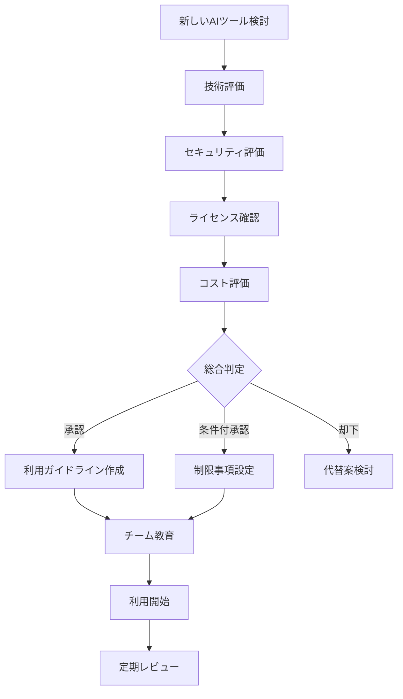
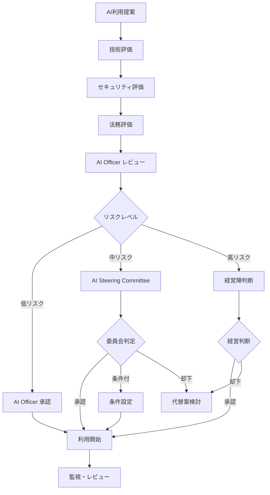

# AI支援開発ポリシー

## 1. ポリシー概要

### 1.1 目的
簿記3級問題集アプリの開発において、AI技術（生成AI、コード支援AI等）を安全かつ効果的に活用するためのガイドラインを定める。

### 1.2 適用範囲
- アプリケーション開発のすべてのフェーズ
- コード生成・レビュー・テスト・ドキュメント作成
- 開発チーム全員の AI ツール利用
- 第三者開発パートナーとの AI 利用協定

### 1.3 基本原則
- **品質第一**: AI支援による品質向上、品質低下の回避
- **透明性**: AI利用の明確な記録・開示
- **責任明確化**: 最終的な責任は人間の開発者が負う
- **セキュリティ**: 機密情報・個人情報の適切な保護
- **継続学習**: AI技術の進歩に応じた適応・改善

## 2. AI ツール分類・利用基準

### 2.1 承認済み AI ツール

#### 2.1.1 コード生成・支援ツール
```typescript
// 承認済みAIツール一覧
interface ApprovedAITools {
  codeGeneration: {
    'GitHub Copilot': {
      purpose: 'コード補完・生成支援'
      approvalLevel: 'full'
      restrictions: ['機密データ入力禁止', 'レビュー必須']
      license: 'enterprise'
    }
    
    'Claude Code': {
      purpose: 'コード解析・改善提案'
      approvalLevel: 'full'
      restrictions: ['個人情報入力禁止', 'アーキテクチャ判断は人間']
      license: 'pro'
    }
    
    'ChatGPT': {
      purpose: '設計・アルゴリズム相談'
      approvalLevel: 'conditional'
      restrictions: ['コード投稿禁止', '概念レベルのみ']
      license: 'plus'
    }
  }
  
  documentation: {
    'Claude': {
      purpose: 'ドキュメント作成・校正'
      approvalLevel: 'full'
      restrictions: ['機密情報除外', '事実確認必須']
      license: 'pro'
    }
  }
  
  testing: {
    'TestGPT': {
      purpose: 'テストケース生成'
      approvalLevel: 'conditional'
      restrictions: ['実データ使用禁止', 'レビュー必須']
      license: 'enterprise'
    }
  }
}
```

#### 2.1.2 利用承認プロセス


### 2.2 禁止・制限事項

#### 2.2.1 禁止事項
```typescript
// AI利用禁止事項
interface AIUsageProhibitions {
  dataInput: [
    '実際のユーザーデータ',
    '個人識別可能情報',
    'API キー・パスワード',
    '企業機密情報',
    'ライセンス情報'
  ]
  
  codeSharing: [
    '完全なソースコード',
    'セキュリティ関連コード',
    'データベーススキーマ',
    '暗号化実装',
    'ビジネスロジック詳細'
  ]
  
  decisions: [
    'アーキテクチャ決定の完全委任',
    'セキュリティ設計の自動化',
    'リリース判定の自動化',
    '法的判断の委任'
  ]
  
  output: [
    'AIが生成したコードの無審査利用',
    'AI推奨事項の無批判的採用',
    'AI生成文書の無確認公開',
    'ライセンス不明コードの利用'
  ]
}
```

#### 2.2.2 制限事項
```typescript
// AI利用制限事項
interface AIUsageRestrictions {
  codeGeneration: {
    maxPercentage: '30%'  // AI生成コードは全体の30%まで
    reviewRequired: true   // 必ずレビュー必須
    testingRequired: true  // 十分なテストが必要
    documentation: true    // AI利用の明記必要
  }
  
  architecturalDecisions: {
    consultationOnly: true  // 相談のみ、決定は人間
    finalApproval: 'human'  // 最終承認は人間
    documentation: 'required'  // 判断過程の記録必須
  }
  
  securityCode: {
    prohibition: 'full'     // セキュリティコードのAI生成禁止
    reviewLevel: 'expert'   // 専門家レビュー必須
    auditTrail: true       // 監査証跡必須
  }
}
```

## 3. AI 支援開発プロセス

### 3.1 開発フェーズ別 AI 活用

#### 3.1.1 要件定義・設計フェーズ
```typescript
// 設計フェーズでのAI活用
interface DesignPhaseAI {
  requirements: {
    analysis: 'AIによる要件分析支援'
    validation: '要件の一貫性チェック'
    alternatives: '代替案の提案・評価'
    risks: 'リスク要因の洗い出し支援'
  }
  
  architecture: {
    consultation: 'アーキテクチャパターンの相談'
    tradeoffAnalysis: 'トレードオフ分析支援'
    bestPractices: 'ベストプラクティス提案'
    documentation: '設計書の品質向上支援'
  }
  
  limitations: {
    finalDecision: '最終決定は人間が実施'
    contextUnderstanding: 'ビジネス文脈は人間が提供'
    stakeholderAlignment: 'ステークホルダー調整は人間'
  }
}
```

#### 3.1.2 実装フェーズ
```typescript
// 実装フェーズでのAI活用
interface ImplementationPhaseAI {
  codeGeneration: {
    boilerplate: 'ボイラープレートコードの生成'
    utilities: 'ユーティリティ関数の実装支援'
    testCases: 'テストケースの生成'
    documentation: 'コードコメント・JSDoc生成'
  }
  
  codeQuality: {
    refactoring: 'リファクタリング提案'
    optimization: 'パフォーマンス改善提案'
    patterns: 'デザインパターン適用支援'
    standards: 'コーディング規約チェック'
  }
  
  qualityGates: {
    humanReview: '人間による必須レビュー'
    testing: '十分なテストカバレッジ'
    integration: '結合テストでの動作確認'
    performance: 'パフォーマンステスト実行'
  }
}
```

#### 3.1.3 テスト・QAフェーズ
```typescript
// テストフェーズでのAI活用
interface TestingPhaseAI {
  testGeneration: {
    unitTests: '単体テストケース生成'
    integrationTests: '結合テストシナリオ作成'
    edgeCases: 'エッジケースの特定・テスト'
    mockData: 'テストデータ生成'
  }
  
  qualityAssurance: {
    codeReview: 'コードレビュー支援'
    bugDetection: '潜在的バグの検出'
    securityCheck: 'セキュリティ問題の確認'
    performanceAnalysis: 'パフォーマンス分析'
  }
  
  validation: {
    humanVerification: 'テスト結果の人間による検証'
    riskAssessment: 'リスク評価は人間が実施'
    releaseDecision: 'リリース判定は人間が決定'
  }
}
```

### 3.2 品質保証プロセス

#### 3.2.1 AI生成コードの品質管理
```typescript
// AI生成コード品質管理
interface AICodeQualityManagement {
  identification: {
    tagging: 'AI生成コードのタグ付け必須'
    documentation: '生成経緯の文書化'
    toolInfo: '使用AIツール・バージョンの記録'
    promptInfo: 'プロンプト内容の記録（適切な場合）'
  }
  
  review: {
    mandatoryReview: '必須人間レビュー'
    reviewCriteria: [
      '機能的正確性',
      'セキュリティ安全性',
      'パフォーマンス効率性',
      '保守性・可読性',
      'チーム標準遵守'
    ]
    approvalRequired: '2名以上の承認必須'
  }
  
  testing: {
    enhancedTesting: 'AI生成コードの強化テスト'
    coverageRequirement: '95%以上のテストカバレッジ'
    securityTesting: 'セキュリティテスト必須'
    performanceTesting: 'パフォーマンステスト必須'
  }
  
  monitoring: {
    runtimeMonitoring: '実行時動作監視'
    errorTracking: 'エラー発生状況追跡'
    performanceTracking: 'パフォーマンス追跡'
    userImpactAssessment: 'ユーザー影響評価'
  }
}
```

#### 3.2.2 継続的改善プロセス
```bash
#!/bin/bash
# ai_code_quality_check.sh

ai_code_quality_review() {
    echo "=== AI生成コード品質レビュー ==="
    
    # 1. AI生成コードの特定
    echo "1. AI生成コード特定"
    grep -r "AI-GENERATED" src/ --include="*.ts" --include="*.tsx" > ai_generated_files.txt
    
    # 2. コード品質メトリクス計測
    echo "2. 品質メトリクス計測"
    npx eslint --format json src/ > eslint_results.json
    npx tsc --noEmit --pretty false 2> type_errors.txt
    
    # 3. テストカバレッジ確認
    echo "3. テストカバレッジ確認"
    npm run test:coverage > coverage_report.txt
    
    # 4. パフォーマンステスト
    echo "4. パフォーマンステスト"
    npm run test:performance > performance_results.txt
    
    # 5. セキュリティスキャン
    echo "5. セキュリティスキャン"
    npm audit --json > security_audit.json
    
    # 6. 結果レポート生成
    echo "6. AI品質レポート生成"
    node scripts/generate_ai_quality_report.js
    
    echo "AI生成コード品質レビュー完了"
}

# AI利用統計の収集
collect_ai_usage_stats() {
    echo "AI利用統計収集"
    
    # コミットメッセージからAI利用を検出
    git log --grep="AI-ASSISTED" --oneline > ai_commits.txt
    
    # AI生成コードの行数カウント
    ai_lines=$(grep -r "AI-GENERATED" src/ | wc -l)
    total_lines=$(find src/ -name "*.ts" -o -name "*.tsx" | xargs wc -l | tail -1 | awk '{print $1}')
    
    ai_percentage=$(echo "scale=2; $ai_lines * 100 / $total_lines" | bc)
    
    echo "AI生成コード比率: ${ai_percentage}%"
    echo "制限値（30%）以下: $([ $ai_percentage -lt 30 ] && echo "OK" || echo "NG")"
}

# AI生成コードライセンスチェック自動化
ai_license_compliance_check() {
    echo "=== AI生成コード ライセンス適合性チェック ==="
    
    # 1. AI生成コード特定
    echo "1. AI生成コード特定中..."
    find src/ -name "*.ts" -o -name "*.tsx" | xargs grep -l "AI-GENERATED" > ai_generated_files.txt
    
    # 2. ライセンススキャン実行
    echo "2. ライセンススキャン実行中..."
    if command -v scancode-toolkit &> /dev/null; then
        scancode-toolkit --license --copyright --format json-pp \
            --output license_scan_results.json \
            $(cat ai_generated_files.txt | tr '\n' ' ')
    else
        echo "Warning: scancode-toolkit not installed. Using npm license-checker as fallback."
        npm run license-check > license_check.txt
    fi
    
    # 3. 禁止ライセンスチェック
    echo "3. 禁止ライセンス検出チェック..."
    prohibited_licenses=("GPL-3.0" "AGPL-3.0" "SSPL-1.0" "GPL-2.0+")
    violations=0
    
    for license in "${prohibited_licenses[@]}"; do
        if grep -q "$license" license_scan_results.json 2>/dev/null; then
            echo "🚨 VIOLATION: Prohibited license detected: $license"
            violations=$((violations + 1))
        fi
    done
    
    # 4. コード類似性チェック
    echo "4. OSS類似性チェック実行中..."
    check_code_similarity() {
        # GitHub Code Search APIを使用した類似性チェック（実装例）
        for file in $(cat ai_generated_files.txt); do
            if [ -f "$file" ]; then
                echo "Checking similarity for: $file"
                # 実際の実装では、コードハッシュやAST比較を行う
                similarity_score=$(calculate_similarity "$file")
                if [ "$similarity_score" -gt 80 ]; then
                    echo "⚠️  High similarity detected: $file (${similarity_score}%)"
                fi
            fi
        done
    }
    
    # 5. ライセンス互換性チェック
    echo "5. ライセンス互換性評価..."
    check_license_compatibility() {
        approved_licenses=("MIT" "Apache-2.0" "BSD-3-Clause" "ISC" "0BSD")
        
        if [ -f "license_scan_results.json" ]; then
            detected_licenses=$(jq -r '.files[].licenses[].key' license_scan_results.json 2>/dev/null | sort -u)
            
            for license in $detected_licenses; do
                if [[ " ${approved_licenses[@]} " =~ " ${license} " ]]; then
                    echo "✅ Approved license: $license"
                else
                    echo "⚠️  Requires review: $license"
                fi
            done
        fi
    }
    
    check_license_compatibility
    
    # 6. 結果レポート生成
    echo "6. ライセンス適合性レポート生成..."
    cat > license_compliance_report.md << EOF
# AI生成コード ライセンス適合性レポート

**実行日時**: $(date)
**スキャン対象**: $(wc -l < ai_generated_files.txt) files

## 検出結果

### 禁止ライセンス違反
- 違反件数: $violations

### 類似性チェック結果
$(check_code_similarity 2>&1)

### ライセンス互換性
$(check_license_compatibility 2>&1)

## 推奨アクション
EOF

    if [ $violations -gt 0 ]; then
        echo "- 🚨 CRITICAL: 禁止ライセンス違反を即座に修正してください" >> license_compliance_report.md
        echo "- 問題のあるコードを隔離し、代替実装を検討してください" >> license_compliance_report.md
        exit 1
    else
        echo "- ✅ ライセンス適合性チェック完了" >> license_compliance_report.md
    fi
    
    echo "ライセンス適合性チェック完了: license_compliance_report.md を確認してください"
}

# コード類似性計算（実装例）
calculate_similarity() {
    local file="$1"
    # 実装例: ハッシュベースの類似性計算
    # 実際の実装では、より高度なAST解析や機械学習モデルを使用
    echo "0" # プレースホルダー値
}
```

## 4. セキュリティ・プライバシー保護

### 4.1 機密情報保護

#### 4.1.1 データ分類・保護レベル
```typescript
// AI利用時のデータ分類
interface AIDataClassification {
  publicData: {
    description: '公開可能な情報'
    aiUsage: '制限なく利用可能'
    examples: ['公開API仕様', '一般的なアルゴリズム', '学習コンテンツ']
  }
  
  internalData: {
    description: '社内情報'
    aiUsage: '承認済みAIツールのみ'
    examples: ['設計書', '開発手順', 'テスト戦略']
    restrictions: ['具体的実装詳細は除外']
  }
  
  sensitiveData: {
    description: '機密情報'
    aiUsage: '制限付き利用'
    examples: ['ビジネスロジック', 'データスキーマ', 'セキュリティ設計']
    restrictions: ['概念レベルのみ', '具体的コード禁止']
  }
  
  restrictedData: {
    description: '利用禁止情報'
    aiUsage: '完全禁止'
    examples: ['認証情報', '個人データ', 'ライセンスキー', '実装詳細']
    rationale: 'プライバシー・セキュリティリスク'
  }
}
```

#### 4.1.2 データ漏洩防止策
```typescript
// データ漏洩防止機能
interface DataLeakPrevention {
  technicalControls: {
    inputFiltering: {
      implementation: '機密データ検出・ブロック機能'
      patterns: [
        'API キー・トークン',
        'パスワード・シークレット',
        '個人識別情報',
        'ライセンス情報'
      ]
      tools: ['git-secrets', 'detect-secrets', 'custom-filters']
    }
    
    outputValidation: {
      implementation: 'AI生成内容の自動検証'
      checks: [
        'ライセンス情報の確認',
        '機密情報の検出',
        '著作権侵害の確認',
        'セキュリティリスクの評価'
      ]
    }
  }
  
  processControls: {
    accessControl: '承認済みツールのみ利用許可'
    auditLogging: 'AI利用の詳細ログ記録'
    regularReview: '定期的な利用状況レビュー'
    incidentResponse: 'データ漏洩時の対応手順'
  }
  
  educationalControls: {
    trainingProgram: 'AI安全利用教育プログラム'
    guidelines: '具体的利用ガイドライン'
    bestPractices: 'ベストプラクティス共有'
    warningSystem: 'リスク警告システム'
  }
}
```

### 4.2 知的財産権保護

#### 4.2.1 著作権・ライセンス管理
```typescript
// AI生成コンテンツの知的財産管理
interface AIIntellectualProperty {
  ownershipPolicy: {
    principle: '生成されたコードの所有権は当社に帰属'
    conditions: [
      'オリジナルプロンプトによる生成',
      '著作権侵害のないことの確認',
      '適切なライセンス遵守'
    ]
    exceptions: '既存著作物の複製・派生は除外'
  }
  
  licenseCompliance: {
    verification: 'AI生成コードのライセンス確認'
    tools: ['license-checker', 'fossa', 'black-duck', 'scancode-toolkit']
    process: [
      '生成コードの類似性チェック',
      'オープンソースライセンス確認',
      '商用利用可能性の検証',
      'ライセンス条件の遵守確認'
    ]
    automated: true
    frequency: 'コミット毎 + 日次バッチ'
  }
  
  // 自動ライセンスチェック実装
  automatedLicenseCheck: {
    implementation: {
      preCommitHook: {
        tool: 'custom-license-scanner'
        action: '生成コードのライセンス事前チェック'
        threshold: 'similarity > 80% で警告'
        blocking: true
      }
      
      cicdIntegration: {
        tool: 'license-compliance-action'
        action: 'ビルド時の包括的ライセンススキャン'  
        reportFormat: 'SPDX標準形式'
        failureCondition: 'GPL/AGPL系ライセンス検出時'
      }
      
      dependencyCheck: {
        tool: 'npm audit + custom scanner'
        action: '依存関係のライセンス適合性確認'
        whitelist: ['MIT', 'Apache-2.0', 'BSD-3-Clause', 'ISC']
        blacklist: ['GPL-3.0', 'AGPL-3.0', 'SSPL-1.0']
      }
    }
    
    detection: {
      codeFingerprinting: {
        algorithm: 'SHA-256 + AST構造解析'
        database: 'OSS コードベース指紋データベース'
        threshold: '類似度80%以上で詳細調査'
      }
      
      patternMatching: {
        method: '正規表現 + 機械学習分類'
        patterns: [
          'ライセンス表示文言',
          '著作権表示パターン',
          'GPL系コピーレフト条項',
          '特許関連条項'
        ]
      }
      
      semanticAnalysis: {
        method: 'コード意味解析による類似判定'
        scope: '関数・クラス・アルゴリズム単位'
        confidence: '90%以上で人的レビュー必須'
      }
    }
  }
  
  riskMitigation: {
    originality: 'オリジナリティの確保・検証'
    attribution: '適切な帰属表示（必要に応じて）'
    documentation: 'AI利用履歴の詳細記録'
    legal: '法的リスクの定期的評価'
  }
  
  // OSS利用時の法的リスク軽減策
  ossRiskMitigation: {
    licenseCompatibility: {
      assessment: {
        method: 'ライセンス互換性マトリクス評価'
        tools: ['license-compatibility-checker', 'fossa-cli']
        criteria: [
          'コピーレフト条項の影響範囲',
          '商用利用制限の有無',
          '特許関連条項の確認',
          '再配布条件の適合性'
        ]
        documentation: '互換性評価結果の文書化必須'
      }
      
      approval: {
        lowRisk: '自動承認（MIT, Apache-2.0, BSD等）'
        mediumRisk: 'AI Officer承認（LGPL, MPL等）'
        highRisk: '法務部門承認（GPL系, AGPL等）'
        prohibited: '利用禁止（SSPL, 独自制限ライセンス）'
      }
    }
    
    dueDiligence: {
      originVerification: {
        process: '生成コードの出典調査'
        tools: ['code-similarity-scanner', 'sourcegraph']
        threshold: '類似度70%以上で詳細調査'
        documentation: '調査結果の記録・保存'
      }
      
      legalClearing: {
        process: '法的クリアランス手続き'
        conditions: [
          '類似度90%以上のコード',
          'GLP系ライセンス関連コード',
          '特許関連技術の実装',
          '商用利用制限のあるコード'
        ]
        timeline: '最大5営業日以内'
        escalation: '法務担当→外部法律事務所'
      }
    }
    
    complianceMonitoring: {
      continuousScanning: {
        frequency: '日次自動スキャン'
        scope: '全ソースコード + 依存関係'
        alerts: 'ライセンス変更・新規検出時'
        dashboard: 'コンプライアンスダッシュボード'
      }
      
      reportingWorkflow: {
        weeklyReport: 'ライセンス利用状況サマリ'
        monthlyAudit: '詳細コンプライアンス監査'
        quarterlyReview: '法的リスク評価・戦略見直し'
        annualAssessment: '外部監査・認証取得'
      }
    }
    
    incidentResponse: {
      violationDetection: {
        triggers: [
          'ライセンス違反の自動検出',
          '第三者からの指摘・クレーム',
          '社内監査での発見',
          '外部監査での指摘'
        ]
        initialResponse: '24時間以内の初期対応'
      }
      
      remediationProcess: {
        immediate: [
          '問題コードの即座隔離',
          '影響範囲の緊急評価',
          'ステークホルダーへの通知',
          '一時的な利用停止'
        ]
        investigation: [
          '詳細な法的分析',
          '損害・リスクの評価',
          '代替案の検討',
          '和解・対応策の立案'
        ]
        resolution: [
          'ライセンス遵守への修正',
          '適切な帰属表示の追加',
          '必要に応じた補償・対応',
          '再発防止策の実装'
        ]
      }
    }
  }
}
```

## 5. ガバナンス・責任体制

### 5.1 役割・責任分担

#### 5.1.1 AI ガバナンス体制
```typescript
// AI利用ガバナンス体制
interface AIGovernanceStructure {
  aiSteeringCommittee: {
    members: ['CTO', 'セキュリティ責任者', '法務担当', '開発リーダー']
    responsibilities: [
      'AI利用戦略の策定',
      'ポリシー・ガイドラインの承認',
      'リスク評価・対策の決定',
      '重大問題の意思決定'
    ]
    meetingFrequency: '月次'
  }
  
  aiOfficer: {
    role: 'AI利用責任者'
    responsibilities: [
      '日常的なAI利用管理',
      'ツール評価・導入管理',
      'チーム教育・サポート',
      'インシデント対応'
    ]
    reportingTo: 'CTO'
  }
  
  developmentTeam: {
    responsibilities: [
      'ガイドラインの遵守',
      'AI利用状況の記録',
      '品質確保・レビュー',
      '問題の報告・エスカレーション'
    ]
    training: '定期的なAI利用研修'
  }
  
  legalCompliance: {
    responsibilities: [
      '法的リスクの評価',
      'ライセンス・著作権の確認',
      'コンプライアンス監査',
      '外部法的相談の調整'
    ]
    consultation: 'AI利用時の法的アドバイス'
  }
}
```

#### 5.1.2 意思決定プロセス


### 5.2 監査・コンプライアンス

#### 5.2.1 内部監査プロセス
```typescript
// AI利用監査プロセス
interface AIAuditProcess {
  monthlyReview: {
    scope: 'AI利用状況の確認'
    auditor: 'AI Officer'
    checkpoints: [
      'ガイドライン遵守状況',
      'セキュリティインシデント',
      '品質問題の発生',
      'コスト・効果の評価'
    ]
    deliverable: '月次AI利用レポート'
  }
  
  quarterlyAudit: {
    scope: 'AI利用プロセス・体制の評価'
    auditor: '外部監査法人'
    checkpoints: [
      'ポリシー遵守状況',
      'リスク管理体制',
      '教育・トレーニング効果',
      '法的コンプライアンス'
    ]
    deliverable: '四半期AI監査報告書'
  }
  
  annualAssessment: {
    scope: 'AI戦略・ガバナンス全体評価'
    auditor: 'AI Steering Committee'
    checkpoints: [
      '戦略目標の達成状況',
      'ROI・効果測定',
      'リスク管理の有効性',
      '業界ベストプラクティス比較'
    ]
    deliverable: '年次AI戦略評価書'
  }
}
```

#### 5.2.2 KPI・メトリクス
```typescript
// AI利用効果測定指標
interface AIUsageMetrics {
  efficiency: {
    developmentSpeed: {
      metric: '開発速度向上率'
      target: '20%以上'
      measurement: 'タスク完了時間の比較'
    }
    
    codeQuality: {
      metric: 'バグ発生率'
      target: 'AI利用前と同等以下'
      measurement: 'バグレポート数の追跡'
    }
    
    productivity: {
      metric: '開発者生産性'
      target: '15%以上向上'
      measurement: 'ストーリーポイント/スプリント'
    }
  }
  
  quality: {
    codeReview: {
      metric: 'レビューコメント数'
      target: 'AI利用前と同等以下'
      measurement: 'PR レビューデータ'
    }
    
    testCoverage: {
      metric: 'テストカバレッジ'
      target: '90%以上維持'
      measurement: '自動テストレポート'
    }
    
    performance: {
      metric: 'アプリパフォーマンス'
      target: '劣化なし'
      measurement: 'パフォーマンステスト結果'
    }
  }
  
  risks: {
    securityIncidents: {
      metric: 'AI関連セキュリティインシデント'
      target: '0件'
      measurement: 'インシデントレポート'
    }
    
    complianceViolations: {
      metric: 'コンプライアンス違反'
      target: '0件'
      measurement: '監査結果'
    }
    
    ipInfringement: {
      metric: '知的財産権侵害'
      target: '0件'
      measurement: '法的チェック結果'
    }
  }
}
```

## 6. 教育・トレーニング

### 6.1 AI リテラシー教育

#### 6.1.1 基礎教育プログラム
```typescript
// AI教育カリキュラム
interface AIEducationProgram {
  foundationCourse: {
    duration: '4時間'
    frequency: '新規参加時 + 年次更新'
    topics: [
      'AI技術の基本概念',
      'AI利用のメリット・リスク',
      '当社AI利用ポリシー',
      '著作権・知的財産権',
      'セキュリティ・プライバシー'
    ]
    assessment: '理解度テスト（85%以上で合格）'
  }
  
  practicalTraining: {
    duration: '2時間'
    frequency: '半年毎'
    topics: [
      '承認済みAIツールの使用方法',
      '効果的なプロンプト設計',
      'AI生成コードのレビュー方法',
      'セキュリティチェックポイント'
    ]
    assessment: 'ハンズオン演習'
  }
  
  advancedWorkshop: {
    duration: '1時間'
    frequency: '四半期毎'
    topics: [
      '最新AI技術トレンド',
      '新しいユースケース',
      'ベストプラクティス共有',
      '失敗事例・教訓'
    ]
    assessment: 'ディスカッション参加'
  }
}
```

#### 6.1.2 実践ガイドライン
```markdown
# AI支援開発 実践ガイド

## コード生成時のベストプラクティス

### ✅ 推奨される使い方
- 明確で具体的なプロンプトを作成する
- 小さな機能単位でAIを活用する
- 生成されたコードを必ず理解してから使用する
- 適切なテストを作成する
- コードレビューで他の開発者に確認してもらう

### ❌ 避けるべき使い方
- 理解できないコードをそのまま使用する
- 機密情報をプロンプトに含める
- AI生成コードを無批判に信頼する
- テストなしでプロダクションに投入する
- ライセンス不明のコードを使用する

## プロンプト設計のコツ

### 効果的なプロンプト例
```
TypeScriptで、SQLiteデータベースから学習履歴を取得する関数を作成してください。
- 関数名: getLearningHistory
- 引数: userId (string), limit (number)
- 戻り値: Promise<LearningHistory[]>
- エラーハンドリングを含める
- JSDocコメントを追加する
```

### 避けるべきプロンプト例
```
学習アプリのデータベース処理を全部作って
（具体性不足、範囲が広すぎる）
```

## セキュリティチェックポイント
- [ ] 生成されたコードに機密情報が含まれていないか
- [ ] SQLインジェクションなどの脆弱性がないか
- [ ] 適切な入力値検証が実装されているか
- [ ] エラーハンドリングが適切に実装されているか
- [ ] ログに機密情報が出力されないか
```

## 7. 継続的改善・アップデート

### 7.1 ポリシー見直しサイクル

#### 7.1.1 定期的レビュープロセス
```bash
#!/bin/bash
# ai_policy_review.sh

quarterly_policy_review() {
    echo "=== AI利用ポリシー四半期レビュー ==="
    
    # 1. AI技術動向調査
    echo "1. 最新AI技術動向の調査"
    curl -s "https://api.github.com/search/repositories?q=ai+assistant+coding" > ai_trends.json
    
    # 2. 利用実績・効果測定
    echo "2. AI利用実績の分析"
    analyze_ai_usage_stats
    
    # 3. インシデント・問題の分析
    echo "3. AI関連インシデントの分析"
    review_ai_incidents
    
    # 4. 法的・規制環境の変化確認
    echo "4. 法的環境変化の確認"
    check_legal_updates
    
    # 5. ポリシー更新提案の作成
    echo "5. ポリシー更新提案作成"
    generate_policy_update_proposal
    
    echo "四半期レビュー完了"
}

analyze_ai_usage_stats() {
    echo "AI利用統計分析"
    
    # 開発効率の測定
    git log --since="3 months ago" --grep="AI-ASSISTED" --oneline | wc -l
    
    # 品質メトリクスの確認
    npm run test:coverage | grep "Lines" | awk '{print $4}'
    
    # パフォーマンス影響の確認
    npm run test:performance | grep "Average" | awk '{print $3}'
}

check_legal_updates() {
    echo "法的環境変化チェック（手動確認項目）"
    echo "- AI著作権法の最新動向"
    echo "- データ保護規制の変更"
    echo "- 業界ガイドラインの更新"
    echo "- 国際的な AI 規制の動向"
}
```

#### 7.1.2 緊急時対応プロセス
```typescript
// 緊急時AI利用停止プロセス
interface EmergencyAIResponse {
  triggers: [
    '重大なセキュリティインシデント',
    '法的リスクの急激な上昇',
    'AI生成コードの重大なバグ',
    '著作権侵害の判明',
    '規制当局からの指導'
  ]
  
  immediateActions: {
    suspension: 'AI利用の即座停止',
    assessment: '影響範囲の緊急評価',
    communication: 'ステークホルダーへの通知',
    isolation: '問題のあるコードの隔離'
  }
  
  investigationProcess: {
    rootCause: '根本原因の調査',
    impact: '影響範囲の詳細分析',
    liability: '法的責任の評価',
    remediation: '修復方法の検討'
  }
  
  recoveryPlanning: {
    shortTerm: '短期的な対応策',
    longTerm: '長期的な改善策',
    prevention: '再発防止策',
    monitoring: '監視体制の強化'
  }
}
```

---

## 更新履歴

| 日付 | バージョン | 変更内容 | 更新者 |
|---|---|---|---|
| 2025-01-27 | 1.0 | 初版作成 | - |

---

**このAI支援開発ポリシーは、AI技術の急速な進歩に応じて継続的に更新します。安全で効果的なAI活用により、開発効率と品質の両立を実現していきます。**