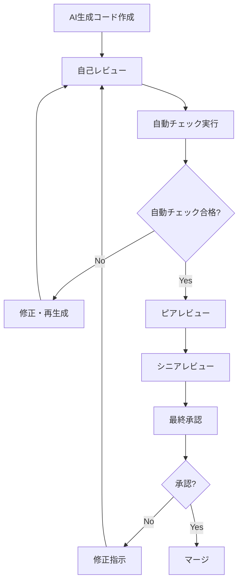

# AI生成コード レビューガイドライン

## 1. ガイドライン概要

### 1.1 目的
AI生成コードの品質・安全性・保守性を確保するため、体系的なレビュープロセスと評価基準を定める。

### 1.2 適用範囲
- すべてのAI生成コード（部分・全体問わず）
- AI支援によるリファクタリングコード
- AI生成テストコード
- AI生成ドキュメント

### 1.3 基本原則
- **品質第一**: 人間が書いたコードと同等以上の品質要求
- **安全性重視**: セキュリティ・信頼性の徹底的な検証
- **透明性**: AI利用の明確な識別・記録
- **学習機会**: レビューを通じたチーム全体のスキル向上

## 2. AI生成コードの識別・分類

### 2.1 AI生成コードの識別方法

#### 2.1.1 必須マーキング
```typescript
// AI生成コードの標準的なマーキング例

/**
 * AI-GENERATED CODE
 * Tool: GitHub Copilot
 * Prompt: "TypeScript function to calculate learning progress"
 * Generated: 2025-01-27
 * Reviewer: [担当者名]
 * Review Status: [PENDING/APPROVED/NEEDS_REVISION]
 */
export function calculateLearningProgress(
  history: LearningHistory[]
): ProgressStats {
  // AI生成による実装
  // 人間による修正・検証済み
}
```

#### 2.1.2 生成レベル分類
```typescript
// AI生成レベルの分類
enum AIGenerationLevel {
  FULL_GENERATION = 'full',      // 完全AI生成
  ASSISTED_WRITING = 'assisted', // AI支援による記述
  AI_REFACTORED = 'refactored',  // AIによるリファクタリング
  AI_OPTIMIZED = 'optimized',    // AI最適化
  HUMAN_INSPIRED = 'inspired'    // AI提案を人間が実装
}

interface AICodeMetadata {
  level: AIGenerationLevel
  tool: string
  prompt: string
  generatedAt: Date
  humanModification: boolean
  modificationDetails?: string
  reviewer: string
  reviewDate: Date
  approvalStatus: 'pending' | 'approved' | 'needs_revision' | 'rejected'
}
```

### 2.2 Git管理における識別

#### 2.2.1 コミットメッセージ規約
```bash
# AI生成コード用コミットメッセージフォーマット
git commit -m "feat: implement user progress calculation [AI-GENERATED]

- Tool: GitHub Copilot
- Generated: LearningProgressService class
- Human review: Performance optimization added
- Tests: Unit tests added and verified
- Security: Input validation implemented

Reviewed-by: [レビュワー名]"
```

#### 2.2.2 プルリクエストテンプレート
```markdown
# AI生成コード用PRテンプレート

## AI利用情報
- [ ] AI生成コードが含まれている
- 使用ツール: [GitHub Copilot/Claude/ChatGPT/etc.]
- 生成レベル: [Full/Assisted/Refactored/Optimized]
- 生成範囲: [具体的なファイル・関数名]

## 人間による検証・修正
- [ ] 機能的正確性の確認
- [ ] セキュリティレビュー完了
- [ ] パフォーマンステスト実行
- [ ] コーディング規約準拠確認
- [ ] テストカバレッジ確認
- [ ] ドキュメント更新

## レビュー観点
- [ ] AI生成コードの品質評価
- [ ] 既存コードとの整合性
- [ ] 保守性・拡張性の評価
- [ ] セキュリティリスクの評価

## 変更内容
[従来通りの変更内容記述]
```

## 3. レビュープロセス

### 3.1 多段階レビュープロセス

#### 3.1.1 レビューステージ


#### 3.1.2 レビュー担当者の役割
```typescript
// レビュー体制の定義
interface ReviewerRoles {
  author: {
    responsibilities: [
      'AI生成コードの初期検証',
      '機能要件との適合確認',
      '基本的な品質チェック',
      'セルフドキュメンテーション'
    ]
    requiredTime: '30分以内'
  }
  
  peerReviewer: {
    responsibilities: [
      'コードロジックの妥当性確認',
      'コーディング規約遵守確認',
      'テスト十分性の評価',
      '可読性・保守性の評価'
    ]
    qualifications: '同等以上の技術レベル'
    requiredTime: '45分以内'
  }
  
  seniorReviewer: {
    responsibilities: [
      'アーキテクチャ適合性の確認',
      'セキュリティリスクの評価',
      'パフォーマンス影響の評価',
      '長期保守性の判断'
    ]
    qualifications: '3年以上の経験、技術リード'
    requiredTime: '60分以内'
  }
}
```

### 3.2 自動チェック項目

#### 3.2.1 自動品質チェック
```bash
#!/bin/bash
# ai_code_quality_check.sh

ai_code_automatic_check() {
    local file_path=$1
    echo "=== AI生成コード自動チェック: $file_path ==="
    
    # 1. 構文・型チェック
    echo "1. TypeScript型チェック"
    npx tsc --noEmit "$file_path"
    
    # 2. ESLintチェック
    echo "2. ESLintチェック"
    npx eslint "$file_path" --format json > eslint_results.json
    
    # 3. セキュリティチェック
    echo "3. セキュリティスキャン"
    npx eslint "$file_path" --config .eslintrc.security.js
    
    # 4. 複雑度チェック
    echo "4. コード複雑度チェック"
    npx complexity-report --format json "$file_path" > complexity_report.json
    
    # 5. 重複コードチェック
    echo "5. 重複コードチェック"
    npx jscpd "$file_path" --format json > duplication_report.json
    
    # 6. テストカバレッジチェック
    echo "6. テストカバレッジ確認"
    npm run test:coverage -- --testNamePattern="$(basename "$file_path" .ts)"
    
    # 7. パフォーマンステスト
    echo "7. パフォーマンステスト"
    npm run test:performance -- --testNamePattern="$(basename "$file_path" .ts)"
    
    # 8. 結果レポート生成
    echo "8. 自動チェック結果統合"
    node scripts/generate_ai_code_report.js "$file_path"
    
    echo "自動チェック完了"
}

# AI生成コード特有のチェック
ai_specific_checks() {
    local file_path=$1
    
    # AI生成マーキングの確認
    if ! grep -q "AI-GENERATED" "$file_path"; then
        echo "警告: AI生成コードのマーキングがありません"
        return 1
    fi
    
    # 過度に複雑な生成コードの検出
    local complexity=$(node -e "
        const report = require('./complexity_report.json');
        console.log(report.reports[0].complexity.cyclomatic);
    ")
    
    if [ "$complexity" -gt 10 ]; then
        echo "警告: AI生成コードが過度に複雑です (複雑度: $complexity)"
        return 1
    fi
    
    # 未処理のTODOコメントチェック
    if grep -q "TODO" "$file_path"; then
        echo "警告: 未完成のTODOコメントがあります"
        return 1
    fi
    
    return 0
}
```

#### 3.2.2 セキュリティ自動チェック
```javascript
// ai_security_check.js
class AISecurityChecker {
  static securityPatterns = {
    // 危険なパターン
    dangerous: [
      /eval\(/g,
      /innerHTML\s*=/g,
      /document\.write/g,
      /setTimeout.*string/g,
      /new Function/g
    ],
    
    // 機密情報パターン
    sensitive: [
      /password\s*[:=]/gi,
      /secret\s*[:=]/gi,
      /token\s*[:=]/gi,
      /api[_-]?key\s*[:=]/gi
    ],
    
    // SQLインジェクション脆弱性
    sqli: [
      /SELECT.*\+.*\+/gi,
      /INSERT.*\+.*\+/gi,
      /UPDATE.*\+.*\+/gi,
      /DELETE.*\+.*\+/gi
    ]
  };
  
  static checkSecurityVulnerabilities(code) {
    const issues = [];
    
    // 危険なパターンチェック
    this.securityPatterns.dangerous.forEach(pattern => {
      const matches = code.match(pattern);
      if (matches) {
        issues.push({
          type: 'dangerous_pattern',
          pattern: pattern.toString(),
          matches: matches.length,
          severity: 'high'
        });
      }
    });
    
    // 機密情報チェック
    this.securityPatterns.sensitive.forEach(pattern => {
      const matches = code.match(pattern);
      if (matches) {
        issues.push({
          type: 'sensitive_data',
          pattern: pattern.toString(),
          matches: matches.length,
          severity: 'critical'
        });
      }
    });
    
    // SQLインジェクションチェック
    this.securityPatterns.sqli.forEach(pattern => {
      const matches = code.match(pattern);
      if (matches) {
        issues.push({
          type: 'sql_injection',
          pattern: pattern.toString(),
          matches: matches.length,
          severity: 'high'
        });
      }
    });
    
    return {
      totalIssues: issues.length,
      issues: issues,
      passed: issues.length === 0
    };
  }
}

module.exports = AISecurityChecker;
```

## 4. レビュー評価基準

### 4.1 機能品質評価

#### 4.1.1 機能的正確性チェックリスト
```typescript
// 機能品質評価項目
interface FunctionalQualityChecklist {
  requirements: {
    specCompliance: boolean     // 仕様書との適合
    edgeCaseHandling: boolean   // エッジケース処理
    errorHandling: boolean      // エラーハンドリング
    inputValidation: boolean    // 入力値検証
    outputCorrectness: boolean  // 出力の正確性
  }
  
  logic: {
    algorithmCorrectness: boolean  // アルゴリズムの正確性
    businessLogicAccuracy: boolean // ビジネスロジックの正確性
    dataFlowConsistency: boolean   // データフロー一貫性
    stateManagement: boolean       // 状態管理の適切性
  }
  
  integration: {
    apiCompatibility: boolean      // API互換性
    databaseIntegration: boolean   // DB統合の正確性
    thirdPartyIntegration: boolean // 外部連携の適切性
    systemConsistency: boolean     // システム一貫性
  }
}
```

#### 4.1.2 機能テスト要件
```typescript
// AI生成コード用テスト要件
interface AICodeTestRequirements {
  unitTests: {
    coverage: number           // 95%以上のカバレッジ
    positiveTests: boolean     // 正常系テスト
    negativeTests: boolean     // 異常系テスト
    boundaryTests: boolean     // 境界値テスト
    mockingStrategy: boolean   // 適切なモック戦略
  }
  
  integrationTests: {
    endToEndFlow: boolean      // E2Eフローテスト
    apiIntegration: boolean    // API統合テスト
    databaseOperations: boolean // DB操作テスト
    errorPropagation: boolean  // エラー伝播テスト
  }
  
  performanceTests: {
    responseTime: boolean      // 応答時間テスト
    memoryUsage: boolean       // メモリ使用量テスト
    scalability: boolean       // スケーラビリティテスト
    stressTest: boolean        // ストレステスト
  }
}
```

### 4.2 セキュリティ評価基準

#### 4.2.1 セキュリティチェック項目
```typescript
// セキュリティ評価基準
interface SecurityEvaluation {
  inputSecurity: {
    validation: 'strict' | 'moderate' | 'none'
    sanitization: 'complete' | 'partial' | 'none'
    injectionPrevention: 'implemented' | 'partial' | 'missing'
    bufferOverflowProtection: 'implemented' | 'not_applicable'
  }
  
  dataProtection: {
    encryption: 'strong' | 'weak' | 'none'
    keyManagement: 'secure' | 'basic' | 'insecure'
    dataMinimization: 'applied' | 'partial' | 'ignored'
    privacyCompliance: 'full' | 'partial' | 'none'
  }
  
  authentication: {
    implementation: 'robust' | 'basic' | 'weak' | 'none'
    sessionManagement: 'secure' | 'basic' | 'insecure'
    authorization: 'granular' | 'basic' | 'missing'
  }
  
  codeSecurityFeatures: {
    errorHandling: 'secure' | 'basic' | 'leaky'
    logging: 'appropriate' | 'excessive' | 'insufficient'
    dependency: 'verified' | 'standard' | 'risky'
  }
}
```

#### 4.2.2 セキュリティレビューチェックリスト
```markdown
# AI生成コードセキュリティレビューチェックリスト

## 入力・出力セキュリティ
- [ ] すべての入力値が適切に検証されているか
- [ ] 出力値が適切にサニタイズされているか
- [ ] SQLインジェクション対策が実装されているか
- [ ] XSS対策が実装されているか
- [ ] CSRF対策が考慮されているか

## データ保護
- [ ] 機密データが適切に暗号化されているか
- [ ] データの送信時に暗号化が使用されているか
- [ ] 不要なデータが保存されていないか
- [ ] ログに機密情報が出力されていないか

## アクセス制御
- [ ] 適切な認証メカニズムが実装されているか
- [ ] 認可チェックが適切に行われているか
- [ ] セッション管理が安全に実装されているか
- [ ] 権限昇格の脆弱性がないか

## エラーハンドリング
- [ ] エラーメッセージで内部情報が漏洩していないか
- [ ] 例外処理が適切に実装されているか
- [ ] ログに機密情報が記録されていないか
- [ ] 失敗時の動作が安全に設計されているか

## 依存関係
- [ ] 使用しているライブラリに既知の脆弱性がないか
- [ ] 最新バージョンのライブラリが使用されているか
- [ ] 不要な依存関係がないか
- [ ] ライセンスが適切に確認されているか
```

### 4.3 コード品質評価

#### 4.3.1 品質メトリクス
```typescript
// コード品質評価メトリクス
interface CodeQualityMetrics {
  maintainability: {
    cyclomaticComplexity: number    // 10以下が理想
    cognitiveComplexity: number     // 15以下が理想
    maintainabilityIndex: number    // 80以上が理想
    technicalDebt: number           // 最小化
  }
  
  readability: {
    namingConventions: 'excellent' | 'good' | 'poor'
    codeStructure: 'clear' | 'moderate' | 'confusing'
    comments: 'appropriate' | 'excessive' | 'insufficient'
    documentation: 'complete' | 'partial' | 'missing'
  }
  
  reusability: {
    modularity: 'high' | 'medium' | 'low'
    coupling: 'loose' | 'moderate' | 'tight'
    cohesion: 'high' | 'medium' | 'low'
    abstraction: 'appropriate' | 'over' | 'under'
  }
  
  testability: {
    testCoverage: number            // 95%以上
    mockability: 'easy' | 'moderate' | 'difficult'
    isolatability: 'high' | 'medium' | 'low'
    deterministicBehavior: boolean
  }
}
```

#### 4.3.2 品質評価ツール統合
```javascript
// code_quality_analyzer.js
class CodeQualityAnalyzer {
  static async analyzeAIGeneratedCode(filePath) {
    const results = {};
    
    // ESLint解析
    results.linting = await this.runESLint(filePath);
    
    // TypeScript型チェック
    results.typeChecking = await this.runTypeScript(filePath);
    
    // 複雑度解析
    results.complexity = await this.analyzeComplexity(filePath);
    
    // 重複コード検出
    results.duplication = await this.detectDuplication(filePath);
    
    // セキュリティ解析
    results.security = await this.analyzeSecurity(filePath);
    
    // 総合スコア計算
    results.overallScore = this.calculateOverallScore(results);
    
    return results;
  }
  
  static calculateOverallScore(results) {
    const weights = {
      linting: 0.2,
      typeChecking: 0.2,
      complexity: 0.2,
      duplication: 0.1,
      security: 0.3
    };
    
    let totalScore = 0;
    let totalWeight = 0;
    
    Object.entries(weights).forEach(([category, weight]) => {
      if (results[category] && results[category].score !== undefined) {
        totalScore += results[category].score * weight;
        totalWeight += weight;
      }
    });
    
    return totalWeight > 0 ? Math.round(totalScore / totalWeight) : 0;
  }
}
```

## 5. 具体的レビュー手順

### 5.1 レビュー実施手順

#### 5.1.1 準備フェーズ
```markdown
# AI生成コードレビュー準備チェックリスト

## レビュー前の確認事項
- [ ] AI生成コードが適切にマーキングされているか
- [ ] 生成に使用したプロンプトが記録されているか
- [ ] 使用したAIツールとバージョンが明記されているか
- [ ] 自動チェックが完了し、基本的な品質要件をクリアしているか
- [ ] 関連するテストコードが準備されているか

## レビュー環境の準備
- [ ] コードレビューツール（GitHub PR等）にアクセス可能
- [ ] ローカル環境でコードを実行・テスト可能
- [ ] 必要な開発ツール・プラグインが使用可能
- [ ] 関連する仕様書・設計書にアクセス可能

## レビュー時間の確保
- [ ] 十分なレビュー時間（AI生成コードは通常の1.5倍程度）を確保
- [ ] 集中できる環境・時間帯での実施
- [ ] 必要に応じて他のエキスパートへの相談時間も確保
```

#### 5.1.2 レビュー実行フェーズ
```typescript
// レビュー実行手順
interface ReviewExecutionPhase {
  step1_overview: {
    duration: '5分'
    activities: [
      'AI生成コード全体の概要把握',
      '変更範囲・影響範囲の確認',
      'アーキテクチャ適合性の初期評価'
    ]
  }
  
  step2_detailedReview: {
    duration: '30-45分'
    activities: [
      '行単位でのコード精査',
      'ロジックの正確性確認',
      'エラーハンドリングの妥当性評価',
      'セキュリティリスクの識別'
    ]
  }
  
  step3_testingValidation: {
    duration: '15分'
    activities: [
      'テストコードの品質確認',
      'テストカバレッジの妥当性評価',
      'テスト実行による動作確認'
    ]
  }
  
  step4_integrationCheck: {
    duration: '10分'
    activities: [
      '既存コードとの整合性確認',
      'API契約の遵守確認',
      'パフォーマンス影響の評価'
    ]
  }
  
  step5_documentation: {
    duration: '10分'
    activities: [
      'コメント・ドキュメントの品質確認',
      '保守性の評価',
      '今後の拡張性の検討'
    ]
  }
}
```

### 5.2 レビューコメント記録

#### 5.2.1 レビューコメントテンプレート
```markdown
# AI生成コードレビューコメントテンプレート

## 総合評価
**AI生成品質**: ⭐⭐⭐⭐☆ (4/5)
**人間修正必要性**: 中程度
**推奨アクション**: 修正後承認

## 詳細評価

### ✅ 良い点
- ロジックが明確で理解しやすい
- エラーハンドリングが適切に実装されている
- TypeScript型定義が正確

### ⚠️ 改善が必要な点
1. **セキュリティ** (重要度: 高)
   - L.23: 入力値検証が不十分です
   - 提案: `validateInput()`関数を追加してください

2. **パフォーマンス** (重要度: 中)
   - L.45-50: 不必要なループ処理があります
   - 提案: `Array.reduce()`を使用して最適化してください

3. **可読性** (重要度: 低)
   - L.67: 変数名が不明確です (`temp` → `temporaryResult`)

### 🔍 確認事項
- [ ] この実装でメモリリークは発生しませんか？
- [ ] エッジケース（空配列）のテストは十分ですか？
- [ ] 既存のユーティリティ関数との重複はありませんか？

### 📝 AI生成特有のコメント
- AI生成部分は適切にマーキングされています
- 生成されたロジックは要件を満たしていますが、エラーハンドリングの改善が必要
- プロンプト設計により、より良い結果が期待できそうです

### 次のステップ
1. 上記の修正を実施
2. 追加テストケースの作成
3. パフォーマンステストの実行
4. 再レビューの実施
```

#### 5.2.2 レビュー結果の分類
```typescript
// レビュー結果分類
enum ReviewResult {
  APPROVED = 'approved',                    // 承認（そのまま利用可能）
  APPROVED_WITH_MINOR = 'approved_minor',   // 軽微な修正後承認
  NEEDS_REVISION = 'needs_revision',        // 修正が必要
  MAJOR_REVISION = 'major_revision',        // 大幅な修正が必要
  REJECTED = 'rejected'                     // 却下（再生成推奨）
}

interface ReviewOutcome {
  result: ReviewResult
  summary: string
  criticalIssues: Issue[]
  minorIssues: Issue[]
  suggestions: Suggestion[]
  aiSpecificFeedback: AIFeedback
  estimatedFixTime: number  // 修正に要する時間（分）
}
```

## 6. レビュー品質保証

### 6.1 レビューの一貫性確保

#### 6.1.1 レビュー基準の標準化
```typescript
// 標準レビュー基準
interface StandardReviewCriteria {
  functionalCorrectness: {
    weight: 30,
    passingScore: 8,  // 10点満点
    criteria: [
      '要件仕様との整合性',
      'ビジネスロジックの正確性',
      'エラーハンドリングの適切性',
      'エッジケースの考慮'
    ]
  }
  
  codeQuality: {
    weight: 25,
    passingScore: 7,
    criteria: [
      '可読性・保守性',
      'コーディング規約遵守',
      '適切な抽象化レベル',
      '再利用性'
    ]
  }
  
  security: {
    weight: 25,
    passingScore: 9,  // セキュリティは高基準
    criteria: [
      '入力値検証',
      '出力サニタイゼーション',
      '認証・認可の適切性',
      '機密情報の保護'
    ]
  }
  
  performance: {
    weight: 10,
    passingScore: 7,
    criteria: [
      '時間計算量の適切性',
      'メモリ使用量の最適化',
      'リソース管理の適切性'
    ]
  }
  
  testability: {
    weight: 10,
    passingScore: 8,
    criteria: [
      'テストカバレッジ',
      'テストの品質',
      'モックの適切な使用'
    ]
  }
}
```

#### 6.1.2 レビュワー間の校正
```bash
#!/bin/bash
# reviewer_calibration.sh

conduct_calibration_session() {
    echo "=== レビュワー校正セッション ==="
    
    # 1. 校正用のサンプルコード準備
    echo "1. 校正用サンプルコード準備"
    cp sample_ai_code/* calibration_samples/
    
    # 2. 独立レビューの実施
    echo "2. 独立レビュー実施"
    echo "各レビュワーが独立してサンプルコードをレビューしてください"
    echo "制限時間: 30分"
    
    # 3. レビュー結果の収集
    echo "3. レビュー結果収集"
    collect_review_results() {
        for reviewer in reviewer1 reviewer2 reviewer3; do
            echo "レビュワー: $reviewer"
            cat "calibration_results/${reviewer}_review.md"
            echo "---"
        done
    }
    
    # 4. 差異分析
    echo "4. レビュー結果の差異分析"
    node scripts/analyze_review_variance.js
    
    # 5. 議論・合意形成
    echo "5. 基準合意セッション実施"
    echo "差異のある項目について議論し、統一基準を確立してください"
    
    echo "校正セッション完了"
}
```

### 6.2 レビュー効果測定

#### 6.2.1 レビュー効果指標
```typescript
// レビュー効果測定指標
interface ReviewEffectivenessMetrics {
  qualityImprovement: {
    preReviewBugDensity: number      // レビュー前のバグ密度
    postReviewBugDensity: number     // レビュー後のバグ密度
    defectRemovalEfficiency: number  // 欠陥除去効率
  }
  
  timeEfficiency: {
    averageReviewTime: number        // 平均レビュー時間
    reviewTimePerLOC: number         // 1行あたりのレビュー時間
    reworkTime: number               // 手戻り時間
  }
  
  knowledgeTransfer: {
    reviewerLearning: number         // レビュワーの学習効果
    teamSkillImprovement: number     // チーム全体のスキル向上
    bestPracticeSharing: number      // ベストプラクティス共有度
  }
  
  aiCodeSpecific: {
    aiCodeAcceptanceRate: number     // AI生成コードの受入率
    humanModificationRate: number    // 人間による修正率
    aiPromptImprovementSuggestions: number // プロンプト改善提案数
  }
}
```

#### 6.2.2 継続的改善プロセス
```javascript
// review_improvement_analyzer.js
class ReviewImprovementAnalyzer {
  static analyzeReviewTrends() {
    const trends = {
      qualityTrends: this.analyzeQualityTrends(),
      efficiencyTrends: this.analyzeEfficiencyTrends(),
      commonIssues: this.identifyCommonIssues(),
      improvementOpportunities: this.identifyImprovementOpportunities()
    };
    
    return trends;
  }
  
  static identifyCommonIssues() {
    // 頻出するレビュー指摘事項の分析
    return {
      securityIssues: [
        'Input validation missing',
        'SQL injection vulnerability',
        'XSS vulnerability'
      ],
      performanceIssues: [
        'Unnecessary loops',
        'Memory leaks',
        'Inefficient algorithms'
      ],
      codeQualityIssues: [
        'Poor naming conventions',
        'Complex functions',
        'Missing error handling'
      ]
    };
  }
  
  static generateImprovementRecommendations() {
    return {
      promptEngineering: [
        'セキュリティ要件をプロンプトに明記',
        'パフォーマンス制約の具体的指定',
        'エラーハンドリング要件の追加'
      ],
      trainingNeeds: [
        'AI生成コードの特徴的な問題パターン',
        '効果的なレビュー技法',
        'セキュリティ観点の強化'
      ],
      processImprovements: [
        'レビューチェックリストの更新',
        '自動チェック項目の追加',
        'レビュー時間の最適化'
      ]
    };
  }
}
```

---

## 更新履歴

| 日付 | バージョン | 変更内容 | 更新者 |
|---|---|---|---|
| 2025-01-27 | 1.0 | 初版作成 | - |

---

**このAI生成コードレビューガイドラインは、AI技術の進歩とレビュー経験の蓄積に応じて継続的に更新します。品質と安全性を確保しながら、AI支援開発の効果を最大限に活用していきます。**