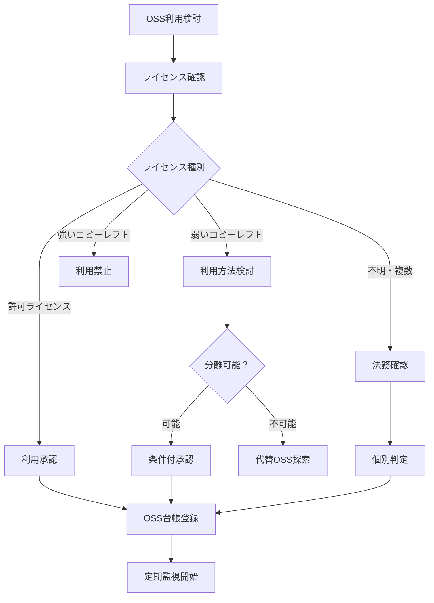

# オープンソースソフトウェア（OSS）利用ポリシー

## 1. ポリシー概要

### 1.1 目的
簿記3級問題集アプリの開発において、オープンソースソフトウェア（OSS）を適切かつ安全に利用するためのガイドラインを定める。

### 1.2 適用範囲
- アプリケーション本体のすべてのソフトウェアコンポーネント
- 開発・ビルド・テストツール
- 依存関係のあるライブラリ・フレームワーク

### 1.3 基本方針
- **ライセンス遵守**: すべてのOSSライセンス要件を厳密に遵守
- **リスク管理**: セキュリティ・法的リスクの最小化
- **透明性**: 利用OSSの明確な管理・開示
- **継続的監視**: 脆弱性・ライセンス変更の定期的確認

## 2. ライセンス分類・利用基準

### 2.1 ライセンス分類

#### 2.1.1 許可ライセンス（推奨）
| ライセンス | 利用可否 | 条件 | 注意事項 |
|---|---|---|---|
| MIT License | ✅ 許可 | 著作権表示・ライセンス表示 | 最も制約が少ない |
| Apache License 2.0 | ✅ 許可 | 著作権表示・変更通知 | 特許権の明示的保護 |
| BSD License | ✅ 許可 | 著作権表示・ライセンス表示 | 3条項・2条項ともに可 |
| ISC License | ✅ 許可 | 著作権表示・ライセンス表示 | MITと同等の自由度 |

#### 2.1.2 弱いコピーレフトライセンス（条件付許可）
| ライセンス | 利用可否 | 条件 | 注意事項 |
|---|---|---|---|
| LGPL 2.1/3.0 | ⚠️ 条件付 | 動的リンク・分離配布 | 静的リンク禁止 |
| MPL 2.0 | ⚠️ 条件付 | 変更ファイルのソース公開 | ファイル単位での適用 |
| EPL 2.0 | ⚠️ 条件付 | 変更部分のソース公開 | 商用利用時は要注意 |

#### 2.1.3 強いコピーレフトライセンス（利用禁止）
| ライセンス | 利用可否 | 理由 | 代替案 |
|---|---|---|---|
| GPL 2.0/3.0 | ❌ 禁止 | 全体ソース公開要求 | MIT/Apache代替探索 |
| AGPL 3.0 | ❌ 禁止 | ネットワーク利用でも公開要求 | 商用アプリに不適合 |
| SSPL | ❌ 禁止 | サービス提供時の制約 | 事業モデルに適さない |

### 2.2 利用判定フロー



## 3. 利用承認プロセス

### 3.1 事前審査

#### 3.1.1 技術的審査項目
```typescript
// OSS評価シート
interface OSSEvaluation {
  basicInfo: {
    name: string                    // OSS名
    version: string                 // バージョン
    license: string                 // ライセンス
    maintainer: string              // 保守者・組織
    repository: string              // リポジトリURL
  }
  
  technicalAssessment: {
    functionality: string           // 機能概要
    codeQuality: 'high' | 'medium' | 'low'  // コード品質
    documentation: 'excellent' | 'good' | 'poor'  // ドキュメント品質
    communityActivity: 'active' | 'moderate' | 'inactive'  // コミュニティ活動
    lastUpdate: Date               // 最終更新日
  }
  
  securityAssessment: {
    knownVulnerabilities: number    // 既知脆弱性数
    securityScanResults: string     // セキュリティスキャン結果
    maintainerResponse: string      // 脆弱性対応状況
  }
  
  legalAssessment: {
    licenseCompatibility: boolean   // ライセンス適合性
    intellectualProperty: string    // 知的財産権関連
    exportControl: boolean          // 輸出管理規制適合
  }
  
  businessImpact: {
    criticality: 'critical' | 'important' | 'nice-to-have'  // 重要度
    alternatives: string[]          // 代替手段
    migrationCost: 'low' | 'medium' | 'high'  // 移行コスト
  }
}
```

#### 3.1.2 承認プロセス
```typescript
// 承認ワークフロー
interface ApprovalWorkflow {
  step1_developerRequest: {
    requester: string
    justification: string
    technicalNeeds: string
    proposedUsage: string
  }
  
  step2_technicalReview: {
    reviewer: 'tech_lead'
    criteria: ['functionality', 'quality', 'maintenance', 'alternatives']
    decision: 'approve' | 'reject' | 'needs_modification'
    comments: string
  }
  
  step3_securityReview: {
    reviewer: 'security_officer'
    criteria: ['vulnerabilities', 'security_practices', 'incident_history']
    decision: 'approve' | 'reject' | 'conditional_approve'
    conditions: string[]
  }
  
  step4_legalReview: {
    reviewer: 'legal_counsel'
    criteria: ['license_compatibility', 'ip_rights', 'compliance']
    decision: 'approve' | 'reject' | 'requires_clarification'
    legalAdvice: string
  }
  
  step5_finalApproval: {
    approver: 'project_manager'
    overallDecision: 'approved' | 'rejected' | 'deferred'
    conditions: string[]
    expiryDate: Date
  }
}
```

### 3.2 OSS台帳管理

#### 3.2.1 台帳記録項目
```typescript
// OSS台帳データ構造
interface OSSRegistry {
  id: string
  componentInfo: {
    name: string
    version: string
    license: string
    licenseFile: string            // ライセンスファイルパス
    homepage: string
    repository: string
    description: string
  }
  
  usageInfo: {
    usageType: 'direct' | 'transitive'  // 直接利用・間接利用
    includedIn: string[]           // 含まれる成果物
    purpose: string                // 利用目的
    criticality: 'critical' | 'important' | 'optional'
  }
  
  complianceInfo: {
    licenseObligations: string[]   // ライセンス義務
    attributionRequired: boolean   // 帰属表示要否
    sourceCodeDisclosure: boolean // ソースコード開示要否
    noticeFile: string            // 通知ファイル
  }
  
  riskInfo: {
    securityRisk: 'low' | 'medium' | 'high'
    legalRisk: 'low' | 'medium' | 'high'
    businessRisk: 'low' | 'medium' | 'high'
    knownIssues: string[]
  }
  
  maintenanceInfo: {
    approvalDate: Date
    approver: string
    reviewDate: Date
    nextReviewDate: Date
    status: 'active' | 'deprecated' | 'obsolete'
  }
}
```

#### 3.2.2 台帳管理ツール
```bash
#!/bin/bash
# oss_registry_tools.sh

# OSS台帳の自動更新
update_oss_registry() {
    echo "=== OSS台帳更新開始 ==="
    
    # 1. package.jsonから依存関係取得
    echo "1. 依存関係スキャン"
    npm list --depth=0 --json > current_dependencies.json
    
    # 2. ライセンス情報収集
    echo "2. ライセンス情報収集"
    npx license-checker --json > license_info.json
    
    # 3. 脆弱性スキャン
    echo "3. セキュリティスキャン"
    npm audit --json > security_audit.json
    
    # 4. 台帳データ更新
    echo "4. 台帳データ更新"
    node scripts/update_registry.js
    
    # 5. コンプライアンスチェック
    echo "5. コンプライアンスチェック"
    node scripts/compliance_check.js
    
    echo "OSS台帳更新完了"
}

# 新しいOSSの追加チェック
check_new_oss() {
    echo "新規OSS検出チェック"
    
    # 前回との差分確認
    diff <(jq -r '.dependencies | keys[]' previous_dependencies.json | sort) \
         <(jq -r '.dependencies | keys[]' current_dependencies.json | sort) \
         > new_dependencies.txt
    
    if [ -s new_dependencies.txt ]; then
        echo "新規依存関係が検出されました:"
        cat new_dependencies.txt
        echo "承認プロセスを実行してください"
        return 1
    else
        echo "新規依存関係はありません"
        return 0
    fi
}
```

## 4. ライセンス遵守・帰属表示

### 4.1 帰属表示要件

#### 4.1.1 アプリ内クレジット表示
```typescript
// アプリ内ライセンス表示
interface LicenseAttribution {
  // 設定画面内の「ライセンス情報」セクション
  displayLocation: 'Settings > About > License Information'
  
  // 表示する情報
  requiredInfo: {
    componentName: string          // コンポーネント名
    version: string               // バージョン
    copyright: string             // 著作権者
    licenseType: string           // ライセンス種別
    licenseText: string           // ライセンス全文
    homepage?: string             // ホームページ（任意）
  }
  
  // 表示形式
  format: {
    grouping: 'by_license_type'   // ライセンス種別でグループ化
    sorting: 'alphabetical'       // アルファベット順
    searchable: true              // 検索可能
    exportable: true              // エクスポート可能
  }
}
```

#### 4.1.2 ライセンス情報生成
```javascript
// scripts/generate_license_info.js
const fs = require('fs')
const path = require('path')

// ライセンス情報生成スクリプト
function generateLicenseInfo() {
  const licenseData = require('../license_info.json')
  const registry = require('../oss_registry.json')
  
  const attributions = []
  
  for (const [packageName, info] of Object.entries(licenseData)) {
    const registryEntry = registry.find(r => r.componentInfo.name === packageName)
    
    if (registryEntry && registryEntry.complianceInfo.attributionRequired) {
      attributions.push({
        name: packageName,
        version: info.version,
        license: info.license,
        copyright: info.copyright,
        licenseText: info.licenseText,
        homepage: info.repository
      })
    }
  }
  
  // React Native用のライセンス情報ファイル生成
  const licenseComponent = generateLicenseComponent(attributions)
  fs.writeFileSync(
    path.join(__dirname, '../src/components/LicenseInfo.tsx'),
    licenseComponent
  )
  
  // ライセンス情報JSON生成
  fs.writeFileSync(
    path.join(__dirname, '../assets/licenses.json'),
    JSON.stringify(attributions, null, 2)
  )
  
  console.log(`生成完了: ${attributions.length}件のライセンス情報`)
}

function generateLicenseComponent(attributions) {
  return `
// 自動生成ファイル - 手動編集禁止
import React from 'react'
import { ScrollView, Text, StyleSheet } from 'react-native'

const LICENSES = ${JSON.stringify(attributions, null, 2)}

export const LicenseInfo: React.FC = () => {
  return (
    <ScrollView style={styles.container}>
      <Text style={styles.title}>オープンソースライセンス</Text>
      <Text style={styles.description}>
        このアプリは以下のオープンソースソフトウェアを使用しています。
      </Text>
      
      {LICENSES.map((license, index) => (
        <View key={index} style={styles.licenseBlock}>
          <Text style={styles.packageName}>{license.name}</Text>
          <Text style={styles.version}>Version: {license.version}</Text>
          <Text style={styles.copyright}>{license.copyright}</Text>
          <Text style={styles.licenseType}>{license.license}</Text>
          <Text style={styles.licenseText}>{license.licenseText}</Text>
        </View>
      ))}
    </ScrollView>
  )
}

const styles = StyleSheet.create({
  container: { flex: 1, padding: 16 },
  title: { fontSize: 18, fontWeight: 'bold', marginBottom: 8 },
  description: { marginBottom: 16, color: '#666' },
  licenseBlock: { marginBottom: 24, padding: 12, backgroundColor: '#f5f5f5' },
  packageName: { fontSize: 16, fontWeight: 'bold' },
  version: { fontSize: 12, color: '#666' },
  copyright: { fontSize: 12, marginTop: 4 },
  licenseType: { fontSize: 12, fontWeight: 'bold', marginTop: 4 },
  licenseText: { fontSize: 10, marginTop: 8, fontFamily: 'monospace' }
})
`
}

generateLicenseInfo()
```

### 4.2 ソースコード開示要件

#### 4.2.1 コピーレフトライセンス対応
```typescript
// ソースコード開示管理
interface SourceDisclosureManagement {
  // 開示が必要なコンポーネント
  disclosureRequired: {
    component: string
    license: string
    reason: string
    scope: 'modified_files' | 'entire_work'
  }[]
  
  // 開示方法
  disclosureMethod: {
    location: string              // 開示場所
    format: 'source_archive' | 'repository_link'
    accessDuration: string        // アクセス可能期間
    notificationMethod: string    // 通知方法
  }
  
  // 管理プロセス
  managementProcess: {
    preparation: string[]         // 準備作業
    review: string[]             // レビュー作業
    publication: string[]         // 公開作業
    maintenance: string[]         // 保守作業
  }
}
```

## 5. セキュリティ・脆弱性管理

### 5.1 脆弱性監視

#### 5.1.1 継続的脆弱性スキャン
```yaml
# .github/workflows/security-scan.yml
name: Security Scan

on:
  schedule:
    - cron: '0 2 * * *'  # 毎日2時に実行
  push:
    branches: [main]
  pull_request:
    branches: [main]

jobs:
  dependency-check:
    runs-on: ubuntu-latest
    steps:
      - uses: actions/checkout@v2
      
      - name: Setup Node.js
        uses: actions/setup-node@v2
        with:
          node-version: '18'
          
      - name: Install dependencies
        run: npm ci
        
      - name: Run npm audit
        run: npm audit --audit-level moderate
        
      - name: Run Snyk test
        uses: snyk/actions/node@master
        env:
          SNYK_TOKEN: ${{ secrets.SNYK_TOKEN }}
        with:
          args: --severity-threshold=medium
          
      - name: Upload results to GitHub Security
        uses: github/codeql-action/upload-sarif@v1
        with:
          sarif_file: snyk.sarif
```

#### 5.1.2 脆弱性対応プロセス
```typescript
// 脆弱性対応ワークフロー
interface VulnerabilityResponse {
  detection: {
    sources: ['npm audit', 'Snyk', 'GitHub Security Advisories', 'CVE database']
    frequency: 'daily_automated_scan'
    alerting: 'Slack + Email notification'
  }
  
  assessment: {
    criteriaEvaluation: {
      severity: 'critical' | 'high' | 'medium' | 'low'
      exploitability: 'proven' | 'functional' | 'poc' | 'unproven'
      affectedVersions: string[]
      patchAvailability: boolean
    }
    
    businessImpact: {
      dataAtRisk: boolean
      serviceAvailability: boolean
      userExperience: boolean
      complianceRisk: boolean
    }
  }
  
  response: {
    immediate: {                    // 24時間以内
      riskContainment: string[]
      temporaryMitigation: string[]
      stakeholderNotification: string[]
    }
    
    shortTerm: {                   // 1週間以内
      patchApplication: string[]
      testing: string[]
      deployment: string[]
    }
    
    longTerm: {                    // 1ヶ月以内
      rootCauseAnalysis: string[]
      processImprovement: string[]
      preventiveMeasures: string[]
    }
  }
}
```

### 5.2 セキュア開発プラクティス

#### 5.2.1 OSS選定セキュリティチェック
```typescript
// セキュリティ評価基準
interface SecurityEvaluationCriteria {
  maintainerTrustworthiness: {
    organizationReputation: 'high' | 'medium' | 'low'
    maintainerHistory: string
    contributorDiversity: number
    responseToSecurity: 'excellent' | 'good' | 'poor'
  }
  
  codeQuality: {
    securityPractices: string[]
    codeReviewProcess: boolean
    securityTestingEnabled: boolean
    staticAnalysisResults: string
  }
  
  vulnerabilityHistory: {
    historicalVulnerabilities: number
    averageDisclosureTime: number  // 日数
    averageFixTime: number         // 日数
    severityDistribution: Record<string, number>
  }
  
  communitySupport: {
    issueResponseTime: number      // 日数
    securityReportingProcess: boolean
    securityAdvisoryProcess: boolean
    bugBountyProgram: boolean
  }
}
```

#### 5.2.2 定期セキュリティレビュー
```bash
#!/bin/bash
# security_review.sh

quarterly_security_review() {
    echo "=== 四半期セキュリティレビュー開始 ==="
    
    # 1. 全OSS棚卸し
    echo "1. OSS利用状況棚卸し"
    npm list --depth=0 > current_oss_list.txt
    
    # 2. 脆弱性状況確認
    echo "2. 脆弱性スキャン"
    npm audit --json > vulnerability_report.json
    npx snyk test --json > snyk_report.json
    
    # 3. ライセンス変更確認
    echo "3. ライセンス変更チェック"
    node scripts/check_license_changes.js
    
    # 4. EOL（End of Life）確認
    echo "4. EOLライブラリ確認"
    node scripts/check_eol_components.js
    
    # 5. 代替品調査
    echo "5. 高リスクコンポーネント代替調査"
    node scripts/alternative_research.js
    
    # 6. レポート生成
    echo "6. セキュリティレビューレポート生成"
    node scripts/generate_security_report.js
    
    echo "四半期セキュリティレビュー完了"
}

# EOLライブラリチェック
check_eol_components() {
    echo "EOLライブラリチェック実行中..."
    
    # EOL情報取得（例：Node.js EOL API）
    curl -s "https://endoflife.date/api/nodejs.json" > nodejs_eol.json
    
    # 現在のNode.jsバージョンがEOLかチェック
    current_node_version=$(node --version | sed 's/v//')
    
    # レポート生成
    node -e "
    const eolData = require('./nodejs_eol.json');
    const currentVersion = '$current_node_version';
    const currentEol = eolData.find(v => currentVersion.startsWith(v.cycle));
    
    if (currentEol && new Date(currentEol.eol) < new Date()) {
        console.log('警告: Node.js バージョン ' + currentVersion + ' はEOLです');
        console.log('EOL日: ' + currentEol.eol);
    } else {
        console.log('Node.jsバージョンは正常です');
    }
    "
}
```

## 6. 教育・トレーニング

### 6.1 開発チーム向け教育

#### 6.1.1 OSSライセンス教育プログラム
```typescript
// OSS教育カリキュラム
interface OSSEducationProgram {
  basicTraining: {
    duration: '2時間'
    topics: [
      'OSSの基本概念',
      '主要ライセンスの理解',
      'コピーレフトの概念',
      'ライセンス違反のリスク'
    ]
    assessment: 'オンラインクイズ（80%以上で合格）'
  }
  
  practicalTraining: {
    duration: '1時間'
    topics: [
      'OSS選定プロセスの実践',
      'ライセンス確認ツールの使用',
      'コンプライアンスチェック',
      '問題発生時の対応'
    ]
    assessment: 'ハンズオン演習'
  }
  
  updateTraining: {
    frequency: '半年毎'
    duration: '30分'
    topics: [
      '新しいライセンストレンド',
      '社内ポリシーの更新',
      '事例研究・教訓'
    ]
  }
}
```

#### 6.1.2 チェックリスト・クイックリファレンス
```markdown
# OSS利用チェックリスト

## 新しいOSSを追加する前に
- [ ] そのOSSは本当に必要か？（代替手段の検討）
- [ ] ライセンスを確認したか？
- [ ] ライセンスは許可リストに含まれているか？
- [ ] 既知の脆弱性がないか確認したか？
- [ ] メンテナンス状況は良好か？
- [ ] 承認プロセスを実行したか？

## 実装時
- [ ] 依存関係を最小限に抑えているか？
- [ ] 不要な機能を含んでいないか？
- [ ] セキュリティ設定は適切か？
- [ ] ドキュメントに記録したか？

## リリース前
- [ ] ライセンス表示は適切か？
- [ ] 脆弱性スキャンを実行したか？
- [ ] コンプライアンスチェックを実行したか？
- [ ] 台帳は最新か？

# クイックリファレンス

## 許可されるライセンス
✅ MIT, Apache 2.0, BSD, ISC
⚠️ LGPL（動的リンクのみ）, MPL
❌ GPL, AGPL, SSPL

## 緊急連絡先
- 技術責任者: tech-lead@example.com
- 法務担当: legal@example.com
- セキュリティ担当: security@example.com
```

### 6.2 コンプライアンス監査

#### 6.2.1 内部監査プロセス
```typescript
// 内部監査チェックリスト
interface ComplianceAudit {
  quarterlyAudit: {
    scope: 'all_oss_components'
    auditor: 'internal_compliance_team'
    
    checkItems: {
      inventoryAccuracy: '台帳と実際の利用状況の一致'
      licenseCompliance: 'ライセンス要件の遵守状況'
      attributionAccuracy: '帰属表示の正確性・完全性'
      securityStatus: '脆弱性対応状況'
      processAdherence: 'プロセス遵守状況'
    }
    
    deliverables: [
      '監査レポート',
      '是正勧告',
      '改善計画',
      '次回監査計画'
    ]
  }
  
  externalAudit: {
    frequency: 'annual'
    auditor: 'external_legal_firm'
    
    focus: [
      '法的リスク評価',
      'ライセンス解釈の確認',
      '業界ベストプラクティス比較',
      'ポリシー改善提案'
    ]
  }
}
```

## 7. ポリシー維持・更新

### 7.1 継続的改善

#### 7.1.1 ポリシー見直しサイクル
```typescript
// ポリシー改善サイクル
interface PolicyImprovementCycle {
  monthlyReview: {
    trigger: '新しい脆弱性・ライセンス問題の発生'
    scope: '緊急対応・プロセス微調整'
    participants: ['tech_lead', 'security_officer']
  }
  
  quarterlyReview: {
    trigger: '定期レビュー'
    scope: 'プロセス効率化・ツール改善'
    participants: ['all_stakeholders']
    outcomes: ['プロセス改善', 'ツール更新', '教育内容見直し']
  }
  
  annualReview: {
    trigger: '年次戦略見直し'
    scope: 'ポリシー全体・戦略的変更'
    participants: ['management', 'legal', 'engineering']
    outcomes: ['ポリシー大幅更新', '新ツール導入', '組織体制変更']
  }
}
```

#### 7.1.2 業界動向・法的変更対応
```bash
#!/bin/bash
# policy_update_monitoring.sh

monitor_industry_changes() {
    echo "=== 業界動向・法的変更監視 ==="
    
    # 1. 新しいライセンストレンド監視
    echo "1. 新ライセンス・ライセンス変更監視"
    curl -s "https://spdx.org/licenses/licenses.json" > current_spdx_licenses.json
    
    # 前回との差分確認
    if [ -f "previous_spdx_licenses.json" ]; then
        diff previous_spdx_licenses.json current_spdx_licenses.json > license_changes.diff
        
        if [ -s license_changes.diff ]; then
            echo "新しいライセンスまたは変更を検出"
            cat license_changes.diff
        fi
    fi
    
    # 2. 重要なOSSプロジェクトのライセンス変更監視
    echo "2. 重要OSSプロジェクトの監視"
    monitor_critical_oss_changes
    
    # 3. 法的判例・規制変更の確認
    echo "3. 法的環境変化の確認（手動確認項目）"
    echo "   - 最新の裁判例"
    echo "   - 新しい規制・ガイドライン"
    echo "   - 業界標準の変更"
    
    mv current_spdx_licenses.json previous_spdx_licenses.json
}
```

---

## 更新履歴

| 日付 | バージョン | 変更内容 | 更新者 |
|---|---|---|---|
| 2025-01-27 | 1.0 | 初版作成 | - |

---

**このOSSポリシーは、法的環境・技術環境の変化に応じて継続的に更新します。不明な点や判断に迷う場合は、必ず法務担当者に相談してください。**