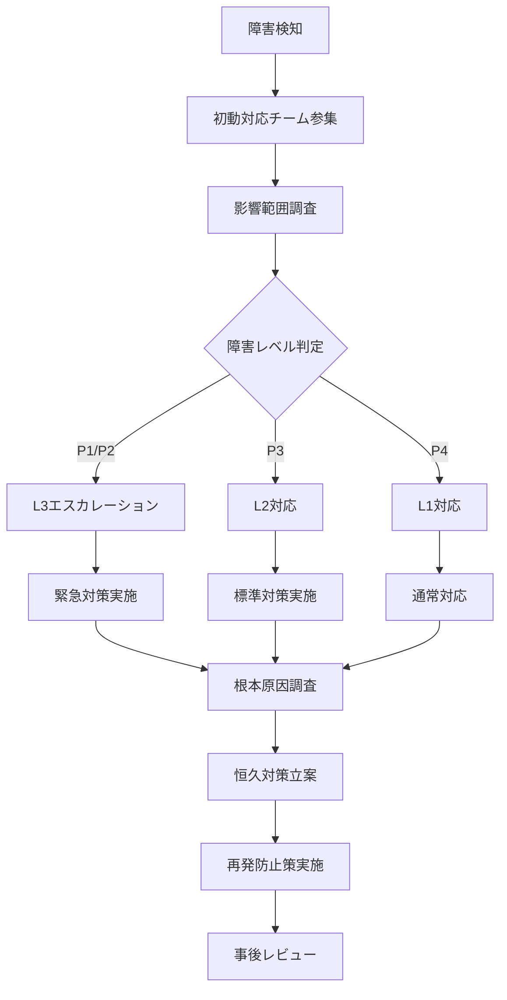

# 運用ランブック

## 1. 概要

### 1.1 本ドキュメントの目的
簿記3級問題集アプリの運用チームが、日常運用・障害対応・メンテナンス作業を効率的に実施するための手順書です。

### 1.2 運用方針
- **プロアクティブ監視**: 問題発生前の予兆検知
- **迅速な障害対応**: ユーザー影響の最小化
- **データ保護最優先**: 学習データの確実な保護
- **継続的改善**: 運用プロセスの最適化

### 1.3 責任分担
| 役割 | 責任範囲 | 対応時間 |
|---|---|---|
| L1サポート | 初動対応・ユーザーサポート | 平日 9:00-18:00 |
| L2エンジニア | 技術的調査・修正 | 平日 9:00-21:00 |
| L3エキスパート | 重大障害・アーキテクチャ変更 | オンコール 24/7 |

## 2. 日常運用

### 2.1 監視・ヘルスチェック

#### 2.1.1 毎日の監視項目
```bash
#!/bin/bash
# daily_health_check.sh

echo "=== 簿記3級アプリ 日次ヘルスチェック ==="
echo "実行日時: $(date)"

# 1. アプリストア統計確認
echo "1. アプリストア指標"
echo "   - 新規ダウンロード数: 要確認"
echo "   - 評価・レビュー: 要確認"
echo "   - クラッシュ率: 要確認"

# 2. ユーザーからの問い合わせ確認
echo "2. ユーザーサポート"
echo "   - 新規問い合わせ: 要確認"
echo "   - 未対応問い合わせ: 要確認"

# 3. システムアラート確認
echo "3. システムアラート"
echo "   - 重要アラート: 要確認"
echo "   - 異常指標: 要確認"

echo "=== ヘルスチェック完了 ==="
```

#### 2.1.2 週次メンテナンス項目
| 項目 | 頻度 | 確認内容 | 対応者 |
|---|---|---|---|
| ユーザーフィードバック分析 | 週次 | アプリストアレビュー・問い合わせ傾向 | L1サポート |
| パフォーマンス監視 | 週次 | 応答時間・メモリ使用量トレンド | L2エンジニア |
| セキュリティ監視 | 週次 | 異常アクセス・脆弱性情報 | L2エンジニア |
| データ整合性チェック | 週次 | 学習データの整合性確認 | L2エンジニア |

### 2.2 ユーザーサポート

#### 2.2.1 問い合わせ分類・対応
```typescript
// 問い合わせ分類
enum InquiryCategory {
  TECHNICAL_ISSUE = 'technical_issue',      // 技術的問題
  USAGE_QUESTION = 'usage_question',        // 使い方質問  
  FEATURE_REQUEST = 'feature_request',      // 機能要望
  DATA_ISSUE = 'data_issue',               // データ問題
  BILLING_QUESTION = 'billing_question'     // 課金質問
}

// 対応レベル判定
interface InquiryResponse {
  category: InquiryCategory
  priority: 'low' | 'medium' | 'high' | 'critical'
  assignedTo: 'L1' | 'L2' | 'L3'
  responseTime: number  // 時間
  escalationCriteria: string[]
}

const inquiryResponseMatrix: Record<InquiryCategory, InquiryResponse> = {
  [InquiryCategory.TECHNICAL_ISSUE]: {
    category: InquiryCategory.TECHNICAL_ISSUE,
    priority: 'high',
    assignedTo: 'L2',
    responseTime: 4,
    escalationCriteria: ['データ損失の可能性', '複数ユーザーへの影響']
  },
  [InquiryCategory.DATA_ISSUE]: {
    category: InquiryCategory.DATA_ISSUE,
    priority: 'critical',
    assignedTo: 'L3',
    responseTime: 1,
    escalationCriteria: ['即座にL3へエスカレーション']
  }
}
```

#### 2.2.2 よくある問い合わせと対応
| 問い合わせ内容 | 分類 | 標準回答 | 対応レベル |
|---|---|---|---|
| アプリが起動しない | 技術的問題 | 端末再起動・アプリ再インストール手順 | L1→L2 |
| 学習データが消えた | データ問題 | データ復旧手順・予防策案内 | L3 |
| 問題の解説が分からない | 使い方質問 | 解説の読み方・学習方法提案 | L1 |
| 新機能追加希望 | 機能要望 | 要望記録・開発ロードマップ案内 | L1 |

### 2.3 データバックアップ・保守

#### 2.3.1 データ保護手順
```bash
#!/bin/bash
# backup_procedures.sh

# ユーザーデータバックアップ（各端末で実行）
backup_user_data() {
    echo "ユーザーデータバックアップ開始"
    
    # 1. データベースファイルの整合性チェック
    sqlite3 app_data.db "PRAGMA integrity_check;"
    
    if [ $? -eq 0 ]; then
        echo "データベース整合性OK"
        
        # 2. バックアップファイル作成
        backup_file="backup_$(date +%Y%m%d_%H%M%S).json"
        
        # 3. データエクスポート
        ./export_user_data.sh > "$backup_file"
        
        echo "バックアップ完了: $backup_file"
    else
        echo "エラー: データベース破損の可能性"
        exit 1
    fi
}

# アプリアップデート前のデータ保護
pre_update_backup() {
    echo "アップデート前バックアップ"
    
    # 1. 現在のデータベースバージョン確認
    current_version=$(get_db_version)
    echo "現在のDBバージョン: $current_version"
    
    # 2. マイグレーション前バックアップ
    cp app_data.db "pre_migration_${current_version}_$(date +%Y%m%d).db"
    
    echo "マイグレーション前バックアップ完了"
}
```

## 3. 障害対応

### 3.1 障害分類・エスカレーション

#### 3.1.1 障害レベル定義
| レベル | 影響範囲 | 対応目標時間 | エスカレーション条件 |
|---|---|---|---|
| P1 (Critical) | 全ユーザー・データ損失 | 1時間以内 | 即座にL3へ |
| P2 (High) | 主要機能停止 | 4時間以内 | 2時間でL3へ |
| P3 (Medium) | 一部機能に問題 | 1営業日以内 | 1日でL2へ |
| P4 (Low) | 軽微な問題 | 1週間以内 | エスカレーション不要 |

#### 3.1.2 障害対応フロー


### 3.2 典型的障害パターンと対応

#### 3.2.1 アプリクラッシュ対応
```typescript
// クラッシュ対応手順
interface CrashResponse {
  detection: string[]
  investigation: string[]
  mitigation: string[]
  resolution: string[]
}

const crashResponseProcedure: CrashResponse = {
  detection: [
    'アプリストアクラッシュ率監視',
    'ユーザーからの報告',
    'クラッシュレポート自動解析'
  ],
  
  investigation: [
    'クラッシュログの収集・解析',
    '再現環境での検証',
    '影響範囲の特定（OS・デバイス・アプリバージョン）',
    '根本原因の特定'
  ],
  
  mitigation: [
    '緊急パッチの開発（可能な場合）',
    'ユーザーへの回避策案内',
    'アプリストアでの注意喚起'
  ],
  
  resolution: [
    '修正版の開発・テスト',
    'アプリストア緊急リリース',
    'ユーザーへのアップデート案内',
    '再発防止策の実装'
  ]
}
```

#### 3.2.2 データ破損対応
```bash
#!/bin/bash
# data_corruption_response.sh

data_corruption_response() {
    echo "=== データ破損対応手順 ==="
    
    # 1. 緊急事態確認
    echo "1. データ破損の確認"
    sqlite3 app_data.db "PRAGMA integrity_check;" > integrity_check.log
    
    if grep -q "ok" integrity_check.log; then
        echo "   データベース整合性: OK"
    else
        echo "   データベース整合性: 破損検出"
        
        # 2. バックアップからの復旧試行
        echo "2. バックアップからの復旧"
        if [ -f "backup_latest.json" ]; then
            echo "   最新バックアップからの復旧を試行"
            restore_from_backup "backup_latest.json"
        else
            echo "   エラー: バックアップファイルが見つかりません"
            echo "   L3エスカレーション必要"
        fi
        
        # 3. ユーザーへの緊急連絡
        echo "3. ユーザーサポート"
        echo "   データ復旧手順の案内"
        echo "   代替手段の提供"
    fi
}

# バックアップからの復旧
restore_from_backup() {
    backup_file=$1
    echo "バックアップファイル: $backup_file"
    
    # データベース再構築
    rm app_data.db
    ./create_database.sh
    ./import_backup_data.sh "$backup_file"
    
    echo "復旧完了"
}
```

#### 3.2.3 パフォーマンス劣化対応
```typescript
// パフォーマンス問題の診断・対応
interface PerformanceIssueResponse {
  symptoms: string[]
  diagnostics: string[]
  quickFixes: string[]
  longTermSolutions: string[]
}

const performanceIssueGuide: PerformanceIssueResponse = {
  symptoms: [
    '問題表示に3秒以上かかる',
    'アプリ操作時の応答遅延',
    'メモリ使用量の異常増加',
    'バッテリー消費の急激な増加'
  ],
  
  diagnostics: [
    'システムリソース使用量確認',
    'データベースクエリ実行時間測定',
    'メモリリーク検出',
    'CPU使用率プロファイリング'
  ],
  
  quickFixes: [
    'アプリキャッシュクリア',
    'データベースVACUUM実行',
    'バックグラウンドプロセス終了',
    'アプリ再起動案内'
  ],
  
  longTermSolutions: [
    'データベースインデックス最適化',
    'クエリ効率化',
    'メモリ管理改善',
    'キャッシュ戦略見直し'
  ]
}
```

### 3.3 緊急連絡・コミュニケーション

#### 3.3.1 緊急連絡体制
```typescript
// 緊急連絡先
interface EmergencyContacts {
  primary: {
    role: string
    name: string
    phone: string
    email: string
    availableHours: string
  }[]
  
  escalation: {
    level: number
    role: string
    contactInfo: string
    escalationCriteria: string
  }[]
}

const emergencyContactList: EmergencyContacts = {
  primary: [
    {
      role: 'L3エンジニア',
      name: '技術リーダー',
      phone: '+81-XX-XXXX-XXXX',
      email: 'tech-lead@example.com',
      availableHours: '24/7'
    },
    {
      role: 'プロダクトオーナー',
      name: 'PO',
      phone: '+81-XX-XXXX-XXXX', 
      email: 'po@example.com',
      availableHours: '平日 9:00-21:00'
    }
  ],
  
  escalation: [
    {
      level: 1,
      role: 'L2エンジニア',
      contactInfo: 'Slack: #tech-support',
      escalationCriteria: '30分以内に対応開始'
    },
    {
      level: 2,
      role: 'L3エンジニア',
      contactInfo: 'Phone + Slack',
      escalationCriteria: 'P2以上または2時間経過'
    }
  ]
}
```

#### 3.3.2 ユーザーコミュニケーション
```markdown
# 障害時ユーザー通知テンプレート

## 障害発生時の通知

### アプリストア通知
```
【重要】一時的な不具合について

現在、簿記3級問題集アプリにおいて一部のユーザー様に
[具体的な症状] の問題が発生しております。

■影響範囲
[影響を受ける機能・ユーザー]

■対応状況
[現在の対応状況]

■回避策
[利用可能な回避策があれば記載]

ご迷惑をおかけして申し訳ございません。
復旧次第、改めてご連絡いたします。
```

### 復旧完了通知
```
【報告】不具合復旧のお知らせ

[障害発生時刻] に発生しておりました不具合は、
[復旧完了時刻] に復旧いたしました。

■復旧内容
[実施した対応内容]

■再発防止策
[今後の対策]

この度はご迷惑をおかけし、誠に申し訳ございませんでした。
```
```

## 4. 定期メンテナンス

### 4.1 アプリアップデート

#### 4.1.1 アップデート手順
```bash
#!/bin/bash
# app_update_procedure.sh

perform_app_update() {
    version=$1
    echo "=== アプリアップデート手順 v$version ==="
    
    # 1. アップデート前チェック
    echo "1. アップデート前準備"
    ./pre_update_checks.sh
    
    if [ $? -ne 0 ]; then
        echo "事前チェック失敗: アップデート中止"
        exit 1
    fi
    
    # 2. データマイグレーション
    echo "2. データマイグレーション実行"
    ./run_database_migration.sh "$version"
    
    # 3. 機能テスト
    echo "3. アップデート後機能テスト"
    ./post_update_tests.sh
    
    # 4. ユーザー通知
    echo "4. ユーザーへのアップデート案内"
    ./notify_users_update.sh "$version"
    
    echo "アップデート完了"
}
```

#### 4.1.2 アップデート品質チェック
| チェック項目 | 確認内容 | 合格基準 |
|---|---|---|
| データ移行 | 既存データの正常移行 | 100%のデータが移行済み |
| 機能テスト | 主要機能の動作確認 | 全テストケースがパス |
| パフォーマンス | 応答時間・メモリ使用量 | 性能劣化なし |
| 互換性 | 旧バージョンとの互換性 | 段階的移行可能 |

### 4.2 データベースメンテナンス

#### 4.2.1 定期メンテナンス作業
```sql
-- データベース最適化スクリプト
-- weekly_db_maintenance.sql

-- 1. 統計情報の更新
ANALYZE;

-- 2. 未使用領域の回収
VACUUM;

-- 3. インデックス再構築（必要に応じて）
REINDEX;

-- 4. データ整合性チェック
PRAGMA integrity_check;

-- 5. 古いログデータの削除（30日以上前）
DELETE FROM learning_history 
WHERE answered_at < datetime('now', '-30 days');

-- 6. 統計サマリーの更新
UPDATE user_progress 
SET updated_at = CURRENT_TIMESTAMP
WHERE updated_at < datetime('now', '-1 day');
```

#### 4.2.2 データ品質監視
```typescript
// データ品質監視スクリプト
interface DataQualityCheck {
  name: string
  query: string
  expectedResult: any
  alertThreshold: number
}

const qualityChecks: DataQualityCheck[] = [
  {
    name: '学習履歴の整合性',
    query: 'SELECT COUNT(*) FROM learning_history lh LEFT JOIN questions q ON lh.question_id = q.id WHERE q.id IS NULL',
    expectedResult: 0,
    alertThreshold: 0
  },
  {
    name: '復習アイテムの妥当性',
    query: 'SELECT COUNT(*) FROM review_items WHERE incorrect_count < 0 OR consecutive_correct_count < 0',
    expectedResult: 0,
    alertThreshold: 0
  },
  {
    name: '進捗データの精度',
    query: 'SELECT COUNT(*) FROM user_progress WHERE accuracy_rate > 1.0 OR accuracy_rate < 0.0',
    expectedResult: 0,
    alertThreshold: 0
  }
]

// 品質チェック実行
async function runDataQualityChecks(): Promise<void> {
  for (const check of qualityChecks) {
    const result = await database.executeSql(check.query)
    
    if (result[0] > check.alertThreshold) {
      console.error(`データ品質アラート: ${check.name}`)
      console.error(`期待値: ${check.expectedResult}, 実際値: ${result[0]}`)
      
      // アラート送信
      await sendAlert({
        level: 'warning',
        message: `データ品質問題: ${check.name}`,
        details: { expected: check.expectedResult, actual: result[0] }
      })
    }
  }
}
```

## 5. 監視・アラート

### 5.1 監視項目・閾値

#### 5.1.1 システム監視
| 項目 | 監視方法 | 警告閾値 | 緊急閾値 | 対応者 |
|---|---|---|---|---|
| アプリクラッシュ率 | アプリストア統計 | 0.5% | 2.0% | L2 |
| 応答時間 | パフォーマンス計測 | 2秒 | 5秒 | L2 |
| メモリ使用量 | リソース監視 | 80MB | 150MB | L2 |
| ストレージ使用量 | 容量監視 | 80MB | 100MB | L1 |

#### 5.1.2 ビジネス監視
| 項目 | 監視方法 | 正常範囲 | アラート条件 | 対応者 |
|---|---|---|---|---|
| 日次アクティブユーザー | 利用統計 | 前週比±20% | 30%以上の変動 | PO |
| 学習完了率 | 行動分析 | 70%以上 | 60%未満 | PO |
| アプリ評価 | アプリストア | 4.0以上 | 3.5未満 | L1 |
| 問い合わせ件数 | サポート統計 | 週10件以下 | 20件以上 | L1 |

### 5.2 アラート設定・対応

#### 5.2.1 アラート自動化
```typescript
// アラート管理システム
interface AlertRule {
  name: string
  condition: string
  severity: 'info' | 'warning' | 'error' | 'critical'
  notificationChannels: ('email' | 'slack' | 'sms')[]
  cooldownPeriod: number // 分
}

const alertRules: AlertRule[] = [
  {
    name: 'クラッシュ率異常',
    condition: 'crash_rate > 0.02', // 2%
    severity: 'critical',
    notificationChannels: ['email', 'slack', 'sms'],
    cooldownPeriod: 15
  },
  {
    name: '応答時間劣化',
    condition: 'response_time > 5000', // 5秒
    severity: 'error',
    notificationChannels: ['slack'],
    cooldownPeriod: 5
  },
  {
    name: '評価低下',
    condition: 'app_rating < 3.5',
    severity: 'warning',
    notificationChannels: ['email'],
    cooldownPeriod: 60
  }
]

// アラート処理
class AlertManager {
  async processAlert(alert: Alert): Promise<void> {
    const rule = this.findMatchingRule(alert)
    
    if (this.shouldSendAlert(rule, alert)) {
      await this.sendNotifications(rule, alert)
      await this.recordAlert(alert)
    }
  }
  
  private async sendNotifications(rule: AlertRule, alert: Alert): Promise<void> {
    for (const channel of rule.notificationChannels) {
      switch (channel) {
        case 'slack':
          await this.sendSlackAlert(alert)
          break
        case 'email':
          await this.sendEmailAlert(alert)
          break
        case 'sms':
          await this.sendSmsAlert(alert)
          break
      }
    }
  }
}
```

## 6. パフォーマンス最適化

### 6.1 定期的最適化作業

#### 6.1.1 データベース最適化
```bash
#!/bin/bash
# database_optimization.sh

optimize_database() {
    echo "=== データベース最適化開始 ==="
    
    # 1. クエリ実行時間分析
    echo "1. 遅いクエリの特定"
    sqlite3 app_data.db ".timer on" < analyze_queries.sql > query_analysis.log
    
    # 2. インデックス効果測定
    echo "2. インデックス使用状況確認"
    sqlite3 app_data.db "EXPLAIN QUERY PLAN SELECT * FROM learning_history WHERE question_id = 'Q001';"
    
    # 3. 統計情報更新
    echo "3. 統計情報更新"
    sqlite3 app_data.db "ANALYZE;"
    
    # 4. 領域回収
    echo "4. 未使用領域回収"
    sqlite3 app_data.db "VACUUM;"
    
    # 5. パフォーマンステスト
    echo "5. 最適化効果測定"
    ./performance_benchmark.sh
    
    echo "データベース最適化完了"
}
```

#### 6.1.2 アプリケーション最適化
```typescript
// パフォーマンス最適化チェックリスト
interface OptimizationTask {
  category: string
  task: string
  frequency: string
  impact: 'low' | 'medium' | 'high'
  effort: 'low' | 'medium' | 'high'
}

const optimizationTasks: OptimizationTask[] = [
  {
    category: 'UI',
    task: '不要な再レンダリング削減',
    frequency: 'リリース毎',
    impact: 'medium',
    effort: 'low'
  },
  {
    category: 'データ',
    task: 'キャッシュ戦略見直し',
    frequency: '月次',
    impact: 'high',
    effort: 'medium'
  },
  {
    category: 'メモリ',
    task: 'メモリリーク検出・修正',
    frequency: 'リリース毎',
    impact: 'high',
    effort: 'high'
  }
]
```

## 7. セキュリティ運用

### 7.1 セキュリティ監視

#### 7.1.1 セキュリティチェック項目
```bash
#!/bin/bash
# security_monitoring.sh

security_health_check() {
    echo "=== セキュリティヘルスチェック ==="
    
    # 1. データ暗号化状態確認
    echo "1. データ暗号化確認"
    check_data_encryption
    
    # 2. 不正アクセス検知
    echo "2. 異常アクセスパターン確認"
    detect_anomalous_access
    
    # 3. 脆弱性スキャン
    echo "3. 既知の脆弱性確認" 
    run_vulnerability_scan
    
    # 4. プライバシー設定確認
    echo "4. プライバシー保護設定確認"
    verify_privacy_settings
    
    echo "セキュリティチェック完了"
}

# 異常アクセス検知
detect_anomalous_access() {
    # アプリ使用パターン分析
    echo "異常な使用パターンの検知..."
    
    # 例: 短時間での大量解答（Bot的動作）
    suspicious_patterns=$(cat <<EOF
SELECT COUNT(*) as rapid_answers
FROM learning_history 
WHERE answered_at > datetime('now', '-1 hour')
GROUP BY session_id
HAVING COUNT(*) > 100
EOF
)
    
    result=$(sqlite3 app_data.db "$suspicious_patterns")
    
    if [ -n "$result" ]; then
        echo "警告: 異常な使用パターンを検出"
        echo "詳細: $result"
    fi
}
```

### 7.2 プライバシー保護運用

#### 7.2.1 データ保護チェック
```typescript
// プライバシー保護監査
interface PrivacyAudit {
  checkDate: Date
  dataCollection: boolean      // データ収集の適切性
  dataStorage: boolean         // データ保存の安全性
  dataSharing: boolean         // データ共有なし
  userConsent: boolean         // ユーザー同意取得
  dataAccess: boolean          // データアクセス制限
}

class PrivacyAuditor {
  async performAudit(): Promise<PrivacyAudit> {
    return {
      checkDate: new Date(),
      dataCollection: await this.checkDataCollection(),
      dataStorage: await this.checkDataStorage(),
      dataSharing: await this.checkDataSharing(),
      userConsent: await this.checkUserConsent(),
      dataAccess: await this.checkDataAccess()
    }
  }
  
  private async checkDataCollection(): Promise<boolean> {
    // 個人情報収集していないことの確認
    const forbiddenData = [
      'email', 'phone', 'name', 'address', 
      'device_id', 'advertising_id', 'location'
    ]
    
    // データベースに禁止データが含まれていないか確認
    return await this.verifyNoForbiddenData(forbiddenData)
  }
  
  private async checkDataSharing(): Promise<boolean> {
    // 外部送信がないことの確認
    const networkLogs = await this.getNetworkActivity()
    return networkLogs.length === 0  // 外部通信なし
  }
}
```

## 8. 事業継続・災害対策

### 8.1 事業継続計画

#### 8.1.1 災害シナリオ・対応
| 災害種別 | 影響 | 対応策 | 復旧時間目標 |
|---|---|---|---|
| 開発チーム不在 | 新機能開発停止 | ドキュメント完備・外部委託 | 2週間 |
| 主要メンバー離脱 | ノウハウ喪失 | 知識移転・複数人体制 | 1ヶ月 |
| App Store停止 | 新規DL不可 | 代替配布経路準備 | 即座 |
| 法規制変更 | サービス停止リスク | 法的要件遵守・機能修正 | 3ヶ月 |

#### 8.1.2 復旧手順
```bash
#!/bin/bash
# disaster_recovery.sh

disaster_recovery_plan() {
    disaster_type=$1
    echo "=== 災害復旧計画: $disaster_type ==="
    
    case $disaster_type in
        "team_unavailable")
            echo "1. 緊急連絡先への通知"
            echo "2. 外部パートナーへの支援要請"
            echo "3. 最小限の運用体制確立"
            ;;
        "app_store_issue")
            echo "1. App Store問題の確認・報告"
            echo "2. 代替配布方法の検討"
            echo "3. ユーザーへの状況説明"
            ;;
        "legal_compliance")
            echo "1. 規制内容の詳細調査"
            echo "2. 法的リスクの評価"
            echo "3. 必要な機能修正の実施"
            ;;
    esac
    
    echo "復旧計画実行完了"
}
```

### 8.2 データ保護・復旧

#### 8.2.1 ユーザーデータ保護
```typescript
// ユーザーデータ保護戦略
interface DataProtectionStrategy {
  // 複数層の保護
  localBackup: boolean         // ローカルバックアップ
  cloudBackup: boolean         // クラウドバックアップ（暗号化）
  exportFunction: boolean      // ユーザー自身によるエクスポート
  
  // 復旧手順
  recoveryProcedures: {
    autoRestore: string        // 自動復旧手順
    manualRestore: string      // 手動復旧手順
    dataValidation: string     // データ整合性確認
  }
  
  // ユーザーサポート
  userGuidance: {
    backupInstructions: string // バックアップ手順案内
    restoreInstructions: string // 復元手順案内
    supportContact: string     // サポート連絡先
  }
}
```

---

## 更新履歴

| 日付 | バージョン | 変更内容 | 更新者 |
|---|---|---|---|
| 2025-01-27 | 1.0 | 初版作成 | - |

---

**この運用ランブックは、サービス運用開始後の実績・課題に基づいて継続的に更新します。特にユーザーサポートの質向上と効率的な障害対応の実現を目指します。**